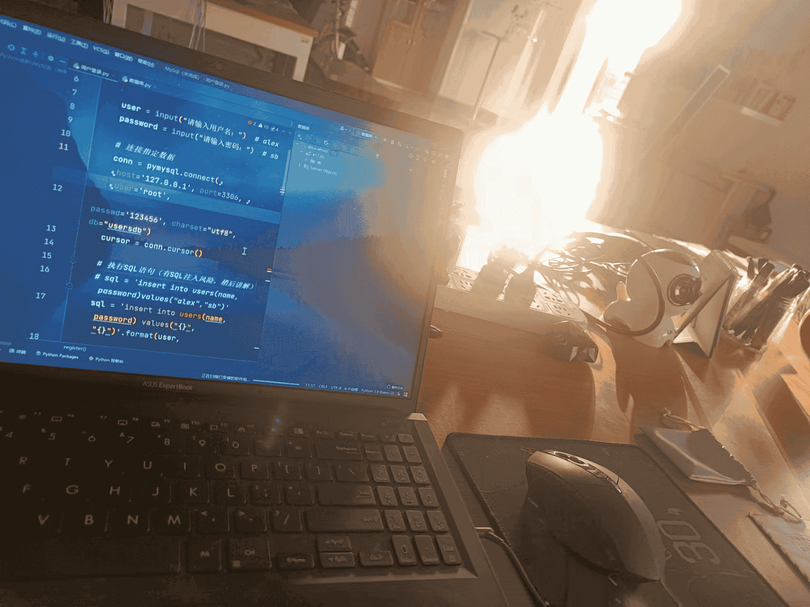

# 小李
| ✅  Do this                                  |              ❌  Don't do this               |
| ------------------------------------------- | :-----------------------------------------: |
|  |  |

### 安装配置

```shell
pip install mkdocs
pip install mkdocs-material
```


### 部署网站

```python
python -m mkdocs build
# main分支
git add .
git commit -m "update"
git push origin main
# 切换gh-pages分支
git checkout gh-pages
git pull origin gh-pages
# 切换main分支
git checkout main
# 部署
python -m mkdocs gh-deploy
```
### 本地测试

```python
python -m mkdocs serve
```

## 图床

```shell
https://cdn.jsdelivr.net/gh/wxnlP/pic
```


​	

