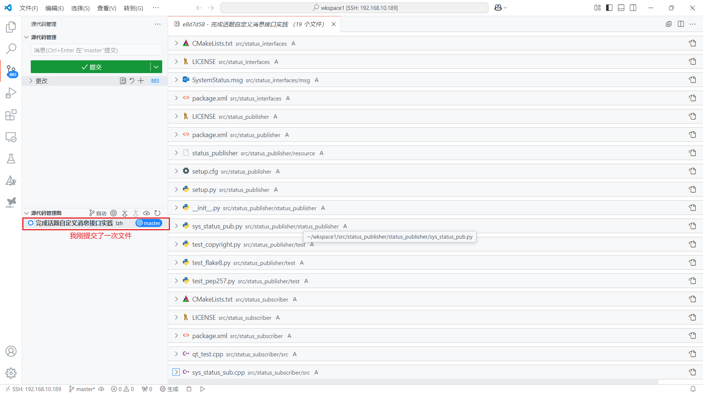

## 使用Git上传Github项目

### 用户配置

右键任意一文件夹内空白处打开<kbd>Git bash here</kbd>进行配置

```shell
# <your_name>是你的自定义用户名
git config --global user.name "<your_name>"

# 配置用户邮箱, 在电脑上提交代码用的就是这个信息
# <your_email>是你的邮箱
git config --global user.email "<your_email>"

# 显示配置信息是否正确, 检查一下
git config --list
```

### 密钥配置（Github）

```shell
//1.输入以下命令不断回车
ssh-keygen -t rsa
//2.获取公钥
cat ~/.ssh/id_rsa.pub

```


复制上述内容至GitHub


检查配置是否完成

```shell
ssh -T git@github.com
```

### 仓库配置

```shell
# 初始化生成Git仓库, 此操作会生成一个.git的文件夹, 用于存放git的相关配置信息
git init

# 将远程仓库链接到本地, 而且仅仅是链接, 不做任何下载上传操作
# <your_repository_url>是你的GitHub仓库链接（https）z
git remote add origin <your_repository_url>

# 若是仓库已经在Github创建则只需要克隆到本地，无需额外链接
git clone <your_repository_url>
```

### 基础应用

```shell
# 克隆代码
git clone <仓库地址>
# 进入本地仓库
cd <本地仓库名称>
# 上传修改文件
git add .
git commit -m "update"
git push origin main
# 拉取仓库最新内容
git pull origin main
#-------------------------------------------
# 修改分支名称
git branch -m master main
```

## 使用Git管理个人项目

### 绑定账户

```shell
git config --global user.name "<your_name>"
git config --global user.email "<your_email>"
```

### 配置默认分支

```shell
git config --global init.defaultBranch master
```

### 查看Git配置

```shell
git config -l
```

### 初始化仓库

进入要初始化为仓库的目录

```shell
git init
```

如果想要删除仓库使用`rm -rf .git`(Linux)删除目录就可以了。

### 提交代码

① 添加当文件到暂存区

```shell
git add <"文件路径">
# 示例
git add src/status_interfaces/package.xml
```

② 添加整个目录到暂存区

```shell
git add <"目录">
# 示例
git add src
```

③ 添加当前目录下所有文件到暂存区

```shell
git add .
```

④ 删除暂存区所有文件

```shell
git reset
```

⑤ 上传暂存区文件

```shell
git commit -m <"更新日志">
# 示例
git add src
git commit -m "完成状态发布功能"
```

⑥ 查看提交日志

```shell
git log
```

想要看提交了哪些文件可以借助Vscode等编译工具。



### 忽略文件gitignore

在仓库根目录新建`.gitignore`文件，添加忽略的目录。

```
build/
install/
log/
.vscode/
```

