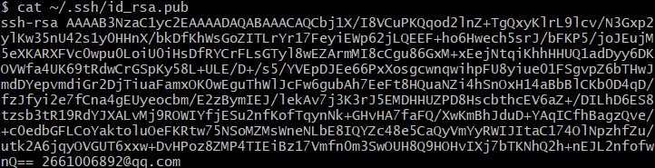

## 用户配置

右键任意一文件夹内空白处打开<kbd>Git bash here</kbd>进行配置

```shell
# <your_name>是你的自定义用户名
git config --global user.name "<your_name>"

# 配置用户邮箱, 在电脑上提交代码用的就是这个信息
# <your_email>是你的邮箱
git config --global user.email "<your_email>"

# 显示配置信息是否正确, 检查一下
git config --list
```

## 密钥配置（Github）

```shell
//1.输入以下命令不断回车
ssh-keygen -t rsa
//2.获取公钥
cat ~/.ssh/id_rsa.pub

```



复制上述内容至GitHub


检查配置是否完成

```shell
ssh -T git@github.com
```

## 仓库配置

```shell
# 初始化生成Git仓库, 此操作会生成一个.git的文件夹, 用于存放git的相关配置信息
git init

# 将远程仓库链接到本地, 而且仅仅是链接, 不做任何下载上传操作
# <your_repository_url>是你的GitHub仓库链接（https）z
git remote add origin <your_repository_url>

```

## 基础应用

```shell
# 克隆代码
git clone 仓库地址
# 进入本地仓库
cd 本地仓库名称
# 上传修改文件
git add .
git commit -m "update"
git push origin main
# 拉取仓库最新内容
git pull origin main
#-------------------------------------------
# 修改分支名称
git branch -m master main
```

