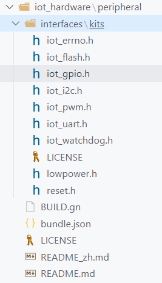
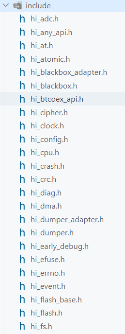

## 5.1 OHOS的IoT接口

### 5.1.1 OHOS接口类型

目前，Open Harmony 提供了三种IoT接口类型：

1. **HAL接口** ：位于硬件服务子系统集的 **IoT专用硬件服务子系统** 。
2. **HDF接口** ：位于内核层的子系统驱动中，这是未来 Open Harmony 主推的接口类型。
3. **海思SDK接口** ：这是Hi3861V100芯片厂商海思提供的原厂接口，也是HAL和HDF的底层接口。

> 目前来说，OpenHarmony在轻量级设备这块，尤其是外设接口，支持的不是很好。
> // 官方以后主推HDF接口，形式上和1.0的接口比较接近。
> 在2.x和3.0阶段，官方对轻量级设备投入的精力比较少。已知到 2021-12-31 为止，HDF还没有一个轻量级芯片支持，包括Hi3861。

**HAL接口** 源码目录为`base\iot_hardware\peripheral\interfaces\kits`，如下图。其中有些接口从 1.0.1 版本以后已经没有了，如ADC、AT、I2S、SDIO等。



**海思SDK接口** 源码目录为`device\hisilicon\hispark_pegasus\sdk_liteos\include`，如下图。海思原厂接口可谓是很全面，因此在HAL接口缺失的情况下，我们就使用海思SDK接口。



??? danger  
    我们应当学会区分HAL接口和海思SDK接口，其中HAL接口以`IoT`开头，函数为大驼峰样式；而海思SDK接口以`hi`开头，函数均为小写以`-`连接。

### 5.1.2 后续开发流程(必看)

- 后续的外设驱动程序均放在`applications\sample\wifi-iot\app`目录下，仅需新建 **模块文件夹** 添加源代码文件和编译脚本文件。
- 编写完源程序，编写 **模块文件夹** 下的编译脚本并修改`applications\sample\wifi-iot\app`目录下的编译脚本。
- 选择开发板，编译。
- 使用快速烧录，将程序下载至开发板。

**因此，后面的内容将不会在重复说明新建文件夹的位置，仅提供编译脚本和源程序，一些重要内容会在注释中说明。**

其中，我会简称两个目录：

1. **模块编译脚本** ：即`applications\sample\wifi-iot\app\模块文件夹`目录下的编译脚本`BUILD.gn`。
2. **APP编译脚本** ：即`applications\sample\wifi-iot\app`目录下的编译脚本`BUILD.gn`。

## 5.2 GPIO

### 5.2.1 GPIO输出

**源代码**

```C
#include <stdio.h>
#include "ohos_init.h"
#include "cmsis_os2.h"
#include "iot_gpio.h"
#include "hi_io.h"

/** 
 * gpio_demo/gpio_output_demo.c
 * GPIO输出案例
 * 熟悉GPIO的API、输出配置流程，让LED灯以500ms为间隔闪烁。
 */ 

/* LED引脚号 */
#define LED_Pin     2

/* LED任务 */
static void LedTask(void *params)
{
    /* 初始化GPIO */
    IoTGpioInit(LED_Pin);
    /* 设置引脚为GPIO功能(海思SDK) */
    hi_io_set_func(LED_Pin, HI_IO_FUNC_GPIO_2_GPIO);
    /* 设置引脚为输出模式 */
    IoTGpioSetDir(LED_Pin, IOT_GPIO_DIR_OUT);
    while(1) 
    {
        /* 设置引脚的高电平状态 */
        IoTGpioSetOutputVal(LED_Pin, IOT_GPIO_VALUE1);
        printf("[INFO] LED ON.\r\n");
        osDelay(50);
        /* 设置引脚的低电平状态 */
        IoTGpioSetOutputVal(LED_Pin, IOT_GPIO_VALUE0);
        printf("[INFO] LED OFF.\r\n");
        osDelay(50);
    }
}

/* LED任务入口函数 */
static void LedEntry(void)
{
    osThreadAttr_t attr = {
        .name = "LedThread",
        .stack_size = 1024,
        .priority = osPriorityNormal
    };
    if (osThreadNew(LedTask, NULL, &attr) == NULL) {
        printf("[ERROR] Thread Create Faild.\r\n");
    }
}

SYS_RUN(LedEntry);
```

**模块编译脚本**

```
static_library("gpio_demo") {
    sources = [
        "gpio_output_demo.c",
    ]

    include_dirs = [
        # include "ohos_init.h"
        "//utils/native/lite/include",
        # include CMSIS-RTOS API V2 for OpenHarmony1.0+
        "//kernel/liteos_m/kal/cmsis",
        # include IoT硬件设备操作接口 for OpenHarmony1.0+：
        "//base/iot_hardware/peripheral/interfaces/kits",
    ]
}
```

**APP编译脚本**

```
import("//build/lite/config/component/lite_component.gni")

lite_component("app") {
    features = [
        "gn_practice/application:gn_app",
        "gn_practice/driver:gn_driver",
        "gn_practice/library:gn_library",
        "kv_store_demo:kv_store_demo",
        "file_demo:file_demo",
        "thread_demo:thread_demo",
        "timer_demo:timer_demo",
        "mutex_demo:mutex_demo",
        # GPIO模块
        "gpio_demo:gpio_demo",
    ]
}

```

!!! danger  
    编译脚本看不到的一定要要去看看[编译原理](https://tonmoon.top/study/OpenHarmony/3.OH编译原理/#31)，很重要！！！

### 5.2.2 GPIO输入

**源代码**

```C
#include <stdio.h>
#include "ohos_init.h"
#include "cmsis_os2.h"
#include "iot_gpio.h"
#include "hi_io.h"

/** 
 * gpio_demo/gpio_input_demo.c
 * GPIO输入案例
 * 熟悉GPIO的API、输入配置流程(是否上拉或下拉电阻)，通过按键控制LED点亮与熄灭。
 */ 

/* LED和KEY引脚号 */
#define LED_Pin         2
#define KEY1_Pin        11
#define KEY2_Pin        12

/* 按键任务 */
static void ButtonTask(void* params)
{
    /* 局部变量 */
    IotGpioValue key1_value, key2_value;
    /* GPIO初始化 */
    IoTGpioInit(LED_Pin);
    IoTGpioInit(KEY1_Pin);
    IoTGpioInit(KEY2_Pin);
    /* 配置引脚的复用功能(海思SDK) */
    hi_io_set_func(LED_Pin, HI_IO_FUNC_GPIO_2_GPIO);
    hi_io_set_func(KEY1_Pin, HI_IO_FUNC_GPIO_11_GPIO);
    hi_io_set_func(KEY2_Pin, HI_IO_FUNC_GPIO_12_GPIO);
    /* 配置引脚的输入输出模式 */
    IoTGpioSetDir(LED_Pin, IOT_GPIO_DIR_OUT);
    IoTGpioSetDir(KEY1_Pin, IOT_GPIO_DIR_IN);
    IoTGpioSetDir(KEY2_Pin, IOT_GPIO_DIR_IN);
    /* 输入模式的引脚设置上拉电阻 */
    hi_io_set_pull(KEY1_Pin, HI_IO_PULL_UP);
    hi_io_set_pull(KEY2_Pin, HI_IO_PULL_UP);
    while (1)
    {
        /* 获取输入电平 */
        IoTGpioGetInputVal(KEY1_Pin, &key1_value);
        IoTGpioGetInputVal(KEY2_Pin, &key2_value);
        if (key1_value == 0) {
            osDelay(2);
            printf("[INFO] KEY1的电平: %d\r\n", key1_value);
            /* 点亮LED */
            IoTGpioSetOutputVal(LED_Pin, IOT_GPIO_VALUE1);
        }
        if (key2_value == 0) {
            osDelay(2);
            printf("[INFO] KEY2的电平: %d\r\n", key2_value);
            /* 熄灭LED */
            IoTGpioSetOutputVal(LED_Pin, IOT_GPIO_VALUE0);
        }
        osDelay(20);
    }
}

static void ButtonEntry(void)
{
     osThreadAttr_t attr = {
        .name = "ButtonThread",
        .stack_size = 4096,
        .priority = osPriorityNormal
    };
    if (osThreadNew(ButtonTask, NULL, &attr) == NULL) {
        printf("[ERROR] Thread Create Faild.\r\n");
    }
}

SYS_RUN(ButtonEntry);
```

**模块编译脚本**

```
static_library("gpio_demo") {
    sources = [
        "gpio_input_demo.c",
        "gpio_output_demo.c",
    ]

    include_dirs = [
        # include "ohos_init.h"
        "//utils/native/lite/include",
        # include CMSIS-RTOS API V2 for OpenHarmony1.0+
        "//kernel/liteos_m/kal/cmsis",
        # include IoT硬件设备操作接口 for OpenHarmony1.0+：
        "//base/iot_hardware/peripheral/interfaces/kits",
    ]
}
```

**APP编译脚本**

```
import("//build/lite/config/component/lite_component.gni")

lite_component("app") {
    features = [
        "gn_practice/application:gn_app",
        "gn_practice/driver:gn_driver",
        "gn_practice/library:gn_library",
        "kv_store_demo:kv_store_demo",
        "file_demo:file_demo",
        "thread_demo:thread_demo",
        "timer_demo:timer_demo",
        "mutex_demo:mutex_demo",
        # GPIO模块
        "gpio_demo:gpio_demo",
    ]
}
```

### 5.2.3 使用中断

**源代码**

```C
#include <stdio.h>
#include "ohos_init.h"
#include "cmsis_os2.h"
#include "iot_gpio.h"
#include "hi_io.h"

/** 
 * gpio_demo/gpio_interrupt_demo.c
 * GPIO中断使用案例
 * 将GPIO输入案例的按键程序放在中断执行。
 */ 

/* LED和KEY引脚号 */
#define LED_Pin         2
#define KEY1_Pin        11
#define KEY2_Pin        12


static void Key1Callback(char* params)
{
    printf("[INFO] KEY1按键按下！\r\n");
    IoTGpioSetOutputVal(LED_Pin, IOT_GPIO_VALUE1);
}

static void Key2Callback(char* params)
{
    printf("[INFO] KEY2按键按下！\r\n");
    IoTGpioSetOutputVal(LED_Pin, IOT_GPIO_VALUE0);
}

static void InterruptTask(void* params)
{
    /* GPIO初始化 */
    IoTGpioInit(LED_Pin);
    IoTGpioInit(KEY1_Pin);
    IoTGpioInit(KEY2_Pin);
    /* 配置引脚的复用功能(海思SDK) */
    hi_io_set_func(LED_Pin, HI_IO_FUNC_GPIO_2_GPIO);
    hi_io_set_func(KEY1_Pin, HI_IO_FUNC_GPIO_11_GPIO);
    hi_io_set_func(KEY2_Pin, HI_IO_FUNC_GPIO_12_GPIO);
    /* 配置引脚的输入输出模式 */
    IoTGpioSetDir(LED_Pin, IOT_GPIO_DIR_OUT);
    IoTGpioSetDir(KEY1_Pin, IOT_GPIO_DIR_IN);
    IoTGpioSetDir(KEY2_Pin, IOT_GPIO_DIR_IN);
    /* 输入模式的引脚设置上拉电阻 */
    hi_io_set_pull(KEY1_Pin, HI_IO_PULL_UP);
    hi_io_set_pull(KEY2_Pin, HI_IO_PULL_UP);
    /* 配置中断: 
     * 1.边沿触发 2.下降沿触发 3.回调函数传入不同IoId和电平
     */
    IoTGpioRegisterIsrFunc(
        KEY1_Pin, 
        IOT_INT_TYPE_EDGE, 
        IOT_GPIO_EDGE_FALL_LEVEL_LOW, 
        Key1Callback,
        NULL
        );
    IoTGpioRegisterIsrFunc(
        KEY2_Pin, 
        IOT_INT_TYPE_EDGE, 
        IOT_GPIO_EDGE_FALL_LEVEL_LOW, 
        Key2Callback,
        NULL
        );
    while (1)
    {
        osDelay(10);
    }   
}

static void InterruptEntry(void)
{
     osThreadAttr_t attr = {
        .name = "InterruptThread",
        .stack_size = 1024,
        .priority = osPriorityNormal
    };
    if (osThreadNew(InterruptTask, NULL, &attr) == NULL) {
        printf("[ERROR] Thread Create Faild.\r\n");
    }
}

SYS_RUN(InterruptEntry);
```

**模块编译脚本**

```
static_library("gpio_demo") {
    sources = [
        "gpio_interrupt_demo.c",
        "gpio_input_demo.c",
        "gpio_output_demo.c",
    ]

    include_dirs = [
        # include "ohos_init.h"
        "//utils/native/lite/include",
        # include CMSIS-RTOS API V2 for OpenHarmony1.0+
        "//kernel/liteos_m/kal/cmsis",
        # include IoT硬件设备操作接口 for OpenHarmony1.0+：
        "//base/iot_hardware/peripheral/interfaces/kits",
    ]
}
```

**APP编译脚本**

```
import("//build/lite/config/component/lite_component.gni")

lite_component("app") {
    features = [
        "gn_practice/application:gn_app",
        "gn_practice/driver:gn_driver",
        "gn_practice/library:gn_library",
        "kv_store_demo:kv_store_demo",
        "file_demo:file_demo",
        "thread_demo:thread_demo",
        "timer_demo:timer_demo",
        "mutex_demo:mutex_demo",
        # GPIO模块
        "gpio_demo:gpio_demo",
    ]
}
```

### 5.2.4 PWM

默认情况下，hi3861_sdk中，PWM的CONFIG选项没有打开，我们需要在`device\hisilicon\hispark_pegasus\sdk_liteos\build\config`目录下找到`user_config.mk`文件，添加PWM的CONFIG选项`CONFIG_PWM_SUPPORT=y` ，同时可以看到UART、SPI等默认也是没有开启，都需要我们手动开启。

```makefile
#
# BSP Settings
#
# CONFIG_I2C_SUPPORT is not set
# CONFIG_I2S_SUPPORT is not set
# CONFIG_SPI_SUPPORT is not set
# CONFIG_DMA_SUPPORT is not set
# CONFIG_SDIO_SUPPORT is not set
# CONFIG_SPI_DMA_SUPPORT is not set
# CONFIG_UART_DMA_SUPPORT is not set
# CONFIG_PWM_SUPPORT is not set
CONFIG_PWM_SUPPORT=y
# CONFIG_PWM_HOLD_AFTER_REBOOT is not set
CONFIG_AT_SUPPORT=y
CONFIG_FILE_SYSTEM_SUPPORT=y
CONFIG_UART0_SUPPORT=y
CONFIG_UART1_SUPPORT=y
# CONFIG_UART2_SUPPORT is not set
# end of BSP Settings
```

**源代码(HAL接口)**

```C
#include <stdio.h>
#include "ohos_init.h"
#include "cmsis_os2.h"
#include "iot_gpio.h"
#include "iot_pwm.h"
#include "hi_io.h"
#include "hi_pwm.h"

/** 
 * gpio_demo/gpio_pwm_demo.c
 * PWM使用案例
 * 熟悉PWM的API，实现呼吸灯。
 */ 

#define LED_Pin         2

static void PwmLedTask(void* params)
{
    int i;
    /* GPIO初始化 */
    IoTGpioInit(LED_Pin);
    /* 配置引脚的复用功能为PWM(海思SDK) */
    hi_io_set_func(LED_Pin, HI_IO_FUNC_GPIO_2_PWM2_OUT);
    /* 配置引脚的输入输出模式 */
    IoTGpioSetDir(LED_Pin, IOT_GPIO_DIR_OUT);
    /* PWM初始化 */
    IoTPwmInit(LED_Pin);
    while(1)
    {
        /* 配置PWM参数，占空比递增后递减、频率4000HZ */
        for (i=0 ; i<100 ; i++) {
            IoTPwmStart(LED_Pin, i, 4000);
            osDelay(1);
        }
        for (i=0 ; i<100 ; i++) {
            IoTPwmStart(LED_Pin, 100-i, 4000);
            osDelay(1);
        }
    }
}

static void PwmEntry(void)
{
     osThreadAttr_t attr = {
        .name = "InterruptThread",
        .stack_size = 1024,
        .priority = osPriorityNormal
    };
    if (osThreadNew(PwmLedTask, NULL, &attr) == NULL) {
        printf("[ERROR] Thread Create Faild.\r\n");
    }
}

SYS_RUN(PwmEntry);
```

**源代码(海思SDK接口)**

关于海思SDK接口需要注意一点，`hi_pwm_start`虽然参数名称与`IoTPwmStart`一致，但含义却并不一样：

- **HAL接口** 
  - `duty`：实际占空比，取值为1-99。
  - `freq`：实际频率。
- **海思SDK接口** 
  - `duty`：占空比，取值为1-65535，默认值为750。但，实际占空比还取决于分配倍数。
  - `freq`：分配倍数，取值为1-65535，默认值为1500。

hi3861芯片的内部时钟(默认)160MHz，外部时钟40MHz；所以对于海思SDK接口：

1. 实际频率 = 时钟源频率/`freq` 

2. 实际占空比 = `duty/freq `。

```C
#include <stdio.h>
#include "ohos_init.h"
#include "cmsis_os2.h"
#include "iot_gpio.h"
#include "iot_pwm.h"
#include "hi_io.h"
#include "hi_pwm.h"

/** 
 * gpio_demo/gpio_pwm_demo.c
 * PWM使用案例
 * 熟悉PWM的API，实现呼吸灯。
 */ 

#define LED_Pin         2

static void PwmLedTask(void* params)
{
    int i;
    /* GPIO初始化 */
    IoTGpioInit(LED_Pin);
    /* 配置引脚的复用功能为PWM(海思SDK) */
    hi_io_set_func(LED_Pin, HI_IO_FUNC_GPIO_2_PWM2_OUT);
    /* 配置引脚的输入输出模式 */
    IoTGpioSetDir(LED_Pin, IOT_GPIO_DIR_OUT);
    /* PWM初始化 */
    // IoTPwmInit(LED_Pin);
    hi_pwm_init(LED_Pin);
    while(1)
    {
        /* 配置PWM参数，占空比递增后递减、频率4000HZ */
        for (i=0 ; i<40000 ; i+=200) {
            // IoTPwmStart(LED_Pin, i, 4000);
            /* 4000 = 160,000,000/40000 ,1% = 400/40000 */
            hi_pwm_start(LED_Pin, i, 40000);
            osDelay(1);
        }
        for (i=0 ; i<40000 ; i+=200) {
            // IoTPwmStart(LED_Pin, 100-i, 4000);
            hi_pwm_start(LED_Pin, 40000-i, 40000);
            osDelay(1);
        }
    }
}

static void PwmEntry(void)
{
     osThreadAttr_t attr = {
        .name = "InterruptThread",
        .stack_size = 1024,
        .priority = osPriorityNormal
    };
    if (osThreadNew(PwmLedTask, NULL, &attr) == NULL) {
        printf("[ERROR] Thread Create Faild.\r\n");
    }
}

SYS_RUN(PwmEntry);
```

**模块编译脚本**

```
static_library("gpio_demo") {
    sources = [
        "gpio_pwm_demo.c",
        "gpio_interrupt_demo.c",
        "gpio_input_demo.c",
        "gpio_output_demo.c",
    ]

    include_dirs = [
        # include "ohos_init.h"
        "//utils/native/lite/include",
        # include CMSIS-RTOS API V2 for OpenHarmony1.0+
        "//kernel/liteos_m/kal/cmsis",
        # include IoT硬件设备操作接口 for OpenHarmony1.0+：
        "//base/iot_hardware/peripheral/interfaces/kits",
    ]
}
```

**APP编译脚本**

```
import("//build/lite/config/component/lite_component.gni")

lite_component("app") {
    features = [
        "gn_practice/application:gn_app",
        "gn_practice/driver:gn_driver",
        "gn_practice/library:gn_library",
        "kv_store_demo:kv_store_demo",
        "file_demo:file_demo",
        "thread_demo:thread_demo",
        "timer_demo:timer_demo",
        "mutex_demo:mutex_demo",
        # GPIO模块
        "gpio_demo:gpio_demo",
    ]
}
```

