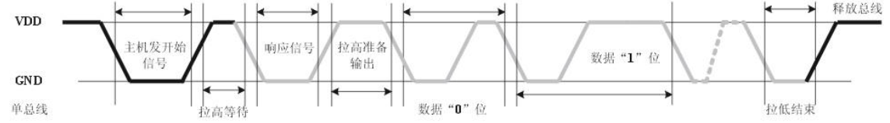
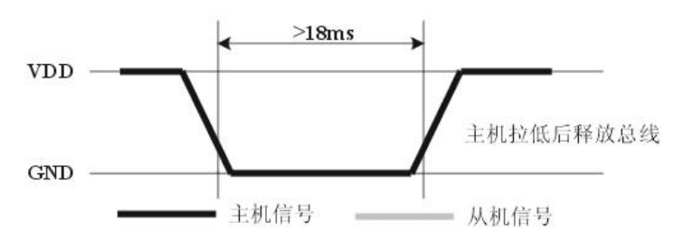
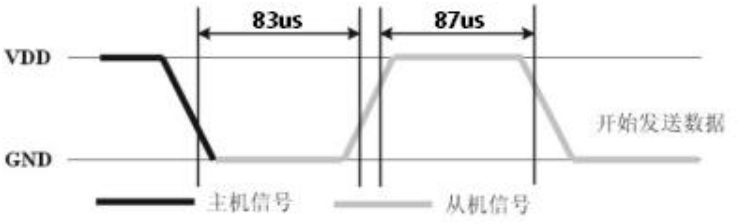

## 6.1 Hi3861的ADC外设

Hi3861V100 芯片的ADC具有以下功能特性
。

- 输入时钟频率：3MHZ
  。
- 采样精度：12bit。
- 单通道采样频率：小于200kHz。
- 买样顺序：从通道0到通道7，每个通道采样一个数据,循环采样。
- 支持采样数据平均滤波处理：平均次数1、2、4、8。在多通道场景下,每个通道接收N个数据(平均滤波个数)再切换通道。
- 数转换电压基准：支持自动识别模式、1.8V 基准模式、3.3V 基准模式。

## 6.2 ADC读取模拟值

**源代码**

```C
#include <stdio.h>
#include "ohos_init.h"
#include "cmsis_os2.h"
#include "iot_gpio.h"
#include "hi_io.h"
#include "hi_adc.h"


/**
 * adc_demo/adc_demo.c
 * ADC读取模拟值案例
 * HAL接口缺失ADC的API，故本节API均采用海思SDK接口。
 * 利用ADC通道读取红外传感器的模拟值，信号引脚接传感器的AO(Analog)。
 * 同时一些宏和函数参数，我们尽量使用API定义好的枚举或结构体，因此要学会阅读源码注释。
 */

#define SensorAdcChannel  HI_ADC_CHANNEL_4

static void SensorAdcTask(void* params)
{
    /* 定义ADC读取的模拟值的存储地址 */
    uint16_t value;
    while(1) 
    {
        if (hi_adc_read(SensorAdcChannel, &value, HI_ADC_EQU_MODEL_4, HI_ADC_CUR_BAIS_DEFAULT, 0) == HI_ERR_SUCCESS) {
            printf("[INFO]ADC_VALUE = %d\r\n", value);
        }
        osDelay(100);
    }

}

static void AdcEntry(void)
{
     osThreadAttr_t attr = {
        .name = "AdcThread",
        .stack_size = 1024,
        .priority = osPriorityNormal
    };
    if (osThreadNew(SensorAdcTask, NULL, &attr) == NULL) {
        printf("[ERROR] Thread Create Faild.\r\n");
    }
}

SYS_RUN(AdcEntry);
```

**模块编译脚本**

```
static_library ("adc_demo") {
    sources = [
        "adc_demo.c"
    ]
    include_dirs = [
        # include "ohos_init.h"
        "//utils/native/lite/include",
        # include CMSIS-RTOS API V2 for OpenHarmony1.0+
        "//kernel/liteos_m/kal/cmsis",
        # include IoT硬件设备操作接口 for OpenHarmony1.0+：
        "//base/iot_hardware/peripheral/interfaces/kits",
    ]
}
```

**APP编译脚本**

```
import("//build/lite/config/component/lite_component.gni")

lite_component("app") {
    features = [
        "gn_practice/application:gn_app",
        "gn_practice/driver:gn_driver",
        "gn_practice/library:gn_library",
        "kv_store_demo:kv_store_demo",
        "file_demo:file_demo",
        "thread_demo:thread_demo",
        "timer_demo:timer_demo",
        "mutex_demo:mutex_demo",
        # GPIO模块
        "gpio_demo:gpio_demo",
        # ADC模块
        "adc_demo:adc_demo",
    ]
}
```

## 6.3 DHT11温湿度

### 6.3.1 DHT11单总线通信

DHT11器件采用简化的单总线通信。单总线即只有一根数据线，系统中的数据交换、控制均由单总线完成。微处理器与DHT11之间的通讯和同步,采用单总线数据格式，一次传送40位数据， **高位先出** 。  

**数据格式：**  
8bit湿度整数数据+8bit湿度小数数据+8bit温度整数数据+8bit温度小数数据+8bit校验位。其中湿度小数部分为0，8bit校验位等于所得结果的末8位。  

特殊说明：当温度低于0℃时温度数据的低8位的最高位置为1。

示例：-10.1 ℃表示为 0000 1010 1000 0001   
0000 1010(整数) = 10℃  ，00000001(小数) = 0.1℃  ，低8位的最高位置为 1 所以温度数据为 -10.1℃

**通信时序：**

用户主机（MCU）发送一次开始信号后，DHT11从低功耗模式转换到高速模式，待主机开始信号结束后，DHT11发送响应信号，送出40bit的数据，并触发一次信息采集。  



### 6.3.2 单总线通信代码

**芯片手册** 中读取DHT11温湿度流程：

- DHT11上电后（DHT11上电后要等待1S以越过不稳定状态在此期间不能发送任何指令），测试环境温湿度数据，并记录数据，同时DHT11的DATA数据线由 **上拉电阻** 拉高一直保持高电平；此时DHT11的DATA引脚处于 **输入状态** ，时刻检测外部信号。  
- 微处理器的I/O设置为 **输出** 同时输出低电平，且低电平保持时间不能小于18ms（最大不得超过30ms），然后微处理器的I/O设置为 **输入状态** ，由于上拉电阻，微处理器的I/O即DHT11的DATA数据线也随之变高，等待DHT11作出回答信号。  



- DHT11的DATA引脚检测到外部信号有低电平时，等待外部信号低电平结束，延迟后DHT11的DATA引脚处于输出状态，输出83微秒的低电平作为应答信号，紧接着输出87微秒的高电平通知外设准备接收数据，微处理器的I/O此时处于输入状态，检测到I/O有低电平（DHT11回应信号）后，等待87微秒的高电平后的数据接收 。



- 由DHT11的DATA引脚输出40位数据，微处理器根据I/O电平的变化接收40位数据，位数据“0”的格式为：54微秒的低电平和23-27微秒的高电平，位数据“1”的格式为：54微秒的低电平加68-74微秒的高电平。  

- 结束信号：DHT11的DATA引脚输出40位数据后，继续输出低电平54微秒后转为输入状态，由于上拉电阻随之变为高电平。但DHT11内部重测环境温湿度数据，并记录数据，等待外部信号的到来。

### 6.3.3 驱动程序

待更新。。。