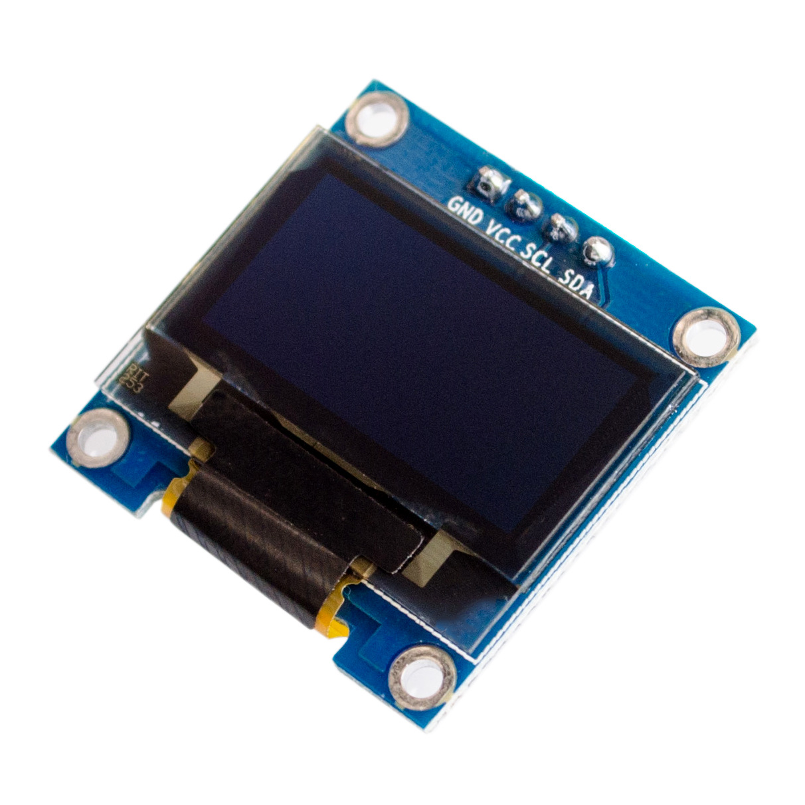
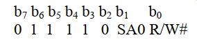
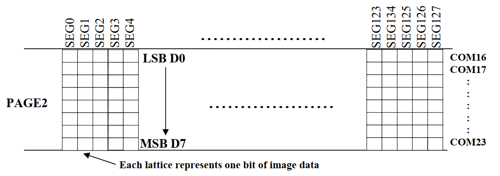
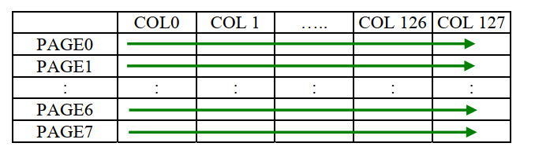
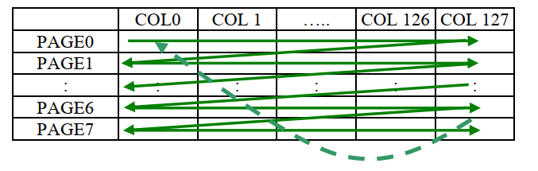
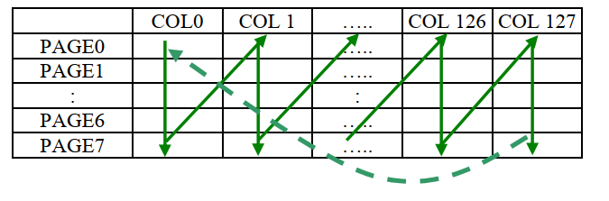
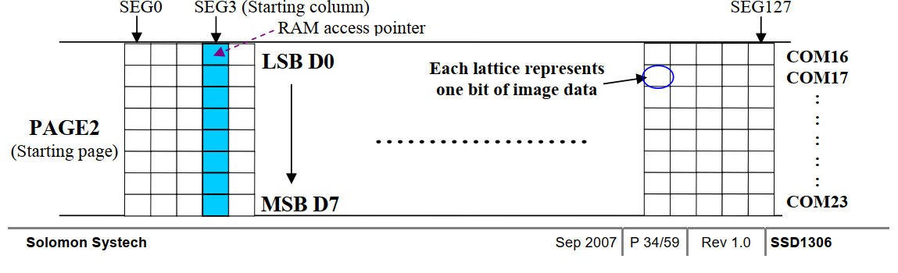
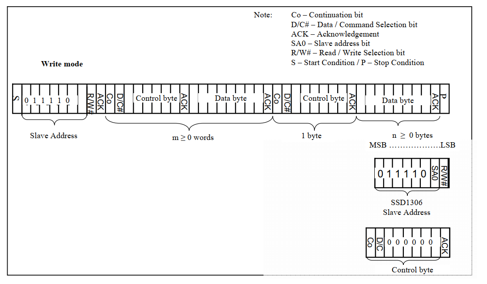

## 7.1 I2C通信

推荐阅读：[I2C理论(含stm32软、硬件I2C)](https://tonmoon.top/study/STM32/10.I2C通信/)

建议掌握：软件模拟I2C

## 7.2 OLED显示屏

### 7.2.1 OLED简介

如图所示为一个0.96寸的OLED显示屏，其驱动芯片为SSD1306，使用I2C通信，从机地址为`0x78`。



本节关于OLED的介绍全部来源于SSD1306芯片数据手册。


### 7.2.2 从机地址

> 内容来源：SSD1306芯片数据手册 <kbd>8.1.5 MUC  I2C Interface</kbd>

1. 8Bit，其中高7位表示从机地址。
2. “SA0” bit  是为了从机地址的灵活性，可以选择 “0111100” 或 “0111101” 为SSD1306芯片的从机地址。 
3. “R/W#” bit 是选择读写模式，R/W#=1  为读模式，R/W#=0  为写模式。



那么为什么说从机地址是`0x78`呢？  

实际上我们说从机地址时，忽略最低位补零，那么默认的地址就是 0111100，也就是`0x78`。然而，在实际I2C通信中则不是直接发从机地址 ，而是加上读写位。如下图，在I2C通信时，若我们进入写模式，则末位补零，程序中可以使用`0x78|0x00`，读模式则为`0x78|0x01`。


### 7.2.3 显存(GDDRAM)

> 内容来源：SSD1306芯片数据手册<kbd>8.7 Graphic Display Data RAM (GDDRAM)</kbd>

如下图 RAM 大小是 128x64 Bits，被划分为 8 个pages，一个page有8像素点。 其中，绿色的计数方式为重映射后的，默认为黑色字体样式。


当一个字节的数据被写入 GDDRAM (也就是通过I2C发送一个字节数据)时，当前一page一列(8Bit)就会被点亮。注意低位在上，高位在下，如下图所示。



### 7.2.4 命令表

> 内容来源：SSD1306芯片数据手册<kbd>9. COMMAND TABLE</kbd> 

展示一些常用的命令：

| 代码（16进制） | 命令                              | 说明                                                         |
| -------------- | --------------------------------- | ------------------------------------------------------------ |
| 81+xx          | 设置对比度                        | 两个字节的命令，xx 的范围为 0~255，值越大，对比度越高。      |
| A4/A5          | 开启／关闭整体显示                | A4：将显存内容输出到屏幕。  <br />A5：输出时忽略显存内容。   |
| A6/A7          | 设置正常／反色显示                | A6：正常显示。0对应像素熄灭，1对应像素亮起。  <br />A7：反色显示。0对应像素亮起，1对应像素熄灭。 |
| AE/AF          | 设置显示开／关                    | AE：显示关闭（睡眠模式，默认状态）。  <br />AF：显示开启（正常模式）。 |
| B0~B7          | 在页寻址模式时，设置页面起始地址  | 设置GDDRAM页面起始地址（PAGE0~PAGE7）。                      |
| 00~0F          | 在页寻址模式时，设置列地址的低4位 | 列地址范围为 0~127，即 0x00~0x7f。                           |
| 10~1F          | 在页寻址模式时，设置列地址的高4位 | 列地址的高 4 位需要和0x10进行按位或作为值。                  |

```C
0xAE,  // 显示关闭
0x00,  // 页寻址模式时，设置列地址的低4位为0000
0x10,  // 页寻址模式时，设置列地址的高4位为0000
0x40,  // 设置起始行地址为第0行
0xB0,  // 页寻址模式时，设置页面起始地址为PAGE0
0x81,  // 设置对比度
0xFF,  // 对比度值
0xA1,  // set segment remap
0xA6,  // 设置正常显示。0对应像素熄灭，1对应像素亮起
0xA8,  // --set multiplex ratio(1 to 64)
0x3F,  // --1/32 duty
0xC0,  // scan direction
0xD3,  // -set display offset
0x00,  // set osc division
0xD5,  // set osc division
0x80,  
0xD8,  // set area color mode off
0x05,  
0xD9,  // Set Pre-Charge Period
0xF1,  
0xDA,  // set com pin configuargtion
0x12,  
0xDB,  // set Vcomh
0x30,  // set charge pump enable
0x8D,  // set charge pump enable
0x14,  
0xAF,  // 显示开启
```

### 7.2.5 显存寻址模式

**页寻址模式(0x20)**

页寻址模式将整个显存划分为多个 “页”，每一页包含 8 行像素。同一页内的像素按列组织，写完一列的 8 个像素后，列地址自动加 1。当列地址达到该页的最大列数时，列地址会回到起始列，但页地址不会自动改变，需要通过专门的命令来切换页。对于 128x64 的 SSD1306 显示屏，会被划分为 8 页（编号 0 - 7），每页有 128 列。同时也寻址模式是 **默认的寻址模式** 。



**水平寻址模式(0x21)**

在水平寻址模式下，显存的读写操作是按照从左到右、从上到下的顺序逐列进行的。当写完一行的所有列后，会自动跳到下一行的起始列继续进行操作。如果到达了显存的最后一列，地址指针会自动回到第一列，同时行地址加 1；若到达最后一行，则地址指针回到第一行第一列。



**垂直寻址模式(0x22)**

垂直寻址模式下，显存的读写是按列进行的，先从上到下写完一列，再跳到下一列继续操作。当写完所有列后，列地址会回到起始列，同时行地址加 1。如果到达最后一行，则地址指针回到第一行第一列。



### 7.2.6 页寻址模式

- 按列写，从列0开始，到列127结束。每列一个字节数据，低位在上，高位在下。
- 列地址指针(RAM access pointer)，每读取或写入一个字节数据，列地址指针自动+1，到列127后返回列0。
- 设置起始页，相当于Y轴，命令0xB0 - 0xB7。
- 设置列地址低四位，命令0x00 - 0x0F。
- 设置列地址高四位，命令0x10 - 0x1F。



封装寻址为函数，用于确定X、Y坐标：

```C
/** 
 * @param x: 横坐标，取值范围是0~127，对应128个像素点，x的单位为bit。
 * @param y: 纵坐标，取值范围是0~7，对应8个pages，y的单位是字节(8bits)。
 */
void OledSetPosition(uint8_t x, uint8_t y)
{
    /* 起始页(y坐标) */
    WriteCmd(0xB0 + y);
    /* 列地址低四位 */
    WriteCmd(0x0F & x);
    /* 列地址高四位 */
    WriteCmd(0x10 | ((0xF0 & x) >> 4));
}
```

**例：x= 0x5D = 93 = 0101 1101，y = 3**

```C
/* 起始页(y坐标) */
0xB0 + y = 0xB3  => page3
/* 列地址低四位 */
0x0F & x = 0000 1101 = 0x0D
/* 列地址高四位 */
0xF0 & x = 0101 0000
((0xF0 & x) >> 4) = 0000 0101
0x10 | ((0xF0 & x) >> 4) = 0001 0101 = 0x15
```

### 7.2.7 I2C写模式

需要特别注意的是，在发送完从机地址后我们需要发送一个 **控制字节** 指定要发送 **命令** 还是 **数据** ，控制字节由<kbd>Co</kbd>位、<kbd>D/C#</kbd>位和六个0组成：

<kbd>Co</kbd>位，当`C0=0`表示后续传输的信息将仅包含数据字节，即不含控制字节。

<kbd>D/C#</kbd>位，其中`D/C#=0`则下一个字节为命令，`D/C#=1`则下一个字节为数据。

因此，发送命令的控制字节为 **0x00** (`C0=0`且`D/C#=0`)；发送数据的控制字节为 **0x40** (`C0=0`且`D/C#=1`)。



## 7.3 OLED简易驱动

### 7.3.1 OLED驱动代码

`oled_fonts.h`

```C
#ifndef OLOED_FONTS_H
#define OLOED_FONTS_H

/************************************6*8的点阵************************************/
// 取模方式：纵向8点下高位
// 采用N*6的二维数组
// 第一维表示字符
// 每个字符对应第二维的6个数组元素，每个数组元素1字节，表示1列像素，一共6列8行
static unsigned char F6x8[][6] =
{
    { 0x00, 0x00, 0x00, 0x00, 0x00, 0x00 }, // 空格
    { 0x00, 0x00, 0x00, 0x2f, 0x00, 0x00 }, // !
    { 0x00, 0x00, 0x07, 0x00, 0x07, 0x00 }, // "
    { 0x00, 0x14, 0x7f, 0x14, 0x7f, 0x14 }, // #
    { 0x00, 0x24, 0x2a, 0x7f, 0x2a, 0x12 }, // $
    { 0x00, 0x62, 0x64, 0x08, 0x13, 0x23 }, // %
    { 0x00, 0x36, 0x49, 0x55, 0x22, 0x50 }, // &
    { 0x00, 0x00, 0x05, 0x03, 0x00, 0x00 }, // '
    { 0x00, 0x00, 0x1c, 0x22, 0x41, 0x00 }, // (
    { 0x00, 0x00, 0x41, 0x22, 0x1c, 0x00 }, // )
    { 0x00, 0x14, 0x08, 0x3E, 0x08, 0x14 }, // *
    { 0x00, 0x08, 0x08, 0x3E, 0x08, 0x08 }, // +
    { 0x00, 0x00, 0x00, 0xA0, 0x60, 0x00 }, // ,
    { 0x00, 0x08, 0x08, 0x08, 0x08, 0x08 }, // -
    { 0x00, 0x00, 0x60, 0x60, 0x00, 0x00 }, // .
    { 0x00, 0x20, 0x10, 0x08, 0x04, 0x02 }, // /
    { 0x00, 0x3E, 0x51, 0x49, 0x45, 0x3E }, // 0
    { 0x00, 0x00, 0x42, 0x7F, 0x40, 0x00 }, // 1
    { 0x00, 0x42, 0x61, 0x51, 0x49, 0x46 }, // 2
    { 0x00, 0x21, 0x41, 0x45, 0x4B, 0x31 }, // 3
    { 0x00, 0x18, 0x14, 0x12, 0x7F, 0x10 }, // 4
    { 0x00, 0x27, 0x45, 0x45, 0x45, 0x39 }, // 5
    { 0x00, 0x3C, 0x4A, 0x49, 0x49, 0x30 }, // 6
    { 0x00, 0x01, 0x71, 0x09, 0x05, 0x03 }, // 7
    { 0x00, 0x36, 0x49, 0x49, 0x49, 0x36 }, // 8
    { 0x00, 0x06, 0x49, 0x49, 0x29, 0x1E }, // 9
    { 0x00, 0x00, 0x36, 0x36, 0x00, 0x00 }, // :
    { 0x00, 0x00, 0x56, 0x36, 0x00, 0x00 }, // ;
    { 0x00, 0x08, 0x14, 0x22, 0x41, 0x00 }, // <
    { 0x00, 0x14, 0x14, 0x14, 0x14, 0x14 }, // =
    { 0x00, 0x00, 0x41, 0x22, 0x14, 0x08 }, // >
    { 0x00, 0x02, 0x01, 0x51, 0x09, 0x06 }, // ?
    { 0x00, 0x32, 0x49, 0x59, 0x51, 0x3E }, // @
    { 0x00, 0x7C, 0x12, 0x11, 0x12, 0x7C }, // A
    { 0x00, 0x7F, 0x49, 0x49, 0x49, 0x36 }, // B
    { 0x00, 0x3E, 0x41, 0x41, 0x41, 0x22 }, // C
    { 0x00, 0x7F, 0x41, 0x41, 0x22, 0x1C }, // D
    { 0x00, 0x7F, 0x49, 0x49, 0x49, 0x41 }, // E
    { 0x00, 0x7F, 0x09, 0x09, 0x09, 0x01 }, // F
    { 0x00, 0x3E, 0x41, 0x49, 0x49, 0x7A }, // G
    { 0x00, 0x7F, 0x08, 0x08, 0x08, 0x7F }, // H
    { 0x00, 0x00, 0x41, 0x7F, 0x41, 0x00 }, // I
    { 0x00, 0x20, 0x40, 0x41, 0x3F, 0x01 }, // J
    { 0x00, 0x7F, 0x08, 0x14, 0x22, 0x41 }, // K
    { 0x00, 0x7F, 0x40, 0x40, 0x40, 0x40 }, // L
    { 0x00, 0x7F, 0x02, 0x0C, 0x02, 0x7F }, // M
    { 0x00, 0x7F, 0x04, 0x08, 0x10, 0x7F }, // N
    { 0x00, 0x3E, 0x41, 0x41, 0x41, 0x3E }, // O
    { 0x00, 0x7F, 0x09, 0x09, 0x09, 0x06 }, // P
    { 0x00, 0x3E, 0x41, 0x51, 0x21, 0x5E }, // Q
    { 0x00, 0x7F, 0x09, 0x19, 0x29, 0x46 }, // R
    { 0x00, 0x46, 0x49, 0x49, 0x49, 0x31 }, // S
    { 0x00, 0x01, 0x01, 0x7F, 0x01, 0x01 }, // T
    { 0x00, 0x3F, 0x40, 0x40, 0x40, 0x3F }, // U
    { 0x00, 0x1F, 0x20, 0x40, 0x20, 0x1F }, // V
    { 0x00, 0x3F, 0x40, 0x38, 0x40, 0x3F }, // W
    { 0x00, 0x63, 0x14, 0x08, 0x14, 0x63 }, // X
    { 0x00, 0x07, 0x08, 0x70, 0x08, 0x07 }, // Y
    { 0x00, 0x61, 0x51, 0x49, 0x45, 0x43 }, // Z
    { 0x00, 0x00, 0x7F, 0x41, 0x41, 0x00 }, // [
    { 0x00, 0x55, 0x2A, 0x55, 0x2A, 0x55 }, /* \ */
    { 0x00, 0x00, 0x41, 0x41, 0x7F, 0x00 }, // ]
    { 0x00, 0x04, 0x02, 0x01, 0x02, 0x04 }, // ^
    { 0x00, 0x40, 0x40, 0x40, 0x40, 0x40 }, // _
    { 0x00, 0x00, 0x01, 0x02, 0x04, 0x00 }, // '
    { 0x00, 0x20, 0x54, 0x54, 0x54, 0x78 }, // a
    { 0x00, 0x7F, 0x48, 0x44, 0x44, 0x38 }, // b
    { 0x00, 0x38, 0x44, 0x44, 0x44, 0x20 }, // c
    { 0x00, 0x38, 0x44, 0x44, 0x48, 0x7F }, // d
    { 0x00, 0x38, 0x54, 0x54, 0x54, 0x18 }, // e
    { 0x00, 0x08, 0x7E, 0x09, 0x01, 0x02 }, // f
    { 0x00, 0x18, 0xA4, 0xA4, 0xA4, 0x7C }, // g
    { 0x00, 0x7F, 0x08, 0x04, 0x04, 0x78 }, // h
    { 0x00, 0x00, 0x44, 0x7D, 0x40, 0x00 }, // i
    { 0x00, 0x40, 0x80, 0x84, 0x7D, 0x00 }, // j
    { 0x00, 0x7F, 0x10, 0x28, 0x44, 0x00 }, // k
    { 0x00, 0x00, 0x41, 0x7F, 0x40, 0x00 }, // l
    { 0x00, 0x7C, 0x04, 0x18, 0x04, 0x78 }, // m
    { 0x00, 0x7C, 0x08, 0x04, 0x04, 0x78 }, // n
    { 0x00, 0x38, 0x44, 0x44, 0x44, 0x38 }, // o
    { 0x00, 0xFC, 0x24, 0x24, 0x24, 0x18 }, // p
    { 0x00, 0x18, 0x24, 0x24, 0x18, 0xFC }, // q
    { 0x00, 0x7C, 0x08, 0x04, 0x04, 0x08 }, // r
    { 0x00, 0x48, 0x54, 0x54, 0x54, 0x20 }, // s
    { 0x00, 0x04, 0x3F, 0x44, 0x40, 0x20 }, // t
    { 0x00, 0x3C, 0x40, 0x40, 0x20, 0x7C }, // u
    { 0x00, 0x1C, 0x20, 0x40, 0x20, 0x1C }, // v
    { 0x00, 0x3C, 0x40, 0x30, 0x40, 0x3C }, // w
    { 0x00, 0x44, 0x28, 0x10, 0x28, 0x44 }, // x
    { 0x00, 0x1C, 0xA0, 0xA0, 0xA0, 0x7C }, // y
    { 0x00, 0x44, 0x64, 0x54, 0x4C, 0x44 }, // z
    { 0x14, 0x14, 0x14, 0x14, 0x14, 0x14 }, // horiz lines
};

/****************************************8*16的点阵************************************/
// 取模方式：纵向8点下高位
// 采用一维数组，每个字符对应16个数组元素
// 每16个数组元素的前8个表示字符的上半部分（8*8点阵），后8个表示字符的下半部分（8*8点阵），一共8列16行
static const unsigned char F8X16[]=
{
    0x00,0x00,0x00,0x00,0x00,0x00,0x00,0x00,0x00,0x00,0x00,0x00,0x00,0x00,0x00,0x00,//空格 0
    0x00,0x00,0x00,0xF8,0x00,0x00,0x00,0x00,0x00,0x00,0x00,0x33,0x30,0x00,0x00,0x00,//! 1
    0x00,0x10,0x0C,0x06,0x10,0x0C,0x06,0x00,0x00,0x00,0x00,0x00,0x00,0x00,0x00,0x00,//" 2
    0x40,0xC0,0x78,0x40,0xC0,0x78,0x40,0x00,0x04,0x3F,0x04,0x04,0x3F,0x04,0x04,0x00,//# 3
    0x00,0x70,0x88,0xFC,0x08,0x30,0x00,0x00,0x00,0x18,0x20,0xFF,0x21,0x1E,0x00,0x00,//$ 4
    0xF0,0x08,0xF0,0x00,0xE0,0x18,0x00,0x00,0x00,0x21,0x1C,0x03,0x1E,0x21,0x1E,0x00,//% 5
    0x00,0xF0,0x08,0x88,0x70,0x00,0x00,0x00,0x1E,0x21,0x23,0x24,0x19,0x27,0x21,0x10,//& 6
    0x10,0x16,0x0E,0x00,0x00,0x00,0x00,0x00,0x00,0x00,0x00,0x00,0x00,0x00,0x00,0x00,//' 7
    0x00,0x00,0x00,0xE0,0x18,0x04,0x02,0x00,0x00,0x00,0x00,0x07,0x18,0x20,0x40,0x00,//( 8
    0x00,0x02,0x04,0x18,0xE0,0x00,0x00,0x00,0x00,0x40,0x20,0x18,0x07,0x00,0x00,0x00,//) 9
    0x40,0x40,0x80,0xF0,0x80,0x40,0x40,0x00,0x02,0x02,0x01,0x0F,0x01,0x02,0x02,0x00,//* 10
    0x00,0x00,0x00,0xF0,0x00,0x00,0x00,0x00,0x01,0x01,0x01,0x1F,0x01,0x01,0x01,0x00,//+ 11
    0x00,0x00,0x00,0x00,0x00,0x00,0x00,0x00,0x80,0xB0,0x70,0x00,0x00,0x00,0x00,0x00,//, 12
    0x00,0x00,0x00,0x00,0x00,0x00,0x00,0x00,0x00,0x01,0x01,0x01,0x01,0x01,0x01,0x01,//- 13
    0x00,0x00,0x00,0x00,0x00,0x00,0x00,0x00,0x00,0x30,0x30,0x00,0x00,0x00,0x00,0x00,//. 14
    0x00,0x00,0x00,0x00,0x80,0x60,0x18,0x04,0x00,0x60,0x18,0x06,0x01,0x00,0x00,0x00,/// 15
    0x00,0xE0,0x10,0x08,0x08,0x10,0xE0,0x00,0x00,0x0F,0x10,0x20,0x20,0x10,0x0F,0x00,//0 16
    0x00,0x10,0x10,0xF8,0x00,0x00,0x00,0x00,0x00,0x20,0x20,0x3F,0x20,0x20,0x00,0x00,//1 17
    0x00,0x70,0x08,0x08,0x08,0x88,0x70,0x00,0x00,0x30,0x28,0x24,0x22,0x21,0x30,0x00,//2 18
    0x00,0x30,0x08,0x88,0x88,0x48,0x30,0x00,0x00,0x18,0x20,0x20,0x20,0x11,0x0E,0x00,//3 19
    0x00,0x00,0xC0,0x20,0x10,0xF8,0x00,0x00,0x00,0x07,0x04,0x24,0x24,0x3F,0x24,0x00,//4 20
    0x00,0xF8,0x08,0x88,0x88,0x08,0x08,0x00,0x00,0x19,0x21,0x20,0x20,0x11,0x0E,0x00,//5 21
    0x00,0xE0,0x10,0x88,0x88,0x18,0x00,0x00,0x00,0x0F,0x11,0x20,0x20,0x11,0x0E,0x00,//6 22
    0x00,0x38,0x08,0x08,0xC8,0x38,0x08,0x00,0x00,0x00,0x00,0x3F,0x00,0x00,0x00,0x00,//7 23
    0x00,0x70,0x88,0x08,0x08,0x88,0x70,0x00,0x00,0x1C,0x22,0x21,0x21,0x22,0x1C,0x00,//8 24
    0x00,0xE0,0x10,0x08,0x08,0x10,0xE0,0x00,0x00,0x00,0x31,0x22,0x22,0x11,0x0F,0x00,//9 25
    0x00,0x00,0x00,0xC0,0xC0,0x00,0x00,0x00,0x00,0x00,0x00,0x30,0x30,0x00,0x00,0x00,//: 26
    0x00,0x00,0x00,0x80,0x00,0x00,0x00,0x00,0x00,0x00,0x80,0x60,0x00,0x00,0x00,0x00,//; 27
    0x00,0x00,0x80,0x40,0x20,0x10,0x08,0x00,0x00,0x01,0x02,0x04,0x08,0x10,0x20,0x00,//< 28
    0x40,0x40,0x40,0x40,0x40,0x40,0x40,0x00,0x04,0x04,0x04,0x04,0x04,0x04,0x04,0x00,//= 29
    0x00,0x08,0x10,0x20,0x40,0x80,0x00,0x00,0x00,0x20,0x10,0x08,0x04,0x02,0x01,0x00,//> 30
    0x00,0x70,0x48,0x08,0x08,0x08,0xF0,0x00,0x00,0x00,0x00,0x30,0x36,0x01,0x00,0x00,//? 31
    0xC0,0x30,0xC8,0x28,0xE8,0x10,0xE0,0x00,0x07,0x18,0x27,0x24,0x23,0x14,0x0B,0x00,//@ 32
    0x00,0x00,0xC0,0x38,0xE0,0x00,0x00,0x00,0x20,0x3C,0x23,0x02,0x02,0x27,0x38,0x20,//A 33
    0x08,0xF8,0x88,0x88,0x88,0x70,0x00,0x00,0x20,0x3F,0x20,0x20,0x20,0x11,0x0E,0x00,//B 34
    0xC0,0x30,0x08,0x08,0x08,0x08,0x38,0x00,0x07,0x18,0x20,0x20,0x20,0x10,0x08,0x00,//C 35
    0x08,0xF8,0x08,0x08,0x08,0x10,0xE0,0x00,0x20,0x3F,0x20,0x20,0x20,0x10,0x0F,0x00,//D 36
    0x08,0xF8,0x88,0x88,0xE8,0x08,0x10,0x00,0x20,0x3F,0x20,0x20,0x23,0x20,0x18,0x00,//E 37
    0x08,0xF8,0x88,0x88,0xE8,0x08,0x10,0x00,0x20,0x3F,0x20,0x00,0x03,0x00,0x00,0x00,//F 38
    0xC0,0x30,0x08,0x08,0x08,0x38,0x00,0x00,0x07,0x18,0x20,0x20,0x22,0x1E,0x02,0x00,//G 39
    0x08,0xF8,0x08,0x00,0x00,0x08,0xF8,0x08,0x20,0x3F,0x21,0x01,0x01,0x21,0x3F,0x20,//H 40
    0x00,0x08,0x08,0xF8,0x08,0x08,0x00,0x00,0x00,0x20,0x20,0x3F,0x20,0x20,0x00,0x00,//I 41
    0x00,0x00,0x08,0x08,0xF8,0x08,0x08,0x00,0xC0,0x80,0x80,0x80,0x7F,0x00,0x00,0x00,//J 42
    0x08,0xF8,0x88,0xC0,0x28,0x18,0x08,0x00,0x20,0x3F,0x20,0x01,0x26,0x38,0x20,0x00,//K 43
    0x08,0xF8,0x08,0x00,0x00,0x00,0x00,0x00,0x20,0x3F,0x20,0x20,0x20,0x20,0x30,0x00,//L 44
    0x08,0xF8,0xF8,0x00,0xF8,0xF8,0x08,0x00,0x20,0x3F,0x00,0x3F,0x00,0x3F,0x20,0x00,//M 45
    0x08,0xF8,0x30,0xC0,0x00,0x08,0xF8,0x08,0x20,0x3F,0x20,0x00,0x07,0x18,0x3F,0x00,//N 46
    0xE0,0x10,0x08,0x08,0x08,0x10,0xE0,0x00,0x0F,0x10,0x20,0x20,0x20,0x10,0x0F,0x00,//O 47
    0x08,0xF8,0x08,0x08,0x08,0x08,0xF0,0x00,0x20,0x3F,0x21,0x01,0x01,0x01,0x00,0x00,//P 48
    0xE0,0x10,0x08,0x08,0x08,0x10,0xE0,0x00,0x0F,0x18,0x24,0x24,0x38,0x50,0x4F,0x00,//Q 49
    0x08,0xF8,0x88,0x88,0x88,0x88,0x70,0x00,0x20,0x3F,0x20,0x00,0x03,0x0C,0x30,0x20,//R 50
    0x00,0x70,0x88,0x08,0x08,0x08,0x38,0x00,0x00,0x38,0x20,0x21,0x21,0x22,0x1C,0x00,//S 51
    0x18,0x08,0x08,0xF8,0x08,0x08,0x18,0x00,0x00,0x00,0x20,0x3F,0x20,0x00,0x00,0x00,//T 52
    0x08,0xF8,0x08,0x00,0x00,0x08,0xF8,0x08,0x00,0x1F,0x20,0x20,0x20,0x20,0x1F,0x00,//U 53
    0x08,0x78,0x88,0x00,0x00,0xC8,0x38,0x08,0x00,0x00,0x07,0x38,0x0E,0x01,0x00,0x00,//V 54
    0xF8,0x08,0x00,0xF8,0x00,0x08,0xF8,0x00,0x03,0x3C,0x07,0x00,0x07,0x3C,0x03,0x00,//W 55
    0x08,0x18,0x68,0x80,0x80,0x68,0x18,0x08,0x20,0x30,0x2C,0x03,0x03,0x2C,0x30,0x20,//X 56
    0x08,0x38,0xC8,0x00,0xC8,0x38,0x08,0x00,0x00,0x00,0x20,0x3F,0x20,0x00,0x00,0x00,//Y 57
    0x10,0x08,0x08,0x08,0xC8,0x38,0x08,0x00,0x20,0x38,0x26,0x21,0x20,0x20,0x18,0x00,//Z 58
    0x00,0x00,0x00,0xFE,0x02,0x02,0x02,0x00,0x00,0x00,0x00,0x7F,0x40,0x40,0x40,0x00,//[ 59
    0x00,0x0C,0x30,0xC0,0x00,0x00,0x00,0x00,0x00,0x00,0x00,0x01,0x06,0x38,0xC0,0x00,//\ 60
    0x00,0x02,0x02,0x02,0xFE,0x00,0x00,0x00,0x00,0x40,0x40,0x40,0x7F,0x00,0x00,0x00,//] 61
    0x00,0x00,0x04,0x02,0x02,0x02,0x04,0x00,0x00,0x00,0x00,0x00,0x00,0x00,0x00,0x00,//^ 62
    0x00,0x00,0x00,0x00,0x00,0x00,0x00,0x00,0x80,0x80,0x80,0x80,0x80,0x80,0x80,0x80,//_ 63
    0x00,0x02,0x02,0x04,0x00,0x00,0x00,0x00,0x00,0x00,0x00,0x00,0x00,0x00,0x00,0x00,//` 64
    0x00,0x00,0x80,0x80,0x80,0x80,0x00,0x00,0x00,0x19,0x24,0x22,0x22,0x22,0x3F,0x20,//a 65
    0x08,0xF8,0x00,0x80,0x80,0x00,0x00,0x00,0x00,0x3F,0x11,0x20,0x20,0x11,0x0E,0x00,//b 66
    0x00,0x00,0x00,0x80,0x80,0x80,0x00,0x00,0x00,0x0E,0x11,0x20,0x20,0x20,0x11,0x00,//c 67
    0x00,0x00,0x00,0x80,0x80,0x88,0xF8,0x00,0x00,0x0E,0x11,0x20,0x20,0x10,0x3F,0x20,//d 68
    0x00,0x00,0x80,0x80,0x80,0x80,0x00,0x00,0x00,0x1F,0x22,0x22,0x22,0x22,0x13,0x00,//e 69
    0x00,0x80,0x80,0xF0,0x88,0x88,0x88,0x18,0x00,0x20,0x20,0x3F,0x20,0x20,0x00,0x00,//f 70
    0x00,0x00,0x80,0x80,0x80,0x80,0x80,0x00,0x00,0x6B,0x94,0x94,0x94,0x93,0x60,0x00,//g 71
    0x08,0xF8,0x00,0x80,0x80,0x80,0x00,0x00,0x20,0x3F,0x21,0x00,0x00,0x20,0x3F,0x20,//h 72
    0x00,0x80,0x98,0x98,0x00,0x00,0x00,0x00,0x00,0x20,0x20,0x3F,0x20,0x20,0x00,0x00,//i 73
    0x00,0x00,0x00,0x80,0x98,0x98,0x00,0x00,0x00,0xC0,0x80,0x80,0x80,0x7F,0x00,0x00,//j 74
    0x08,0xF8,0x00,0x00,0x80,0x80,0x80,0x00,0x20,0x3F,0x24,0x02,0x2D,0x30,0x20,0x00,//k 75
    0x00,0x08,0x08,0xF8,0x00,0x00,0x00,0x00,0x00,0x20,0x20,0x3F,0x20,0x20,0x00,0x00,//l 76
    0x80,0x80,0x80,0x80,0x80,0x80,0x80,0x00,0x20,0x3F,0x20,0x00,0x3F,0x20,0x00,0x3F,//m 77
    0x80,0x80,0x00,0x80,0x80,0x80,0x00,0x00,0x20,0x3F,0x21,0x00,0x00,0x20,0x3F,0x20,//n 78
    0x00,0x00,0x80,0x80,0x80,0x80,0x00,0x00,0x00,0x1F,0x20,0x20,0x20,0x20,0x1F,0x00,//o 79
    0x80,0x80,0x00,0x80,0x80,0x00,0x00,0x00,0x80,0xFF,0xA1,0x20,0x20,0x11,0x0E,0x00,//p 80
    0x00,0x00,0x00,0x80,0x80,0x80,0x80,0x00,0x00,0x0E,0x11,0x20,0x20,0xA0,0xFF,0x80,//q 81
    0x80,0x80,0x80,0x00,0x80,0x80,0x80,0x00,0x20,0x20,0x3F,0x21,0x20,0x00,0x01,0x00,//r 82
    0x00,0x00,0x80,0x80,0x80,0x80,0x80,0x00,0x00,0x33,0x24,0x24,0x24,0x24,0x19,0x00,//s 83
    0x00,0x80,0x80,0xE0,0x80,0x80,0x00,0x00,0x00,0x00,0x00,0x1F,0x20,0x20,0x00,0x00,//t 84
    0x80,0x80,0x00,0x00,0x00,0x80,0x80,0x00,0x00,0x1F,0x20,0x20,0x20,0x10,0x3F,0x20,//u 85
    0x80,0x80,0x80,0x00,0x00,0x80,0x80,0x80,0x00,0x01,0x0E,0x30,0x08,0x06,0x01,0x00,//v 86
    0x80,0x80,0x00,0x80,0x00,0x80,0x80,0x80,0x0F,0x30,0x0C,0x03,0x0C,0x30,0x0F,0x00,//w 87
    0x00,0x80,0x80,0x00,0x80,0x80,0x80,0x00,0x00,0x20,0x31,0x2E,0x0E,0x31,0x20,0x00,//x 88
    0x80,0x80,0x80,0x00,0x00,0x80,0x80,0x80,0x80,0x81,0x8E,0x70,0x18,0x06,0x01,0x00,//y 89
    0x00,0x80,0x80,0x80,0x80,0x80,0x80,0x00,0x00,0x21,0x30,0x2C,0x22,0x21,0x30,0x00,//z 90
    0x00,0x00,0x00,0x00,0x80,0x7C,0x02,0x02,0x00,0x00,0x00,0x00,0x00,0x3F,0x40,0x40,//{ 91
    0x00,0x00,0x00,0x00,0xFF,0x00,0x00,0x00,0x00,0x00,0x00,0x00,0xFF,0x00,0x00,0x00,//| 92
    0x00,0x02,0x02,0x7C,0x80,0x00,0x00,0x00,0x00,0x40,0x40,0x3F,0x00,0x00,0x00,0x00,//} 93
    0x00,0x06,0x01,0x01,0x02,0x02,0x04,0x04,0x00,0x00,0x00,0x00,0x00,0x00,0x00,0x00,//~ 94
};

#endif

```

`oled.h`

```C
#ifndef OLED_H
#define OLED_H

typedef enum {
    FONT6x8 = 1,
    FONT8x16,
}Font;

uint32_t OledInit(void);
void OledSetPosition(uint8_t x, uint8_t y);
void OledFillScreen(uint8_t data);
void OledShowChar(uint8_t x, uint8_t y, uint8_t ch, Font font);
void OledShowString(uint8_t x, uint8_t y,  const char *str, Font font);

#endif  // OLED_H
```

`oled.c`

```C
#include <stdio.h>
#include <stdint.h>
#include "iot_gpio.h"
#include "iot_i2c.h"
#include "iot_errno.h"
#include "hi_io.h"
#include "oled_fonts.h"
#include "oled.h"


// 从机地址(最低位补零后)
#define OLED_SLAVE_ADDR     0x78
// I2C设备ID，即使用I2C1
#define OLED_I2C1_ID        1
// I2C1引脚
#define OLED_I2C1_SDA       0
#define OLED_I2C1_SCL       1
// I2C1的波特率，即传输速率 400kHZ
#define OLED_I2C1_BAUDRATE  (400 * 1000)
// 控制字节-写命令
#define OLED_CTR_CMD        0x00
// 控制字节-写数据
#define OLED_CTR_DATA       0x40
// 计算数组长度
#define ARRAY_SIZE(a) sizeof(a) / sizeof(a[0])

/* 存储发送和接收的数据 */
typedef struct
{
    // 要发送的数据的指针
    unsigned char *sendBuf;
    // 要发送的数据长度
    unsigned int sendLen;
    // 要接收的数据的指针
    unsigned char *receiveBuf;
    // 要接收的数据长度
    unsigned int receiveLen;
} IotI2cData;


/**
 * @brief 指定内存地址写入一个字节命令/数据
 * @param memAddr 内存地址，可以选择写入命令 0x00 或写入数据 0x40 模式
 * @param byte 需要写入的命令/数据
 * @retval 成功返回 IOT_SUCCESS，失败返回 IOT_FAILURE
 */
static uint32_t I2cMemWriteByte(uint8_t memAddr, uint8_t byte)
{
    /* 定义发送的 */
    uint8_t buffer[] = {memAddr, byte};
    IotI2cData i2cData = {0};
    /* 用结构体处理发送数据 */
    i2cData.sendBuf = buffer;
    i2cData.sendLen = sizeof(buffer) / sizeof(buffer[0]);
    return IoTI2cWrite(OLED_I2C1_ID, OLED_SLAVE_ADDR, i2cData.sendBuf, i2cData.sendLen);
}

/**
 * @brief 写一个字节命令
 * @param cmd 需写入的命令
 * @retval 成功返回 IOT_SUCCESS，失败返回 IOT_FAILURE
 */
static uint32_t WriteCmd(uint8_t cmd)
{
    return I2cMemWriteByte(OLED_CTR_CMD, cmd);
}

/**
 * @brief 写一个字节数据
 * @param data 需写入的数据
 * @retval 成功返回 IOT_SUCCESS，失败返回 IOT_FAILURE
 */
static uint32_t WriteData(uint8_t data)
{
    return I2cMemWriteByte(OLED_CTR_DATA, data);
}

/**
 * @brief 初始化OLED
 */
uint32_t OledInit(void)
{
    static const uint8_t initCmds[] = {
        0xAE, // 显示关闭
        0x00, // 页寻址模式时，设置列地址的低4位为0000
        0x10, // 页寻址模式时，设置列地址的高4位为0000
        0x40, // 设置起始行地址为第0行
        0xB0, // 页寻址模式时，设置页面起始地址为PAGE0
        0x81, // 设置对比度
        0xFF, // 对比度数值
        0xA1, // set segment remap
        0xA6, // 设置正常显示。0对应像素熄灭，1对应像素亮起
        0xA8, // --set multiplex ratio(1 to 64)
        0x3F, // --1/32 duty
        0xC8, // Com scan direction
        0xD3, // -set display offset
        0x00, //
        0xD5, // set osc division
        0x80, //
        0xD8, // set area color mode off
        0x05, //
        0xD9, // Set Pre-Charge Period
        0xF1, //
        0xDA, // set com pin configuartion
        0x12, //
        0xDB, // set Vcomh
        0x30, //
        0x8D, // set charge pump enable
        0x14, //
        0xAF, // 显示开启
    };
    /* 初始化I2C的GPIO引脚 */
    IoTGpioInit(OLED_I2C1_SDA);
    hi_io_set_func(OLED_I2C1_SDA, HI_IO_FUNC_GPIO_0_I2C1_SDA);
    IoTGpioInit(OLED_I2C1_SCL);
    hi_io_set_func(OLED_I2C1_SCL, HI_IO_FUNC_GPIO_1_I2C1_SCL);
    /* 初始化I2C1的波特率 */
    IoTI2cInit(OLED_I2C1_ID, OLED_I2C1_BAUDRATE);
    /* 发送初始化命令 */ 
    for (int i=0 ; i < ARRAY_SIZE(initCmds) ; i++) {
        uint32_t status = WriteCmd(initCmds[i]);
        if (status != IOT_SUCCESS) {
            return status;
        }
    }
    return IOT_SUCCESS;
}

/** 
 * @brief 设置显示的起始位置
 * @param x: 横坐标，取值范围是0~127，对应128个像素点，单位为1bit。
 * @param y: 纵坐标，取值范围是0~7，对应8个pages，单位是字节(8bits)。
 */
void OledSetPosition(uint8_t x, uint8_t y)
{
    /* 起始页(y坐标) */
    WriteCmd(0xB0 + y);
    /* 列地址低四位 */
    WriteCmd(0x0F & x);
    /* 列地址高四位 */
    WriteCmd(0x10 | ((0xF0 & x) >> 4));
}

/**
 * @brief 全屏填充，即按128列数据一致的方式填充
 * @param data 填充的1字节数据
 */
void OledFillScreen(uint8_t data)
{
    uint8_t m=0;
    uint8_t n=0;
    /* 遍历8个page，一个page有8像素点 */
    for (m=0 ; m < 8 ; m++) {
        // 设置page地址：0~7
        WriteCmd(0xB0 + m);
        // 设置显示位置为第0列
        WriteCmd(0x00);
        WriteCmd(0x10);
        // 遍历128列
        for (n=0 ; n < 128 ; n++) {
            WriteData(data);
        }
    }
}

/**
 * @brief 显示一个字符
 * @param x: x坐标，1像素为单位 
 * @param y: y坐标，8像素为单位 
 * @param ch: 要显示的字符
 * @param font: 字库
 */
void OledShowChar(uint8_t x, uint8_t y, uint8_t ch, Font font)
{
    /* 字库数组下标 */
    uint8_t c;
    /* 循环计数 */
    uint8_t i = 0;
    /* 空格的ASCII码十进制数为32,(字符-32)即为其在字库数组的下标 */
    c = ch - ' ';
    /* 区分字体大小, FONT8x16需分两个pages */
    if (font == FONT8x16) {
        // 定位
        OledSetPosition(x, y);
        // 写第一个page
        for (i=0 ; i < 8 ; i++) {
            WriteData(F8X16[c*16 + i]);
        }
        // 重新定位
        OledSetPosition(x, y + 1);
        // 写第二个page
        for (i=0 ; i < 8 ; i++) {
            WriteData(F8X16[c * 16 + i + 8]);
        }
    }
    /* FONT6x8,一个page足矣 */ 
    else {
        // 定位
        OledSetPosition(x, y);
        // 写一个page
        for (i=0 ; i < 6 ; i++) {
            WriteData(F6x8[c][i]);
        }
    }
}

/**
 * @brief 显示字符串
 * 
 */
void OledShowString(uint8_t x, uint8_t y,  const char *str, Font font)
{
    /* 字符数组（字符串）下标 */ 
    uint8_t j = 0;
    if (str == NULL)
    {
        printf("[ERROR] param is NULL,Please check!!!\r\n");
        return;
    }
     while (str[j])
    {
        // 显示一个字符
        OledShowChar(x, y, str[j], font);
        // 设置字符间距
        x += 8;
        // 如果下一个要显示的字符超出了OLED显示的范围，则换行
        if (x > 120) {
            x = 0;
            y += 2;
        }
        // 下一个字符
        j++;
    }
}
```

### 7.3.2 OLED使用示例

```C
#include <stdio.h>
#include <stdint.h>
#include "ohos_init.h"
#include "cmsis_os2.h"
#include "oled.h"

/**
 * oled_demo/oled_demo.c 
 * OLED案例分析
 * 使用自己编写的各个OLED驱动显示字符
 */

static void OledTask(void* params)
{
    /* 初始化 */
    OledInit();
    OledFillScreen(0x00);
    /* FONT6x8 */
    OledShowChar(0, 0, 'A', FONT6x8);
    OledShowChar(0, 1, 'B', FONT6x8);
    OledShowChar(0, 2, 'C', FONT6x8);
    OledShowChar(0, 3, 'D', FONT6x8);
    OledShowChar(0, 4, 'E', FONT6x8);
    OledShowChar(0, 5, 'F', FONT6x8);
    OledShowChar(0, 6, 'G', FONT6x8);
    OledShowChar(0, 7, 'H', FONT6x8);
    /* FONT8x16 */
    OledShowChar(8, 0, 'I', FONT8x16);
    OledShowChar(8, 2, 'J', FONT8x16);
    OledShowChar(8, 4, 'K', FONT8x16);
    OledShowChar(8, 6, 'L', FONT8x16);
    /* 字符串 */
    OledShowString(16, 0, "OpenHarmony", FONT8x16);
    while(1)
    {
        osDelay(10);
    } 
}

static void OledEntry(void)
{
     osThreadAttr_t attr = {
        .name = "OledThread",
        .stack_size = 1024,
        .priority = osPriorityNormal
    };
    if (osThreadNew(OledTask, NULL, &attr) == NULL) {
        printf("[ERROR] Thread Create Faild.\r\n");
    } else {
        printf("[INFO] Thread Create Success.\r\n");
    }
}

SYS_RUN(OledEntry);
```

**模块编译脚本**

```
static_library ("oled_demo") {
    sources = [
        "oled.c",
        "oled_demo.c",
    ]
    include_dirs = [
        # include "ohos_init.h"
        "//utils/native/lite/include",
        # include CMSIS-RTOS API V2 for OpenHarmony1.0+
        "//kernel/liteos_m/kal/cmsis",
        # include IoT硬件设备操作接口 for OpenHarmony1.0+：
        "//base/iot_hardware/peripheral/interfaces/kits",
    ]
}
```

**APP编译脚本**

```C
import("//build/lite/config/component/lite_component.gni")

lite_component("app") {
    features = [
        "gn_practice/application:gn_app",
        "gn_practice/driver:gn_driver",
        "gn_practice/library:gn_library",
        "kv_store_demo:kv_store_demo",
        "file_demo:file_demo",
        "thread_demo:thread_demo",
        "timer_demo:timer_demo",
        "mutex_demo:mutex_demo",
        # GPIO模块
        "gpio_demo:gpio_demo",
        # ADC模块
        "adc_demo:adc_demo",
        # OLED模块
        "oled_demo:oled_demo",
    ]
}

```

