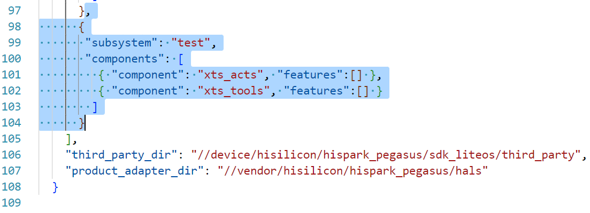
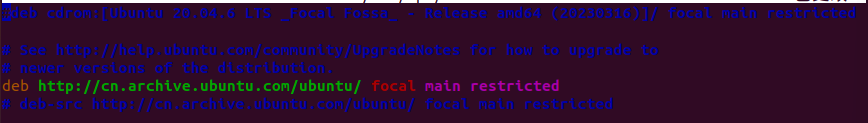

# OpenHarmony环境配置

> 基于命令行开发

## 安装必要库与工具

```shell
sudo apt-get update
sudo apt-get install build-essential gcc g++ make zlib* libffi-dev
```

```shell
sudo apt-get install e2fsprogs pkg-config flex bison perl bc openssl libssl-dev libelf-dev libc6-dev-amd64 binutils binutils-dev libdwarf-dev u-boot-tools mtd-utils gcc-arm-linux-gnueabi cpio device-tree-compiler
```

## 更改python源

```shell
which python3.8
```

```shell
sudo update-alternatives --install /usr/bin/python python /usr/bin/python3.8 1    #/usr/bin/python3.8为上一步查看的Python 3.8的位置
sudo update-alternatives --install /usr/bin/python3 python3 /usr/bin/python3.8 1   #/usr/bin/python3.8为上一步查看的Python 3.8的位置
```

## 配置华为云为pip的更新源

```shell
sudo apt install python3-pip
```

```shell
mkdir ~/.pip
pip3 config set global.index-url https://mirrors.huaweicloud.com/repository/pypi/simple
pip3 config set global.trusted-host mirrors.huaweicloud.com
pip3 config set global.timeout 120
```

## 安装编译和构建工具

**表1** Hi3861 WLAN模组需要安装的编译工具

| 开发工具                                                     | 用途         |
| :----------------------------------------------------------- | :----------- |
| SCons3.0.4+                                                  | 编译构建工具 |
| python模块：setuptools、kconfiglib、pycryptodome、six、ecdsa | 编译构建工具 |
| gcc riscv32                                                  | 编译构建工具 |

### scons

```shell
python3 -m pip install scons
#添加环境变量
echo 'export PATH=~/.local/bin:$PATH' | tee -a ~/.bashrc
source ~/.bashrc
```

```shell
# 验证
scons -v
```


### kconfiglib

```shell
pip3 install  kconfiglib
```

### pycryptodome和ecdsa

```shell
pip3 install pycryptodome ecdsa
```

### gcc riscv32

下载

```shell
wget https://repo.huaweicloud.com/harmonyos/compiler/gcc_riscv32/7.3.0/linux/gcc_riscv32-linux-7.3.0.tar.gz
```

解压到<kbd>home</kbd>目录

```shell
tar -xvf gcc_riscv32-linux-7.3.0.tar.gz -C ~/
```

删除压缩包

```shell
rm gcc_riscv32-linux-7.3.0.tar.gz
```

添加环境变量

```shell
echo 'export PATH=~/gcc_riscv32/bin:$PATH' | tee -a ~/.bashrc
source ~/.bashrc
```

## 安装Samba服务

```shell
sudo apt-get install samba
#打开配置文件
sudo nano /etc/samba/smb.conf   
```

将下列信息填入`smb.conf   `的最后一行

```
[home]
comment = User Homes
path = /home
guest ok = no
writable = yes
browsable = yes  
create mask = 0755
directory mask = 0755
```

指定共享账号

```shell
sudo smbpasswd -a username   #用户名为Ubuntu用户名。输入命令后，根据提示设置密码。
```

```shell
sudo service smbd restart
```

## 获取源码

### 安装git和git-lfs

```shell
#更新软件列表
sudo apt-get update
#安装git客户端和git-lfs
sudo apt-get install git git-lfs
```

### git用户配置

```shell
git config --global user.name "yourname"
git config --global user.email "your-email-address"
git config --global credential.helper store
```

### 安装repo和requests

```shell
wget https://gitee.com/oschina/repo/raw/fork_flow/repo-py3 
sudo mv repo-py3 /usr/local/bin/repo
sudo chmod a+x /usr/local/bin/repo
```

```shell
pip install requests
```

### 获取3.0.7LTS版本源码

创建源码存放文件夹

```shell
mkdir ~/OpenHarmony/3.0.7
cd ~/OpenHarmony/3.0.7
```

获取OpenHarmony-3.0.7-LTS源代码

```shell
#使用repo工具-初始化源码仓
repo init -u https://gitee.com/openharmony/manifest.git -b refs/tags/OpenHarmony-v3.0.7-LTS --no-repo-verify
#使用repo工具-同步源码仓
repo sync -c
#使用repo工具-拉取源码仓大型文件
repo forall -c 'git lfs pull'
```

## 完善编译环境

### 安装hb

在源码根目录打开终端

```shell
python3 -m pip install --user build/lite
echo 'export PATH=~/.local/bin:$PATH' | tee -a ~/.bashrc
source ~/.bashrc
hb -h
```

### 安装gn

```shell
#建立目录
mkdir -p ~/OpenHarmony/3.0.7/prebuilts/build-tools/linux-x86/bin/
#下载
wget https://repo.huaweicloud.com/harmonyos/compiler/gn/1717/linux/gn-linux-x86-1717.tar.gz
#安装
tar -xvf gn-linux-x86-1717.tar.gz -C ~/OpenHarmony/3.0.7/prebuilts/build-tools/linux-x86/bin/
#删除安装包
rm gn-linux-x86-1717.tar.gz
```

### 安装ninja

```shell
#下载
wget https://repo.huaweicloud.com/harmonyos/compiler/ninja/1.10.1/linux/ninja-linux-x86-1.10.1.tar.gz
#安装
tar -xvf ninja-linux-x86-1.10.1.tar.gz -C ~/OpenHarmony/3.0.7/prebuilts/build-tools/linux-x86/bin/
#删除安装包
rm ninja-linux-x86-1.10.1.tar.gz
```

## 编译源码

在终端进入源代码的根目录，如下图所示：


选择开发板

```shell
hb set
```

需要确认代码目录，我们已经在根目录，回车即可。然后，上下移动选择开发板


编译

```shell
hb build
```

## 烧录固件

> 使用hiburn


## 关闭默认测试输出

删除<kbd>vendor\hisilicon\hispark_pegasus\config.json</kbd>的如下内容



## AT命令联网

> 不要有多余的空格，否则容易错误

```shell
AT+STARTSTA				# 启动STA模式
AT+SCAN						# 扫描周边AP
AT+SCANRESULT				# 显示扫描结果
AT+CONN="pi",,2,"123456789"	# 连接指定AP
AT+STASTAT					# 查看连接结果
AT+DHCP=wlan0,1				# 通过DHCP向AP请求wlan0的IP地址
AT+IFCFG					# 查看开发板的IP地址
AT+PING=www.baidu.com
```

# 错误解析

```shell
更换介质：请把标有                     
 “Ubuntu 20.04.6 LTS _Focal Fossa_ - Release amd64 (20230316)”
的盘片插入驱动器“/cdrom/”再按「回车」键
```

```shell
# 打开sources.list
sudo nano /etc/apt/sources.list
```

注释第一行




