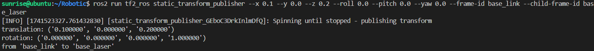
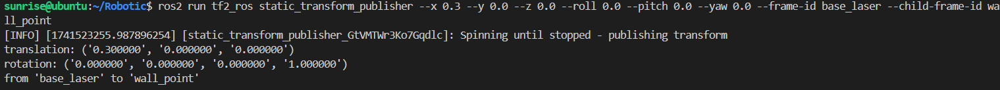
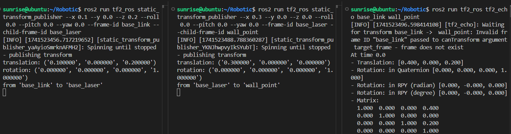
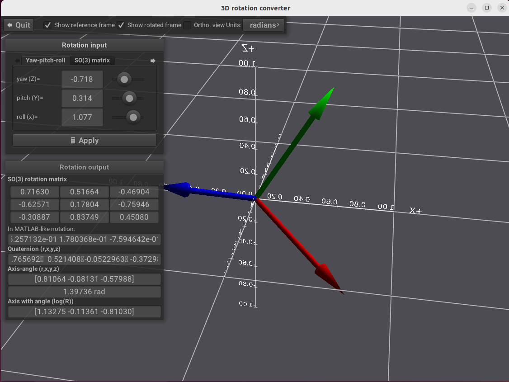
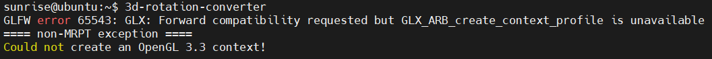

## 10.1 TF坐标变换工具

### 10.1.1 TF命令行

- [x] 假设，一个轮式机器人的中心坐标为 (0, 0, 0) ，雷达的的坐标为 (0.1, 0, 0.2) ，雷达检测到障碍物在 (0.3, 0, 0)。
- [x] 三个坐标分别用`base_link`、`base_laser`、`wall_point`代指。

在ROS2中，我们使用<kbd>tf2</kbd>（即第二代坐标变换工具）处理这些已知数据。

① 使用静态坐标变换发布`base_link`和`base_laser`之间的坐标关系。

```shell
ros2 run tf2_ros static_transform_publisher --x 0.1 --y 0.0 --z 0.2 --roll 0.0 --pitch 0.0 --yaw 0.0 --frame-id base_link --child-frame-id base_laser
```



其中`--roll 0.0 --pitch 0.0 --yaw 0.0`是欧拉角，分别为横滚角、俯仰角、偏航角。而命令行返回的`rotation`有四个数，这里是使用四元数来表示的旋转姿态。其中ROS中使用四元数居多，且欧拉角具有万向锁等确定，但易于看出旋转变化，所以在图形化界面多采用欧拉角展示旋转姿态。

② 使用静态坐标变换发布`base_laser`和`wall_point`之间的坐标关系。

```shell
ros2 run tf2_ros static_transform_publisher --x 0.3 --y 0.0 --z 0.0 --roll 0.0 --pitch 0.0 --yaw 0.0 --frame-id base_laser --child-frame-id wall_point
```



③ 计算坐标系关系

```shell
ros2 run tf2_ros tf2_echo base_link wall_point
```



其中，`Translation`即为转换结果，相对于`base_link`而言，`wall_point`的坐标位置。其余四项数据均是表示旋转姿态，`Quaternion`为四元数，`Matrix`为旋转矩阵，其他两项为弧度、角度单位下的欧拉角。

### 10.1.2 mrpt工具

**mrpt** 工具可以可视化的看到四元数、欧拉角下的姿态变化。

安装mrpt

```shell
sudo apt install mrpt-apps
```

打开工具

```shell
3d-rotation-converter
```



!!!danger  
   我在RDK X5安装成功，但打开会报错。建议在虚拟机使用此软件，无需浪费时间找原因，很麻烦。  
 
