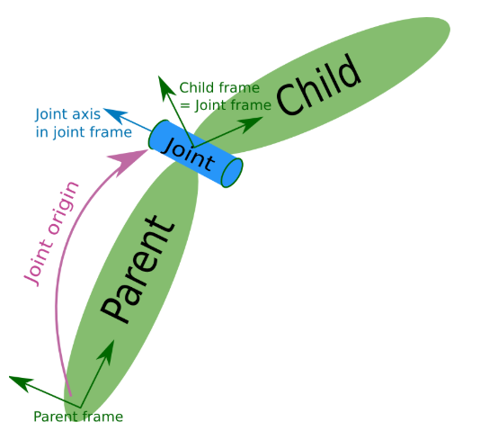
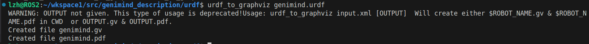
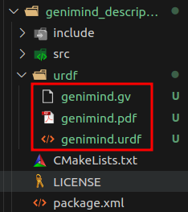
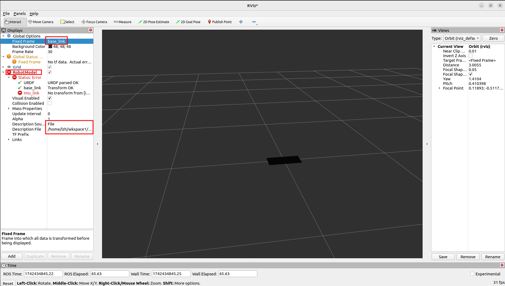
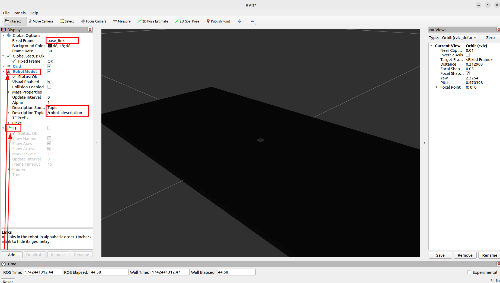
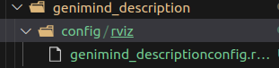

## 12.1 建模工具urdf

### 12.1.1 urdf简介

URDF 文件是一个标准的 XML 文件，在 ROS 中预定义了一系列的标签用于描述机器人模型，机器人模型可能较为复杂，但是 ROS 的 URDF 中机器人的组成却是较为简单的，可以有以下三种标签：

- <kbd>robot</kbd> ，这是整个 urdf 文件的根标签；
- <kbd>link</kbd> ，用于描述机器人刚体部分的标签；
- <kbd>joint</kbd> ，是用于连接不同刚体的“关节”。

### 12.1.2 robot标签

urdf 中为了保证 xml 语法的完整性，使用了robot标签作为根标签，所有的 link 和 joint 以及其他标签都必须包含在 robot 标签内。

属性：

- <kbd>name</kbd> ：用于指定机器人模型的名称。
  - 主文件必须具有名称属性， name 属性在被包含的文件中是可选的。如果在被包含文件中指定了属性名称，则它必须具有与主文件中相同的值。

```xml
<robot name="robot_name">

</robot>
```

### 12.1.3 link标签

urdf 中的 link 标签用于描述机器人某个部件(也即刚体部分)的外观和物理属性，比如: 机器人底座、轮子、激光雷达、摄像头等。每一个部件都对应一个 link, 在 link 标签内，可以设计该部件的形状、尺寸、颜色、惯性矩阵、碰撞参数等一系列属性。


属性：

- <kbd>name</kbd>：用于指定 link 的名称。

子标签：

- <kbd>visual</kbd>：用于描述 link 的可视化属性，可以设置link的形状。
  - <kbd>geometry</kbd>：设置 link 的形状。
    - box：立方体。
    - cylinder：圆柱体。
    - sphere：球体。
    - mesh：通过属性filename引用“皮肤”文件，为link设置外观，该文件必须是本地文件。使用 package://<packagename>/<path>为文件名添加前缀。
  - <kbd>origin</kbd>：设置 link 相对偏移量和旋转角度。
    - xyz：三个轴的偏移量。
    - rpy：欧拉角(roll、pitch、yaw)的角度。
  - <kbd>material</kbd>：材设置 link 的材料/材质。
    - name：材料名称。
    - color：材料的颜色，通过rgba(red/green/blue/alpha)参数指定，范围 [0, 1] 。
    - texture：材质的纹理，通过属性filename引用。
- <kbd>collision</kbd>：用于指定 link 的碰撞属性。可以与 link 的可视化属性一致，也可以不同。
  - <kbd>name</kbd>：用于指定碰撞属性的名称。
  - <kbd>geometry</kbd>：参考 visual 子标签的使用规则。
  - <kbd>origin</kbd>：参考 visual 子标签的使用规则。
- <kbd>inertial</kbd>：用于设置 link 的质量、质心位置和中心惯性特性，如果未指定，则默认为质量为 0 、惯性为 0 。
  - <kbd>origin</kbd>
  - <kbd>mass</kbd>：设置 link 的质量。
  - <kbd>inertia</kbd>

!!! warning  
    <kbd>collision</kbd> 和 <kbd>inertial</kbd> 在仿真环境下才需要使用到，如果只是在 rviz2 中集成 urdf，那么不必须为 link 定义这两个标签。

### 12.1.4 joint标签

urdf 中的 joint 标签用于描述机器人关节的运动学和动力学属性，还可以指定关节运动的安全极限，机器人的两个部件(分别称之为 parent link 与 child link)以 ”关节“ 的形式相连接，不同的关节有不同的运动形式: 旋转、滑动、固定、旋转速度、旋转角度限制等。



属性：

- <kbd>name</kbd>：为关节命名，名称需要唯一。

- <kbd>type</kbd>：设置关节类型。

  - continuous：旋转关节，可以绕单轴无限旋转。


  - revolute：旋转关节，类似于 continues，但是有旋转角度限制。


  - prismatic：滑动关节，沿某一轴线移动的关节，有位置极限。


  - planer：平面关节，允许在平面正交方向上平移或旋转。


  - floating：浮动关节，允许进行平移、旋转运动。


  - fixed：固定关节，不允许运动的特殊关节。

子标签：

- <kbd>parent</kbd>：指定父级 link 。

  - link：父级link的名称。

- <kbd>child</kbd>：指定子级 link 。

  - link：子级link的名称。

- <kbd>origin</kbd>：表示从父 link 到子 link 的转换，关节位于子 link 的原点。

  - xyz：各轴线上的偏移量。
  - rpy：各轴线上的偏移弧度。

- <kbd>axis</kbd>：用于设置围绕哪个关节轴运动，默认值为（1，0，0）

  - xyz：各轴线上的偏移量。

- <kbd>calibration</kbd>：关节的参考位置，用于校准关节的绝对位置。

  - rising：当关节向正方向移动时，该参考位置将触发上升沿。
  - falling：当关节向正方向移动时，该参考位置将触发下降沿。

- <kbd>dynamics</kbd>：指定接头物理特性的元素。这些值用于指定关节的建模属性，对仿真较为有用。

  - damping：关节的物理阻尼值，默认为0。
  - friction：关节的物理静摩擦值，默认为0。

- <kbd>limit</kbd>：（关节类型是 **revolute** 或 **prismatic** 时必须使用）。

  - lower：指定关节下限的属性（旋转关节以弧度为单位，棱柱关节以米为单位），如果关节是连续的，则省略。
  - upper：指定关节上限的属性（旋转关节以弧度为单位，棱柱关节以米为单位），如果关节是连续的，则省略。

  - effort：指定关节可受力的最大值。


  - velocity：用于设置最大关节速度（旋转关节以弧度每秒 [rad/s] 为单位，棱柱关节以米每秒 [m/s] 为单位）。

- <kbd>mimic</kbd>：模拟其他关节运动：value = multiplier * other_joint + offset 。

  - joint：指定要模拟的关节的名称。

  - multiplier：指定上述公式中的乘法因子。


  - offset：指定要在上述公式中添加的偏移量，默认为 0（旋转关节的单位是弧度，棱柱关节的单位是米）。

- <kbd>safety_controller</kbd>：安全控制器。
  - soft_lower_limit：指定安全控制器开始限制关节位置的下关节边界，此限制需要大于joint下限。
  - soft_upper_limit：指定安全控制器开始限制关节位置的关节上边界的属性，此限制需要小于joint上限。

  - k_position：指定位置和速度限制之间的关系。

  - k_velocity：指定力和速度限制之间的关系。

## 12.2 urdf简单使用

### 12.2.1 urdf建模示例

创建功能包

```shell
ros2 pkg create genimind_description --build-type ament_cmake --license Apache-2.0
```

在功能包下新建`urdf`目录，添加第一个文件`genimind.urdf`。

```xml
<?xml version="1.0"?>
<robot name="genimind">
    <!-- link_1:机器人身体部分 -->
    <link name="base_link">
        <!-- 外观描述 -->
        <visual>
            <!-- 1.沿着机器人几何中心的偏移和旋转分量 -->
            <origin xyz="0.0 0.0 0.0" rpy="0.0 0.0 0.0"/>
            <!-- 2.几何形状 -->
            <geometry>
                <!-- 单位是米 -->
                <box size="0.3 0.137 0.004"/>
            </geometry>
            <!-- 3.材料 -->
            <material name="carbon_fiber">
                <color rgba="0.05 0.05 0.05 1.0"/>
            </material>
        </visual>
    </link>
    <!-- link_2:惯性测量单元 -->
    <link name="imu_link">
        <visual>
            <origin xyz="0.0 0.0 0.0" rpy="0.0 0.0 0.0"/>
            <geometry>
                <box size="0.004 0.004 0.002"/>
            </geometry>
            <material name="black">
                <color rgba="0.5 0.5 0.5 0.5"/>
            </material>
        </visual>
    </link>
    <!-- joint_1 -->
    <joint name="joint_1" type="fixed">
        <origin xyz="0.0 0.0 0.002" rpy="0.0 0.0 0.0"/>
        <parent link="base_link"/>
        <child link="imu_link"/>
    </joint>
</robot>
```

进入`genimind_description/urdf`目录，输入以下命令：

```shell
urdf_to_graphviz genimind.urdf
```



新增两个文件，可以点开pdf瞅瞅，以树形结构显示了link与joint的关系。



然后我们启动`rviz2`加载模型会发现TF错误，是因为我们写的`joint`未成功加载。



### 12.2.2 rviz中加载模型

要成功加载urdf模型，我们需要使用两个话题，`robot_state_publisher`和`joint_state_publisher`，而话题内容无需我们自己写，安装对应的库即可。

```shell
sudo apt install ros-humble-joint-state-publisher
```

```shell
sudo apt install ros-humble-robot-state-publisher
```

然后在功能包`genimind_description`下新建`launch`目录，我们需要封装两个话题需要的指令以及自动启动`rviz2`。

```python
import launch
import launch_ros
from ament_index_python.packages import get_package_share_directory
import launch_ros.parameter_descriptions


def generate_launch_description():
    # 获取urdf功能包的路径
    urdf_pkg_path = get_package_share_directory("genimind_description")
    # 获取urdf文件的路径
    urdf_file_path = urdf_pkg_path + "/urdf/genimind.urdf"

    # 声明一个urdf文件路径的参数
    action_declare_arg_urdf_path = launch.actions.DeclareLaunchArgument(
        "urdf", 
        default_value=urdf_file_path,
        description="urdf文件的绝对路径"
    )

    # 1.获取指令的返回内容
    substitutions_cmd = launch.substitutions.Command(
        ["cat ", launch.substitutions.LaunchConfiguration("urdf")]
    )
    # 2.获取指令的返回内容(多一次类型转换)
    robot_description = launch_ros.parameter_descriptions.ParameterValue(
        substitutions_cmd,
        value_type=str
    )

    # robot_state_publisher话题节点启动
    robot_state_publisher_node = launch_ros.actions.Node(
        package="robot_state_publisher",
        executable="robot_state_publisher",
        parameters=[{"robot_description": robot_description}]
    )
    # joint_state_publisher话题节点启动
    joint_state_publisher_node = launch_ros.actions.Node(
        package="joint_state_publisher",
        executable="joint_state_publisher",
    )
    # rviz节点启动
    rviz_node = launch_ros.actions.Node(
        package="rviz2",
        executable="rviz2"
    )

    # 合成启动描述
    launch_description = launch.LaunchDescription([
        action_declare_arg_urdf_path,
        joint_state_publisher_node,
        robot_state_publisher_node,
        rviz_node
    ])
    return launch_description

```

`rviz`加载`urdf`模型程序有几点需要注意：

🕐`robot_state_publisher`话题需要一个`robot_description`参数。

可以使用`ros2 run robot_state_publisher robot_state_publisher --debug`查看报错输出，显示这个参数是URDF文件。


🕑`robot_description`参数并未传文件路径，而是使用`cat`指令传入了文件内容。

按照报错注释应是传入文件才对，但实测按照 fishros 书籍直接传入文件内容才不会报错。

🕒`launch.substitutions.Command`获取命令的返回值，字符串类型。`launch_ros.parameter_descriptions.ParameterValue`可以更该参数类型，因此`robot_description`参数传入 robot_description 变量或 substitutions_cmd 变量结果均对。

🕓`rivz`除了直接输入`rviz2`还可以使用`ros2 run rviz2 rviz2`运行，所以可以使用`launch_ros.actions.Node`方式启动。

****

配置`CmakeLists.txt`文件

```cmake
# 安装launch urdf目录
install(DIRECTORY launch urdf
  DESTINATION share/${PROJECT_NAME}
)
```

运行launch文件：

```shell
colcon build --packages-select genimind_description
source install/setup.bash
ros2 launch genimind_description genimind_model.launch.py
```



### 12.2.3 初始化rviz

🕐将添加过`TF`、`RobotModel`组件的rviz保存到功能包下config目录下。



🕑在launch中添加参数。

```python
# 获取rviz初始化文件路径
rviz_config_path = urdf_pkg_path + "/config/rviz/genimind_descriptionconfig.rviz"
# rviz节点启动
rviz_node = launch_ros.actions.Node(
    package="rviz2",
    executable="rviz2",
    arguments=['-d', rviz_config_path]
)
```

完整程序：

```python
import launch
import launch_ros
from ament_index_python.packages import get_package_share_directory
import launch_ros.parameter_descriptions


def generate_launch_description():
    # 获取urdf功能包的路径
    urdf_pkg_path = get_package_share_directory("genimind_description")
    # 获取urdf文件的路径
    urdf_file_path = urdf_pkg_path + "/urdf/genimind.urdf"
    # 获取rviz初始化文件路径
    rviz_config_path = urdf_pkg_path + "/config/rviz/genimind_descriptionconfig.rviz"

    # 声明一个urdf文件路径的参数
    action_declare_arg_urdf_path = launch.actions.DeclareLaunchArgument(
        "urdf", 
        default_value=urdf_file_path,
        description="urdf文件的绝对路径"
    )

    # 1.获取指令的返回内容
    substitutions_cmd = launch.substitutions.Command(
        ["cat ", launch.substitutions.LaunchConfiguration("urdf")]
    )
    # 2.获取指令的返回内容(多一次类型转换)
    robot_description = launch_ros.parameter_descriptions.ParameterValue(
        substitutions_cmd,
        value_type=str
    )

    # robot_state_publisher话题节点启动
    robot_state_publisher_node = launch_ros.actions.Node(
        package="robot_state_publisher",
        executable="robot_state_publisher",
        parameters=[{"robot_description": robot_description}]
    )
    # joint_state_publisher话题节点启动
    joint_state_publisher_node = launch_ros.actions.Node(
        package="joint_state_publisher",
        executable="joint_state_publisher",
    )
    # rviz节点启动
    rviz_node = launch_ros.actions.Node(
        package="rviz2",
        executable="rviz2",
        arguments=['-d', rviz_config_path]
    )

    # 合成启动描述
    launch_description = launch.LaunchDescription([
        action_declare_arg_urdf_path,
        joint_state_publisher_node,
        robot_state_publisher_node,
        rviz_node
    ])
    return launch_description

```

配置`CmakeLists.txt`文件

```cmake
# 安装config目录
install(DIRECTORY launch urdf
  DESTINATION share/${PROJECT_NAME}
)
```

这样每次启动就不用重复添加组件了。

```shell
colcon build --packages-select genimind_description
source install/setup.bash
ros2 launch genimind_description genimind_model.launch.py
```

