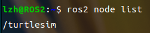

# 第四章 工作空间与功能包

## 4.1 ROS2的节点

### 4.1.1 节点介绍

每一个节点即是一个模块化的功能，各个节点通过四个通信机制进行信息通信交互

**ROS2有四种通信方式：**

- **话题：** 是一种单向通信模型，在通信双方中，发布方发布数据，订阅方订阅数据，数据流单向的由发布方传输到订阅方。
- **服务：** 是一种基于请求响应的通信模型，在通信双方中，客户端发送请求数据到服务端，服务端响应结果给客户端。
- **动作：** 是一种带有连续反馈的通信模型，在通信双方中，客户端发送请求数据到服务端，服务端响应结果给客户端，但是在服务端接收到请求到产生最终响应的过程中，会发送连续的反馈信息到客户端。
- **参数：** 是一种基于共享的通信模型，在通信双方中，服务端可以设置数据，而客户端可以连接服务端并操作服务端数据。

下面是官方给的图：


### 4.1.2 启动节点

终端指令：

```shell
ros2 run <package_name> <executable_name>
```

package_name--功能包的名称       executable_name--可执行文件（即功能包下的 **节点** ）

举例：启动小乌龟节点

```shell
ros2 run turtlesim turtlesim_node
```

### 4.1.3 节点常用的命令行指令

查看节点列表(**已经启用的节点**)：

```shell
ros2 node list
```

如下图，打开<kbd>turtlesim</kbd>下的<kbd>turtlesim_node</kbd>节点，可以查看到节点<kbd>turtlesim</kbd>



查看节点信息，注意节点名称有`/`：

```shell
ros2 node info <node_name> 
```


重映射节点名称：

```shell
ros2 run turtlesim turtlesim_node --ros-args --remap __node:=my_turtle
```

## 4.2 ROS2的功能包与工作空间

> **注意：一个工作空间下可以有多个功能包，一个功能包可以有多个节点存在**

### 4.2.1 ROS2编译工具colcon

#### 1. 什么是colcon

> colcon想当于ros1中的catkin编译工具。

#### 2. 安装colcon工具

```shell
sudo apt-get install python3-colcon-common-extensions
```

#### 3. colcon相关指令

> pkg_name属于 **变量** ，即功能包的名称

只编译一个包

```shell
colcon build --packages-select 'pkg_name' 
```

不编译测试单元

```shell
colcon build --packages-select 'pkg_name'  --cmake-args -DBUILD_TESTING=0
```

运行编译的包的测试

```shell
colcon test
```

允许通过更改src下的部分文件来改变install（重要），每次调整 python 脚本时都不必重新build了

```shell
colcon build --symlink-install
```

### 4.2.2 创建工作空间

安装编译工具，后面有具体介绍<kbd>colcon</kbd>编译工具

```shell
sudo apt-get install python3-colcon-common-extensions
```

创建 **工作空间** 文件夹，并编译文件夹，编译以后，会多出`build` 、`install `、 `log` 三个文件夹

> mkdir： 创建一个目录，mkdir -p ：递归创建目录，即使上级目录不存在，会按目录层级自动创建目录

```shell
mkdir -p wkspace1/src # 递归创建目录
cd wkspace1 # 进入文件夹
colcon build # 编译
```

准备好工作空间以后就可以进行功能包的创建和程序的编写，分别使用C++和Python编程语言

### 4.2.3 Python示例

！！！进入`wkspace1/src`目录

```shell
cd src
```


#### 1. 创建功能包

```shell
ros2 pkg create helloworld_py --build-type ament_python  --dependencies rclpy  --node-name helloworld
```

**参数介绍：**

- `helloworld_py`----功能包的名称
- `--build-type`----编译方式，**ament_python** 和 **ament_cmake** 分别用于python和C++
- `--dependencies`----依赖名称， **rclpy** 和 **rclcpp** 分别用于python和C++
- `--node-name`----节点名称 ，可以在创建功能包的时候创建一个节点，也可以选择自己手动添加

创建功能包以后会出现一个警告“未知的许可证”


这个经过不影响后续操作，根据不舒服，添加一个许可证即可消除警告

```shell
ros2 pkg create helloworld_py --build-type ament_python  --dependencies rclpy  --node-name helloworld --license Apache-2.0
```

#### 2. 程序源码

```python
import rclpy

def main():
    # 初始化 ROS2
    rclpy.init()
    # 创建节点
    node = rclpy.create_node("helloworld_node")
    # 输出文本
    node.get_logger().error("damage world!")
    rclpy.spin(node)
    # 释放资源
    rclpy.shutdown()


if __name__ == '__main__':
    main()
```

#### 3. 修改setup.py

`helloworld = helloworld_py.helloworld:main` 即 <kbd>映射名称 = 功能包名称.源代码文件名称:函数名称</kbd>，”映射名称“是在终端运行可执行文件时后使用的名称。

```python
from setuptools import setup

package_name = 'pkg02_helloworld_py'

setup(
    name=package_name,
    version='0.0.0',
    packages=[package_name],
    data_files=[
        ('share/ament_index/resource_index/packages',
            ['resource/' + package_name]),
        ('share/' + package_name, ['package.xml']),
    ],
    install_requires=['setuptools'],
    zip_safe=True,
    maintainer='ros2',
    maintainer_email='ros2@todo.todo',
    description='TODO: Package description',
    license='TODO: License declaration',
    tests_require=['pytest'],
    entry_points={
        'console_scripts': [
            # 映射源文件与可执行文件
            'helloworld = helloworld_py.helloworld:main'
        ],
    },
)
```

#### 4. 编译运行节点

打开vscode或终端，进入`wkspace1`目录：

**编译功能包**

```shell
colcon build
```

**source环境**

```shell
source install/setup.bash
```

**运行节点**

```shell
ros2 run helloworld_py hello_node
```

#### 5. 节点混淆错误解释

初学者很容易弄混，`setup.py`中的 **映射名称** `helloworld`，和源代码中的`rclpy.create_node("helloworld_node")`中的`helloworld_node`都是节点。但事实上，`helloworld`是映射源文件与可执行文件的一个别称，仅用于终端运行可执行文件时使用；而`helloworld_node`才是真正的节点名称，即可以用<kbd>ros2 node list</kbd>查到的节点，如下图：


### 4.2.4 C++示例

！！！进入`wkspace1/src`目录

```shell
cd src
```


#### 1. 创建功能包

```shell
ros2 pkg create helloworld_cpp --build-type ament_cmake  --dependencies rclcpp  --node-name helloworld --license Apache-2.0
```

> 为什么添加`license`参数在python那一章有介绍，可以往上翻一翻

**参数介绍：**

- `helloworld_py`----功能包的名称
- `--build-type`----编译方式， **ament_python** 和 **ament_cmake** 分别用于python和C++
- `--dependencies`----依赖名称，**rclpy** 和 **rclcpp** 分别用于python和C++
- `--node-name`----节点名称 ，可以在创建功能包的时候创建一个节点，也可以选择自己手动添加

#### 2. 程序源码

```c++
#include "rclcpp/rclcpp.hpp"

int main(int argc, char ** argv)
{
  // 初始化 ROS2
  rclcpp::init(argc,argv);
  // 创建节点
  auto node = rclcpp::Node::make_shared("helloworld_node");
  // 输出文本
  RCLCPP_INFO(node->get_logger(),"hello world!");
  // 释放资源
  rclcpp::shutdown();
  return 0;
}
```

#### 3. 修改CMakeLists.txt

```cmake
cmake_minimum_required(VERSION 3.8)
project(pkg01_helloworld_cpp)

if(CMAKE_COMPILER_IS_GNUCXX OR CMAKE_CXX_COMPILER_ID MATCHES "Clang")
  add_compile_options(-Wall -Wextra -Wpedantic)
endif()

# find dependencies
find_package(ament_cmake REQUIRED)
# 引入外部依赖包
find_package(rclcpp REQUIRED)

# 映射源文件与可执行文件
add_executable(helloworld src/helloworld.cpp)
# 设置目标依赖库
ament_target_dependencies(
  helloworld
  "rclcpp"
)
# 定义安装规则
install(TARGETS helloworld
  DESTINATION lib/${PROJECT_NAME})

if(BUILD_TESTING)
  find_package(ament_lint_auto REQUIRED)
  # the following line skips the linter which checks for copyrights
  # comment the line when a copyright and license is added to all source files
  set(ament_cmake_copyright_FOUND TRUE)
  # the following line skips cpplint (only works in a git repo)
  # comment the line when this package is in a git repo and when
  # a copyright and license is added to all source files
  set(ament_cmake_cpplint_FOUND TRUE)
  ament_lint_auto_find_test_dependencies()
endif()

ament_package()
```

#### 4. 编译运行节点

打开vscode或终端，进入`wkspace1`目录：

**编译单个功能包**

```shell
colcon build --packages-select 'helloworld_cpp'
```


**source环境**

```shell
source install/setup.bash
```

**运行节点**

```shell
ros2 run helloworld_py hello_node
```

### 4.2.5 运行优化

每次终端中执行工作空间下的节点时，都需要调用`. install/setup.bash`指令，使用不便，优化策略是，可以将该指令的调用添加进`~/setup.bash`，操作格式如下：

```shell
echo "source /{工作空间路径}/install/setup.bash" >> ~/.bashrc
```

示例：

```shell
echo "source /home/lzh/wkspace1/install/setup.bash" >> ~/.bashrc
```

### 4.2.6 面向过程编程

面向过程编程即是C++和Python的一大特点，同时也是ROS2区分于ROS的编程风格差异。

#### 1. Python

```python
#!/usr/bin/env python3
import rclpy
from rclpy.node import Node


class TestNode(Node):
    """
    继承Node类,并创建一个节点,打印节点名称
    """
    def __init__(self, node):
        super().__init__(node)
        self.node = node
        self.get_logger().info(f"节点名称为{self.node}")


def main(args=None):
    """
    ros2运行该节点的入口函数
    """
    rclpy.init(args=args) # 初始化rclpy
    node = TestNode("helloworld_node")  # 新建一个节点
    rclpy.spin(node) # 保持节点运行，检测是否收到退出指令（Ctrl+C）
    rclpy.shutdown() # 关闭rclpy

```


#### 2. C++

```cpp
#include "rclcpp/rclcpp.hpp"
#include <string>

using  namespace std;
/*
    创建一个类节点，名字叫做TestNode,继承自Node.
*/
class TestNode : public rclcpp::Node
{

public:
    // 构造函数,有一个参数为节点名称
    TestNode(string name) : Node(name)
    {
        // 打印一句自我介绍
        RCLCPP_INFO(this->get_logger(), "节点的名称为:%s.",name.c_str());
    }

};

int main(int argc, char **argv)
{
    rclcpp::init(argc, argv);
    /*产生一个Wang2的节点*/
    auto node = make_shared<TestNode>("helloworld_node");
    /* 运行节点，并检测退出信号*/
    rclcpp::spin(node);
    rclcpp::shutdown();
    return 0;
}

```

