### 1.1 定时器与定时中断（Timer）

#### 1.1.1 TIM简介

- **TIM（Timer）定时器**
- **定时器可以对输入的时钟进行计数，并在计数值达到设定值时触发中断**
- **16位计数器、预分频器、自动重装寄存器的时基单元，在72MHz计数时钟下可以实现最大59.65s的定时**
- **不仅具备基本的定时中断功能，而且还包含内外时钟源选择、输入捕获、输出比较、编码器接口、主从触发模式等多种功能**
- **根据复杂度和应用场景分为了高级定时器、通用定时器、基本定时器三种类型**

**定时器类型**

| 类型       | **编号**               | **总线** | **功能**                                                     |
| :--------- | ---------------------- | -------- | ------------------------------------------------------------ |
| 高级定时器 | TIM1、TIM8             | APB2     | 拥有通用定时器全部功能，并额外具有重复计数器、死区生成、互补输出、刹车输入等功能 |
| 通用定时器 | TIM2、TIM3、TIM4、TIM5 | APB1     | 拥有基本定时器全部功能，并额外具有内外时钟源选择、输入捕获、输出比较、编码器接口、主从触发模式等功能 |
| 基本定时器 | TIM6、TIM7             | APB1     | 拥有定时中断、主模式触发DAC的功能                            |

> 不同的芯片拥有的定时器资源不同，例如STM32F103C8T6定时器资源：TIM1、TIM2、TIM3、TIM4

#### 1.1.2 定时器框架

##### 1、高级定时器框图

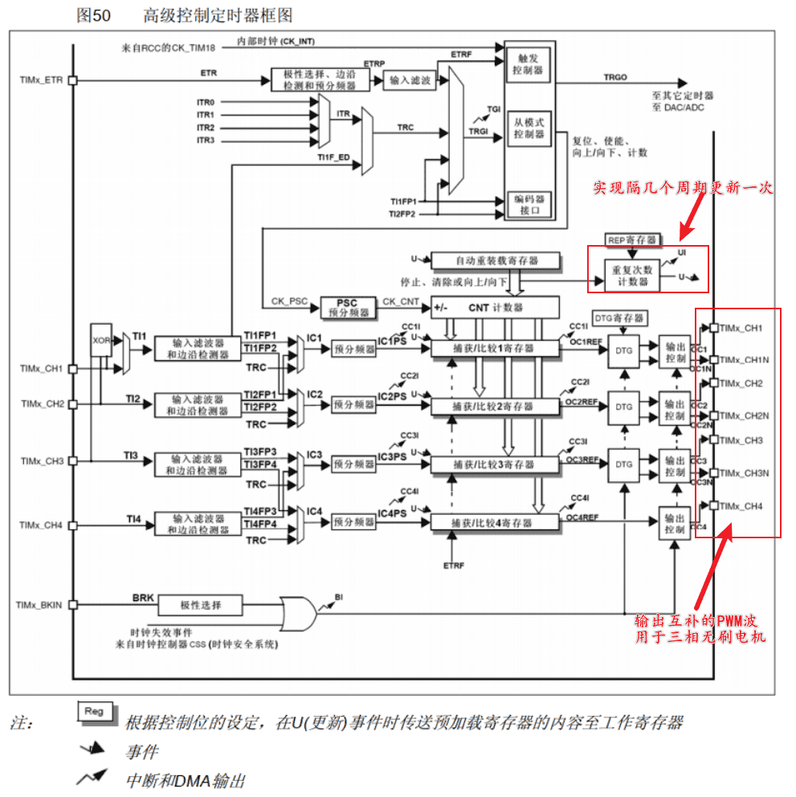

##### 2、通用定时器

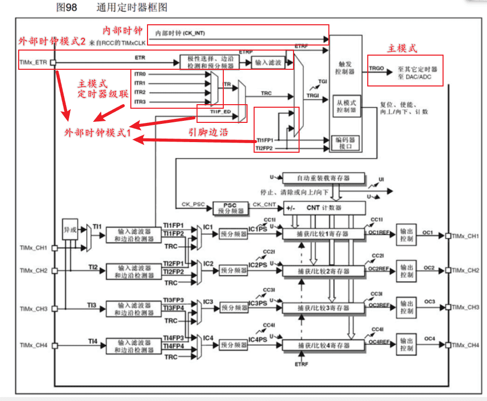

- 通用定时器有多种时钟选择（外部时钟模式1、2，内部时钟）
- 定时器级联与主从模式相关。（参考：[1.3.4 主从触发模式](#1.3.4 主从触发模式)）

##### 3、基本定时器

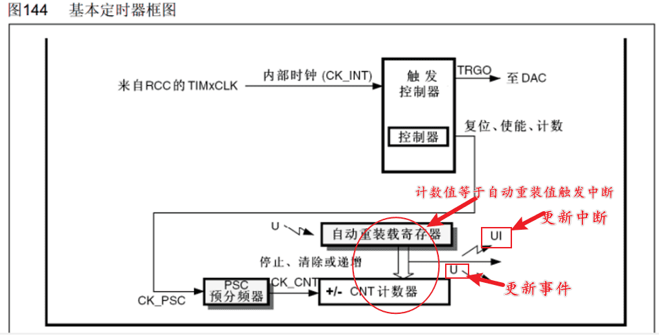

> ⚠：--基本定时器仅支持向上计数--时钟选择也仅支持内部时钟，为72MHZ

#### 1.1.3 定时中断基本结构

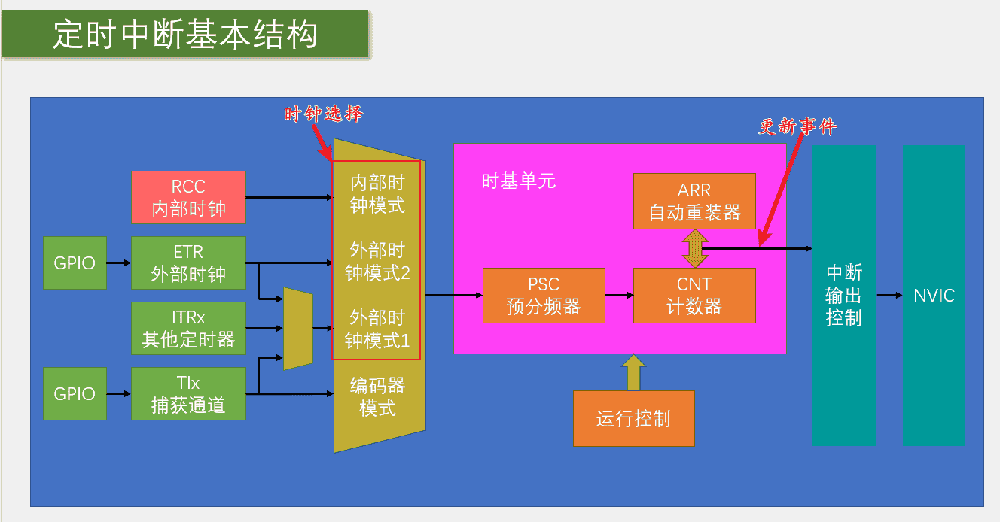

#### 1.1.4 时序图

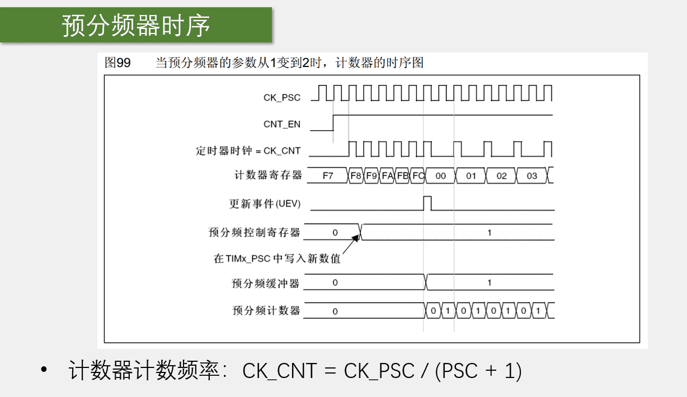

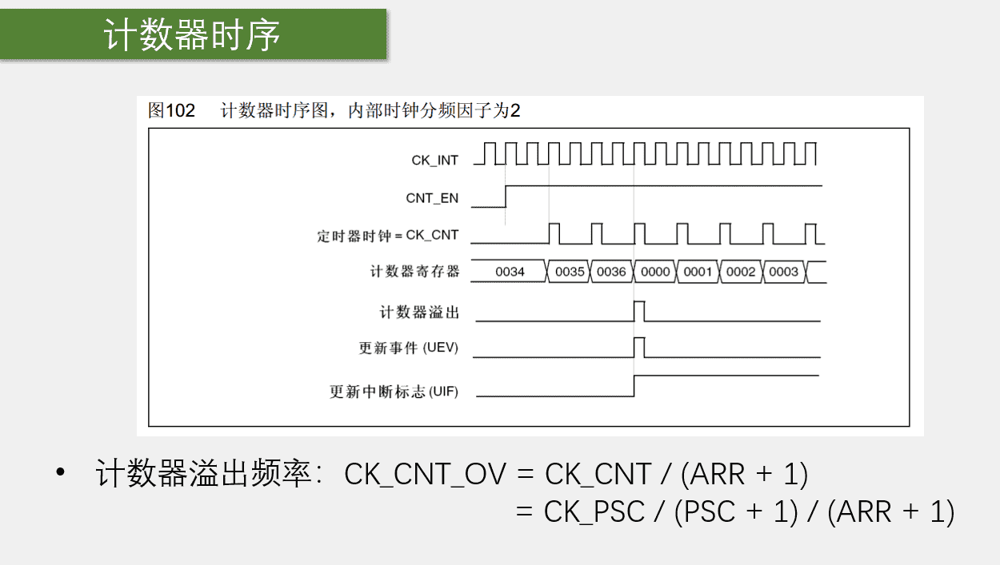

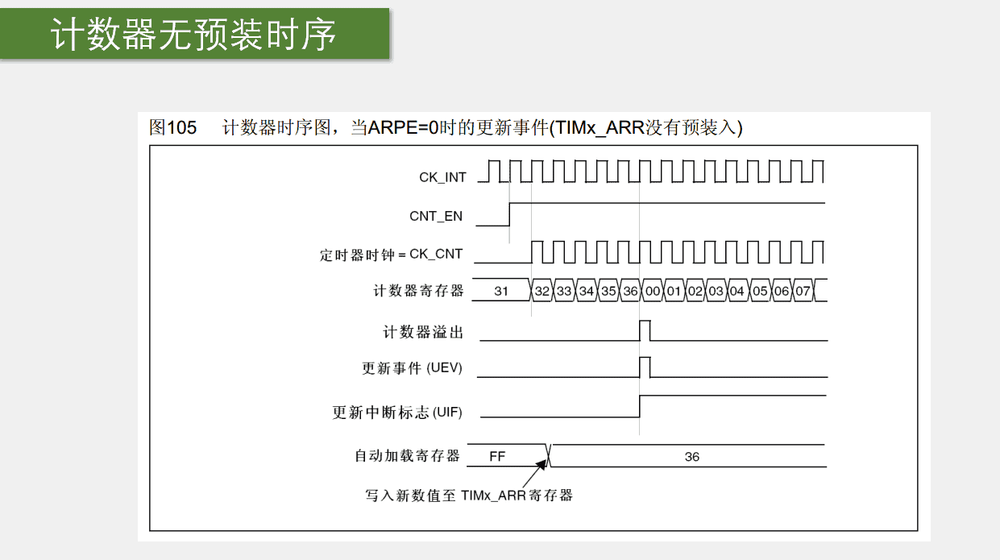

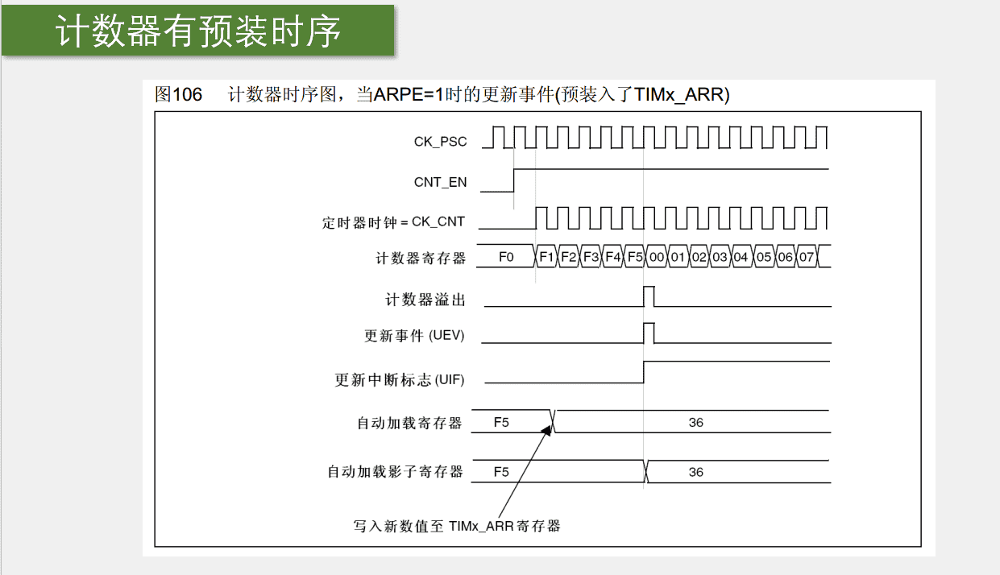

#### 1.1.5 RCC时钟树

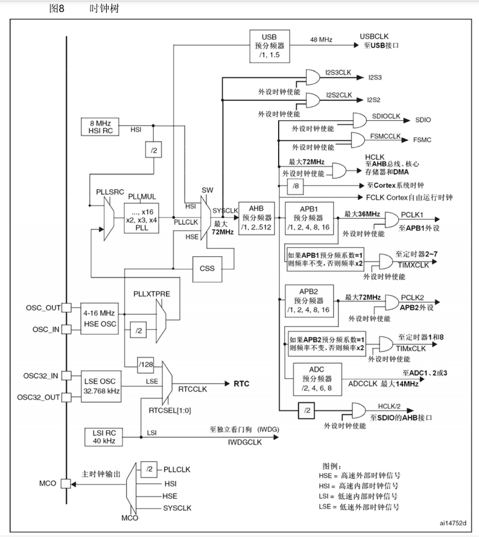

#### 1.1.6 代码示例(标准库)

```c
#include "stm32f10x.h"                  // Device header

/**
  * 函    数：定时中断初始化
  * 参    数：无
  * 返 回 值：无
  */
void Timer_Init(void)
{
	/*开启时钟*/
	RCC_APB1PeriphClockCmd(RCC_APB1Periph_TIM2, ENABLE);			//开启TIM2的时钟
	
	/*配置时钟源*/
	TIM_InternalClockConfig(TIM2);		//选择TIM2为内部时钟，若不调用此函数，TIM默认也为内部时钟
	
	/*时基单元初始化*/
	TIM_TimeBaseInitTypeDef TIM_TimeBaseInitStructure;				//定义结构体变量
	TIM_TimeBaseInitStructure.TIM_ClockDivision = TIM_CKD_DIV1;		//时钟分频，选择不分频
	TIM_TimeBaseInitStructure.TIM_CounterMode = TIM_CounterMode_Up;//计数器模式，选择向上计数
	TIM_TimeBaseInitStructure.TIM_Period = 10000 - 1;				//计数周期，即ARR的值
	TIM_TimeBaseInitStructure.TIM_Prescaler = 7200 - 1;				//预分频器，即PSC的值
	TIM_TimeBaseInitStructure.TIM_RepetitionCounter = 0;	//重复计数器，高级定时器才会用到
	TIM_TimeBaseInit(TIM2, &TIM_TimeBaseInitStructure);				
	
	/*中断输出配置*/
	TIM_ClearFlag(TIM2, TIM_FLAG_Update);						
    /*清除定时器更新标志位TIM_TimeBaseInit函数末尾，
    手动产生了更新事件若不清除此标志位，则开启中断后，
    会立刻进入一次中断如果不介意此问题，则不清除此标志位也可*/
	
	TIM_ITConfig(TIM2, TIM_IT_Update, ENABLE);					//开启TIM2的更新中断
	
	/*NVIC中断分组*/
	NVIC_PriorityGroupConfig(NVIC_PriorityGroup_2);				//配置NVIC为分组2
	/*即抢占优先级范围：0~3，响应优先级范围：0~3
	此分组配置在整个工程中仅需调用一次
	若有多个中断，可以把此代码放在main函数内，while循环之前
	若调用多次配置分组的代码，则后执行的配置会覆盖先执行的配置*/
	
	/*NVIC配置*/
	NVIC_InitTypeDef NVIC_InitStructure;						//定义结构体变量
	NVIC_InitStructure.NVIC_IRQChannel = TIM2_IRQn;				//选择配置NVIC的TIM2线
	NVIC_InitStructure.NVIC_IRQChannelCmd = ENABLE;				//指定NVIC线路使能
	NVIC_InitStructure.NVIC_IRQChannelPreemptionPriority = 2;	//指定NVIC线路的抢占优先级为2
	NVIC_InitStructure.NVIC_IRQChannelSubPriority = 1;			//指定NVIC线路的响应优先级为1
	NVIC_Init(&NVIC_InitStructure);							
	
	/*TIM使能*/
	TIM_Cmd(TIM2, ENABLE);			//使能TIM2，定时器开始运行
}

/* 定时器中断函数，可以复制到使用它的地方
void TIM2_IRQHandler(void)
{
	if (TIM_GetITStatus(TIM2, TIM_IT_Update) == SET)
	{
		
		TIM_ClearITPendingBit(TIM2, TIM_IT_Update);
	}
}
*/

```


### 1.2 输出比较（Output Compare）

#### 1.2.1 输出比较介绍

- **OC（Output Compare）输出比较**
- **输出比较可以通过比较CNT与CCR寄存器值的关系，来对输出电平进行置1、置0或翻转的操作，用于输出一定频率和占空比的PWM波形**
- **每个高级定时器和通用定时器都拥有4个输出比较通道**
- **高级定时器的前3个通道额外拥有死区生成和互补输出的功能**（用于驱动三相无刷电机）

#### 1.2.2 PWM简介

- PWM（Pulse Width Modulation）脉冲宽度调制

- 在具有惯性的系统中，可以通过对一系列脉冲的宽度进行调制，来等效地获得所需要的模拟参量，常应用于电机控速等领域

- PWM参数：

  ​      ⭐频率 = 1 / T_S            ⭐占空比 = T_ON / T_S           分辨率 = 占空比变化步距

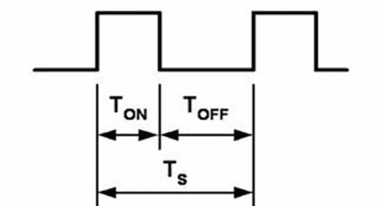


#### 1.2.3 输出比较通道

**高级定时器输出比较通道：**

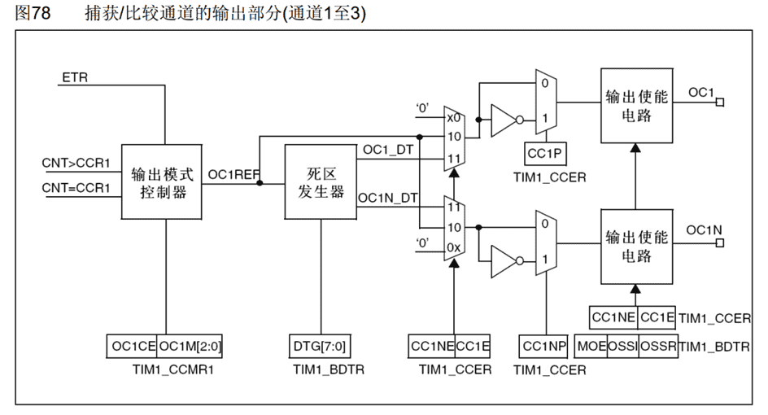

**通用定时器输出比较通道：**

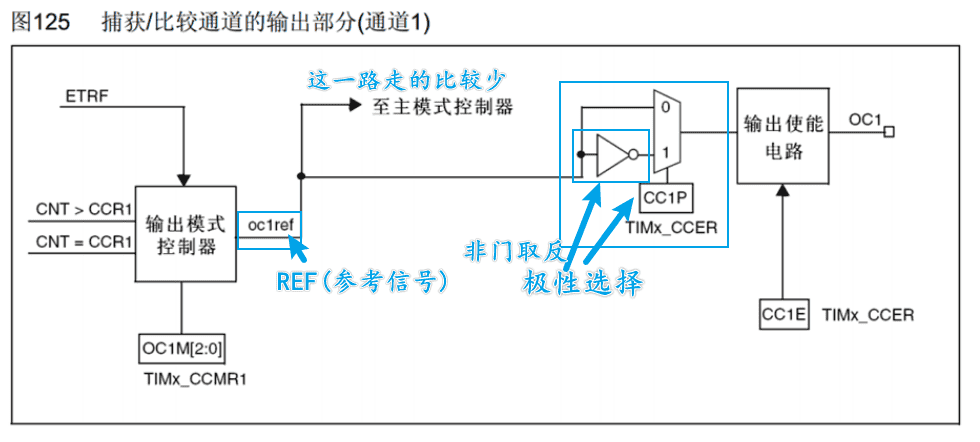

> 关于定时器主模式控制器参考[1.3.4 主从触发模式](#1.3.4 主从触发模式)

#### 1.2.4 输出比较模式

| **模式**         | **描述**                                                     |
| :--------------- | ------------------------------------------------------------ |
| 冻结             | CNT=CCR时，REF保持为原状态                                   |
| 匹配时置有效电平 | CNT=CCR时，REF置有效电平                                     |
| 匹配时置无效电平 | CNT=CCR时，REF置无效电平                                     |
| 匹配时电平翻转   | CNT=CCR时，REF电平翻转                                       |
| 强制为无效电平   | CNT与CCR无效，REF强制为无效电平                              |
| 强制为有效电平   | CNT与CCR无效，REF强制为有效电平                              |
| PWM模式1         | 向上计数：CNT<CCR时，REF置有效电平，CNT≥CCR时，REF置无效电平   向下计数：CNT>CCR时，REF置无效电平，CNT≤CCR时，REF置有效电平 |
| PWM模式2         | 向上计数：CNT<CCR时，REF置无效电平，CNT≥CCR时，REF置有效电平   向下计数：CNT>CCR时，REF置有效电平，CNT≤CCR时，REF置无效电平 |

#### 1.2.5 PWM基本结构

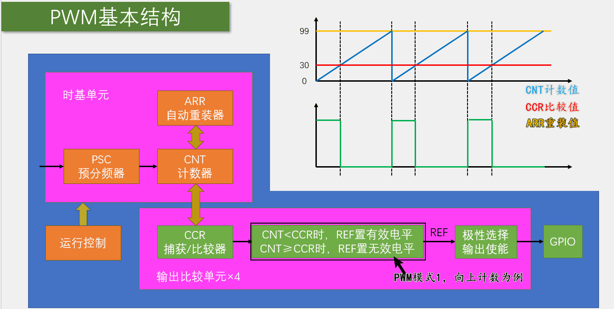

- PWM频率：  Freq = CK_PSC / (PSC + 1) / (ARR + 1)
- PWM占空比：  Duty = CCR / (ARR + 1)
- PWM分辨率： Reso = 1 / (ARR+ 1)

> 关于参数介绍---
>
> CK_PSC--时钟频率：APB1为36MHZ，APB2为72MHZ
>
> PSC --预分频值：代码设置
>
> ARR --自动重装值：代码设置
>
> CNT--定时器计数值：按时钟频率计数

#### 1.2.6 硬件介绍（舵机、TB6612芯片）

- **舵机**

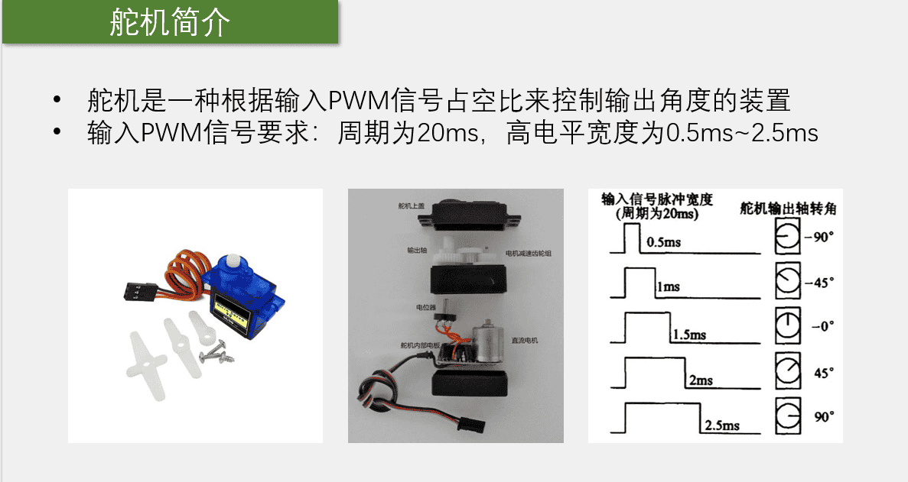

- **TB6612直流电机驱动**

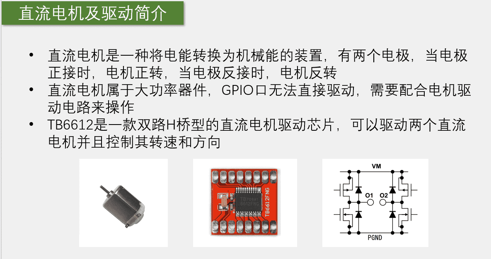

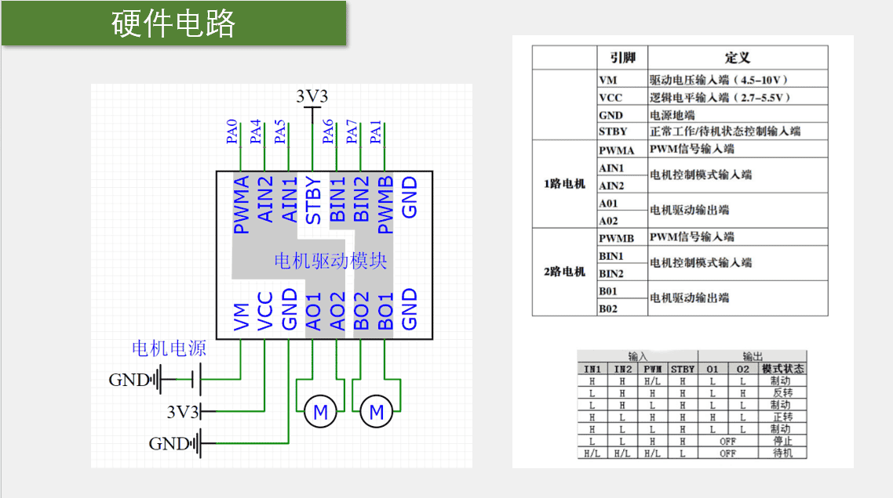

#### 1.2.7 代码示例(标准库)

```c
#include "stm32f10x.h"                  // Device header

/**
  * 函    数：PWM初始化
  * 参    数：无
  * 返 回 值：无
  */
void PWM_Init(void)
{
	/*开启时钟*/
	RCC_APB1PeriphClockCmd(RCC_APB1Periph_TIM2, ENABLE);			//开启TIM2的时钟
	RCC_APB2PeriphClockCmd(RCC_APB2Periph_GPIOA, ENABLE);			//开启GPIOA的时钟
	
	/*GPIO初始化*/
	GPIO_InitTypeDef GPIO_InitStructure;
	GPIO_InitStructure.GPIO_Mode = GPIO_Mode_AF_PP;
	GPIO_InitStructure.GPIO_Pin = GPIO_Pin_1;
	GPIO_InitStructure.GPIO_Speed = GPIO_Speed_50MHz;
	GPIO_Init(GPIOA, &GPIO_InitStructure);							//将PA1引脚初始化为复用推挽输出	
																	//受外设控制的引脚，均需要配置为复用模式
	
	/*配置时钟源*/
	TIM_InternalClockConfig(TIM2);		//选择TIM2为内部时钟，若不调用此函数，TIM默认也为内部时钟
	
	/*时基单元初始化*/
	TIM_TimeBaseInitTypeDef TIM_TimeBaseInitStructure;				//定义结构体变量
	TIM_TimeBaseInitStructure.TIM_ClockDivision = TIM_CKD_DIV1;     //时钟分频，选择不分频
	TIM_TimeBaseInitStructure.TIM_CounterMode = TIM_CounterMode_Up; //选择向上计数
	TIM_TimeBaseInitStructure.TIM_Period = 20000 - 1;				//计数周期，即ARR的值
	TIM_TimeBaseInitStructure.TIM_Prescaler = 72 - 1;				//预分频器，即PSC的值
	TIM_TimeBaseInitStructure.TIM_RepetitionCounter = 0;      //重复计数器，高级定时器才会用到
	TIM_TimeBaseInit(TIM2, &TIM_TimeBaseInitStructure);          
	
	/*输出比较初始化*/ 
	TIM_OCInitTypeDef TIM_OCInitStructure;					  //定义结构体变量
	TIM_OCStructInit(&TIM_OCInitStructure);                   //给结构体所有成员都赋一个默认值 
	                                                       
	TIM_OCInitStructure.TIM_OCMode = TIM_OCMode_PWM1;            //输出比较模式，选择PWM模式1
	TIM_OCInitStructure.TIM_OCPolarity = TIM_OCPolarity_High;    //输出极性，选择为高，若选择极性为低，则输出高低电平取反
	TIM_OCInitStructure.TIM_OutputState = TIM_OutputState_Enable;   //输出使能
	TIM_OCInitStructure.TIM_Pulse = 0;								//初始的CCR比较值
	TIM_OC2Init(TIM2, &TIM_OCInitStructure);                        //配置输出比较通道2
	
	/*TIM使能*/
	TIM_Cmd(TIM2, ENABLE);			//使能TIM2，定时器开始运行
}

/**
  * 函    数：PWM设置CCR
  * 参    数：Compare 要写入的CCR的值，范围：0~100
  * 返 回 值：无
  * 注意事项：CCR和ARR共同决定占空比，此函数仅设置CCR的值，并不直接是占空比
  *           占空比Duty = CCR / (ARR + 1)
  */
void PWM_SetCompare2(uint16_t Compare)
{
	TIM_SetCompare2(TIM2, Compare);		//设置CCR的值
}

```


### 1.3 输入捕获（Input Capture）

#### 1.3.1 输入捕获介绍

- **IC（Input Capture）输入捕获**
- **输入捕获模式下，当通道输入引脚出现指定电平跳变时，当前CNT的值将被锁存到CCR中，可用于测量PWM波形的频率、占空比、脉冲间隔、电平持续时间等参数**
- **每个高级定时器和通用定时器都拥有4个输入捕获通道**
- **可配置为PWMI模式，同时测量频率和占空比**
- **可配合主从触发模式，实现硬件全自动测量**

#### 1.3.2 频率测量

频率测量分为测频法和测周法：

- 测频法---一定闸门时间T内，记上升沿的次数$$N$$，取周期的倒数得可到频率：$$f_x=N/T$$
- 测周法---在两个上升沿之间，以标准频率$$f_c$$计次$$N$$，标准频率的周期为$$1/f_c$$,到周期T为$$N/f_c$$，取周期的倒数即可得到频率：$$f_x=f_c/N$$
- 中界频率---令$$f_x=N/T$$和$$f_x=f_c/N$$中的$$N$$相等解出$$f_x$$ 得到测频法与测周法误差相等的频率点：$$f_m=\sqrt(f_c/T)$$

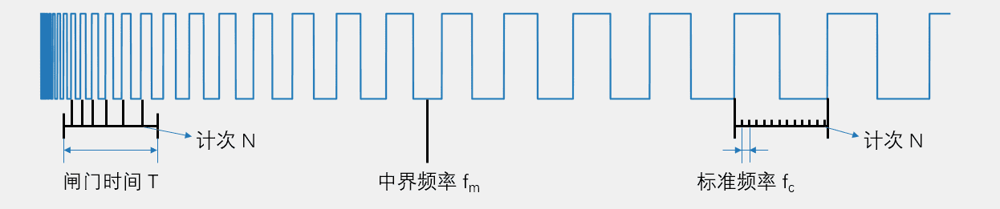

#### 1.3.3 输入捕获框架

下面是通用定时器的框架：

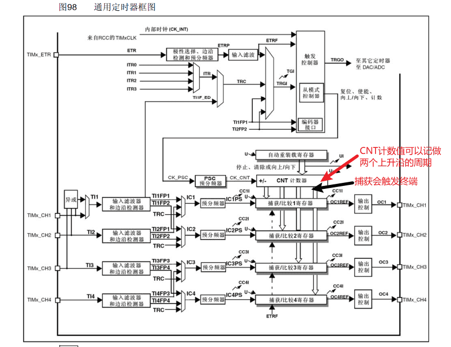

- **工作流程：**经过输入滤波器和极性选择进入预分频器，可以选择进行触发信号分频，然后触发信号进入捕获电路工作，每来一个触发信号，CNT的值向CCR转运一次，同时触发捕获事件，在状态寄存器置标志位触发中断，可以设置中断处理。
- **测周法实现：**以上升沿为触发信号，CNT计数器由内部标准时钟驱动（驱动时钟为$$f_c$$ ），CNT数值即可记录两个上升沿的事件间隔，即为周期，取倒数可获得测周法的频率。

> 每次捕获以后要将CNT清零，可以用主从触发模式自动完成。

#### 1.3.4 主从触发模式

- 主模式：将定时器内部的信号映射到TRGO引脚，用于触发别的外设。
- 从模式：接收其他外设或自身外设的一些信号用于控制自身定时器的运行。**(被其他信号控制)**

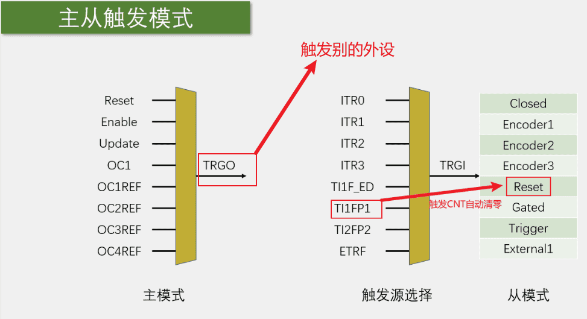

**从模式的触发源选择：**

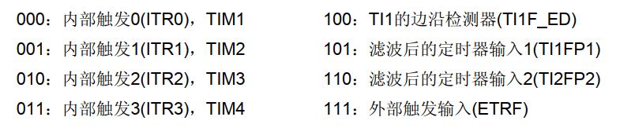

**通用定时器内部触发的连接：**

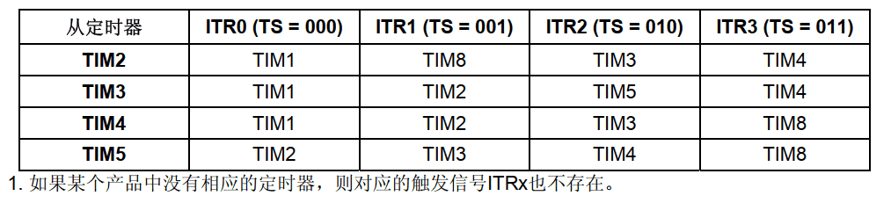

> 高级定时器的内部触发连接需要自己查stm32开发手册。

**从模式选择(与上表的顺序一致):**

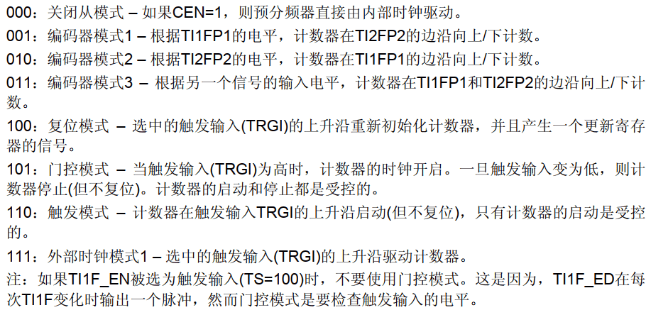

#### 1.3.5 输入捕获基本结构

测周法读取频率

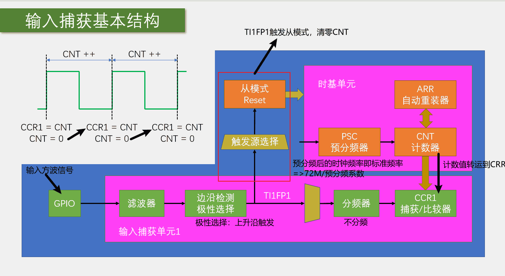

#### 1.3.6 PWMI模式

同时读取频率和占空比

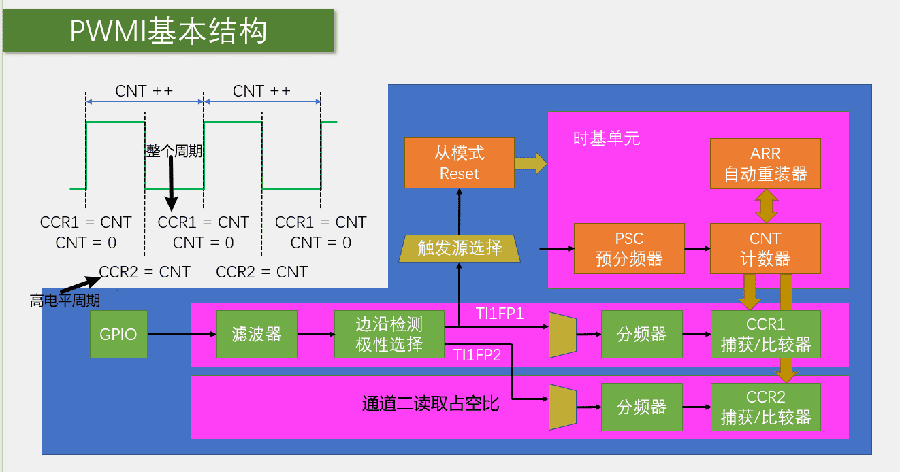

#### 1.3.7 代码示例(标准库)

```c
void IC_Init(void)
{
	/*开启时钟*/
	RCC_APB1PeriphClockCmd(RCC_APB1Periph_TIM3, ENABLE);			//开启TIM3的时钟
	RCC_APB2PeriphClockCmd(RCC_APB2Periph_GPIOA, ENABLE);			//开启GPIOA的时钟
	
	/*GPIO初始化*/
	GPIO_InitTypeDef GPIO_InitStructure;
	GPIO_InitStructure.GPIO_Mode = GPIO_Mode_IPU;
	GPIO_InitStructure.GPIO_Pin = GPIO_Pin_6;
	GPIO_InitStructure.GPIO_Speed = GPIO_Speed_50MHz;
	GPIO_Init(GPIOA, &GPIO_InitStructure);						//将PA6引脚初始化为上拉输入
	
	/*配置时钟源*/
	TIM_InternalClockConfig(TIM3);		//选择TIM3为内部时钟，若不调用此函数，TIM默认也为内部时钟
	
	/*时基单元初始化*/
	TIM_TimeBaseInitTypeDef TIM_TimeBaseInitStructure;				//定义结构体变量
	TIM_TimeBaseInitStructure.TIM_ClockDivision = TIM_CKD_DIV1;     //时钟分频，选择不分频
	TIM_TimeBaseInitStructure.TIM_CounterMode = TIM_CounterMode_Up; //计数器模式，向上计数
	TIM_TimeBaseInitStructure.TIM_Period = 65536 - 1;               //计数周期，即ARR的值
	TIM_TimeBaseInitStructure.TIM_Prescaler = 72 - 1;               //预分频器，即PSC的值
	TIM_TimeBaseInitStructure.TIM_RepetitionCounter = 0;      //重复计数器，高级定时器才会用到
	TIM_TimeBaseInit(TIM3, &TIM_TimeBaseInitStructure);             
	
	/*PWMI模式初始化*/
	TIM_ICInitTypeDef TIM_ICInitStructure;							//定义结构体变量
	TIM_ICInitStructure.TIM_Channel = TIM_Channel_1;				//选择配置定时器通道1
	TIM_ICInitStructure.TIM_ICFilter = 0xF;					//输入滤波器参数，可以过滤信号抖动
	TIM_ICInitStructure.TIM_ICPolarity = TIM_ICPolarity_Rising;  //极性，选择为上升沿触发捕获
	//捕获预分频，选择不分频，每次信号都触发捕获
    TIM_ICInitStructure.TIM_ICPrescaler = TIM_ICPSC_DIV1;	
    //输入信号交叉，选择直通，不交叉
	TIM_ICInitStructure.TIM_ICSelection = TIM_ICSelection_DirectTI;	
	TIM_PWMIConfig(TIM3, &TIM_ICInitStructure);						
	//此函数同时会把另一个通道配置为相反的配置，实现PWMI模式

	/*选择触发源及从模式*/
	TIM_SelectInputTrigger(TIM3, TIM_TS_TI1FP1);		//触发源选择TI1FP1
	TIM_SelectSlaveMode(TIM3, TIM_SlaveMode_Reset);		//从模式选择复位
														//即TI1产生上升沿时，会触发CNT归零
	
	/*TIM使能*/
	TIM_Cmd(TIM3, ENABLE);			//使能TIM3，定时器开始运行
}
/**
  * 函    数：获取输入捕获的频率
  * 参    数：无
  * 返 回 值：捕获得到的频率
  */
uint32_t IC_GetFreq(void)
{
	return 1000000 / (TIM_GetCapture1(TIM3) + 1);		//测周法得到频率fx = fc / N，这里不执行+1的操作也可
}

/**
  * 函    数：获取输入捕获的占空比
  * 参    数：无
  * 返 回 值：捕获得到的占空比
  */
uint32_t IC_GetDuty(void)
{
	return (TIM_GetCapture2(TIM3) + 1) * 100 / (TIM_GetCapture1(TIM3) + 1);	//占空比Duty = CCR2 / CCR1 * 100，这里不执行+1的操作也可
}

```

### 1.4 编码器接口（Encoder）

#### 1.4.1 编码器接口介绍

- **（Encoder Interface ）编码器接口**
- **编码器接口可接收增量（正交）编码器的信号，根据编码器旋转产生的正交信号脉冲，自动控制CNT自增或自减，从而指示编码器的位置、旋转方向和旋转速度**
- **每个高级定时器和通用定时器都拥有1个编码器接口（用于编码器接口的定时器无法再做其他事）**
- **定时器的通道1和通道2作为编码器接口**

如下图，为正交编码器（A相与B相相差90°），通过观察A相高低电平时B相的电平判断正反转，同时脉冲频率即体现电机的转速。

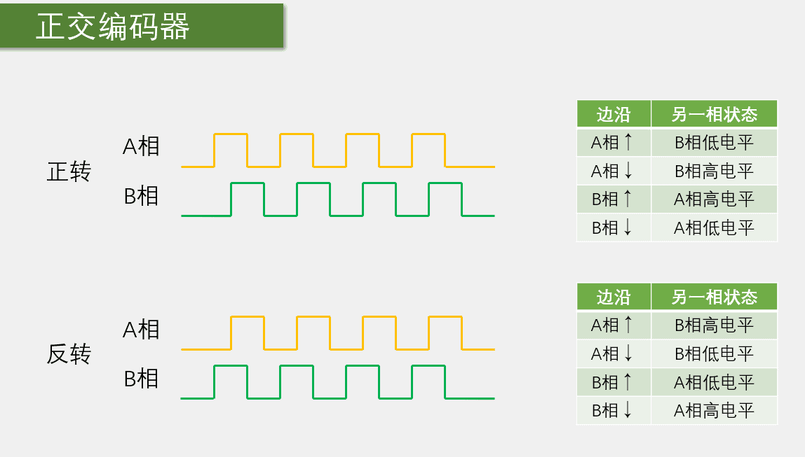

#### 1.4.2 编码器接口基本结构

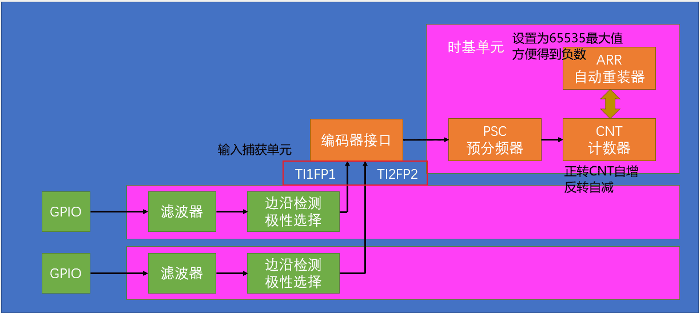

说明一下极性选择：

- 选择“上升沿”则正常波形

- 选择“下降沿”则需要经过一个“非门”（逻辑）

  > 详情可看[1.4.5 计数示例（极性选择）](#1.4.5 计数示例（极性选择）)

#### 1.4.3 编码器接口工作模式

编码器接口工作模式分三种：

- 仅在A相上升沿和下降沿计数
- 仅在B相上升沿和下降沿计数
- 在AB相都计数（精度最高，一些资料会称为四倍频）

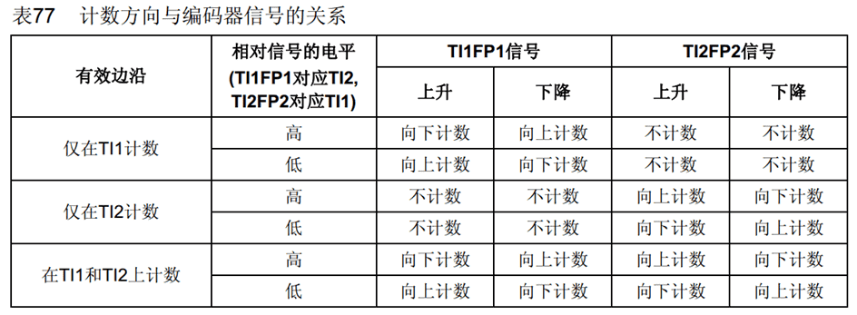

> 工作模式表格要对应**[1.4.1编码器接口介绍](#1.4.1 编码器接口介绍)**的表格看，即通过看A相B相对应电平判断正反转。

#### 1.4.4 #四倍频法

四倍频是通过程序提升我们的编码器的精度的一种数据处理方法， 可以有效的最大化我们的编码器的精度和测量精度。 

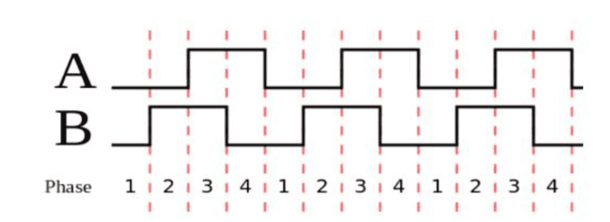

上图是一个我们编码器输出的波形图， 正常我们一般的处理方式是通过 A 相去计数， B 相去判断目前的转动方向。 具体实现比如： A 相的上升沿计数或者下降沿计数， 同时在 A 相的上升沿或者下降沿来根据 B 相此时的电平状态来判断转向。四倍频则是同时计算 AB 两相的每个跳边沿， 这样子原本在 A 相计数的一个脉冲周期内就实现了四次计数， 从而实现了精度的提升。 

#### 1.4.5 计数示例（极性选择）

- 正常不反相，正转自增，反转自减。

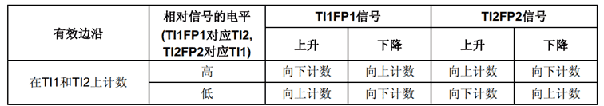

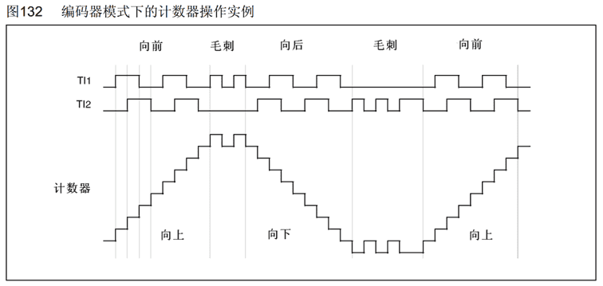

- TI1极性反转（需要将TI1的**高低电平反转**，在对应表格找正反转）


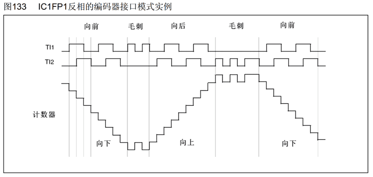

#### 1.4.6 代码示例(标准库)

```c
void Encoder_Init(void)
{
	/*开启时钟*/
	RCC_APB1PeriphClockCmd(RCC_APB1Periph_TIM3, ENABLE);			//开启TIM3的时钟
	RCC_APB2PeriphClockCmd(RCC_APB2Periph_GPIOA, ENABLE);			//开启GPIOA的时钟
	
	/*GPIO初始化*/
	GPIO_InitTypeDef GPIO_InitStructure;
	GPIO_InitStructure.GPIO_Mode = GPIO_Mode_IPU;
	GPIO_InitStructure.GPIO_Pin = GPIO_Pin_6 | GPIO_Pin_7;
	GPIO_InitStructure.GPIO_Speed = GPIO_Speed_50MHz;
	GPIO_Init(GPIOA, &GPIO_InitStructure);				//将PA6和PA7引脚初始化为上拉输入
	
	/*时基单元初始化*/
	TIM_TimeBaseInitTypeDef TIM_TimeBaseInitStructure;			   //定义结构体变量
    //时钟分频，选择不分频，此参数用于配置滤波器时钟，不影响时基单元功能
	TIM_TimeBaseInitStructure.TIM_ClockDivision = TIM_CKD_DIV1;    
	TIM_TimeBaseInitStructure.TIM_CounterMode = TIM_CounterMode_Up;//计数器模式，选择向上计数
	TIM_TimeBaseInitStructure.TIM_Period = 65536 - 1;           //计数周期，即ARR的值
	TIM_TimeBaseInitStructure.TIM_Prescaler = 1 - 1;          //预分频器，即PSC的值
	TIM_TimeBaseInitStructure.TIM_RepetitionCounter = 0;    //重复计数器，高级定时器才会用到
	TIM_TimeBaseInit(TIM3, &TIM_TimeBaseInitStructure);      
	
	/*输入捕获初始化*/
	TIM_ICInitTypeDef TIM_ICInitStructure;				//定义结构体变量
    /*结构体初始化，若结构体没有完整赋值
    则最好执行此函数，给结构体所有成员都赋一个默认值
    避免结构体初值不确定的问题*/
	TIM_ICStructInit(&TIM_ICInitStructure);

	TIM_ICInitStructure.TIM_Channel = TIM_Channel_1;	//选择配置定时器通道1
	TIM_ICInitStructure.TIM_ICFilter = 0xF;				//输入滤波器参数，可以过滤信号抖动
	TIM_ICInit(TIM3, &TIM_ICInitStructure);			
    
	TIM_ICInitStructure.TIM_Channel = TIM_Channel_2;	//选择配置定时器通道2
	TIM_ICInitStructure.TIM_ICFilter = 0xF;				//输入滤波器参数，可以过滤信号抖动
	TIM_ICInit(TIM3, &TIM_ICInitStructure);							
	
	/*编码器接口配置*/
    /*配置编码器模式以及两个输入通道是否反相
	注意此时参数的Rising和Falling已经不代表上升沿和下降沿了，而是代表是否反相
	此函数必须在输入捕获初始化之后进行，否则输入捕获的配置会覆盖此函数的部分配置*/
	TIM_EncoderInterfaceConfig(TIM3, TIM_EncoderMode_TI12, TIM_ICPolarity_Rising, TIM_ICPolarity_Rising);

	/*TIM使能*/
	TIM_Cmd(TIM3, ENABLE);			//使能TIM3，定时器开始运行
}
int16_t Encoder_Get_(void)
{
	int16_t Temp;
	Temp = TIM_GetCounter(TIM3);
	TIM_SetCounter(TIM3, 0);
	return Temp;
}

```

