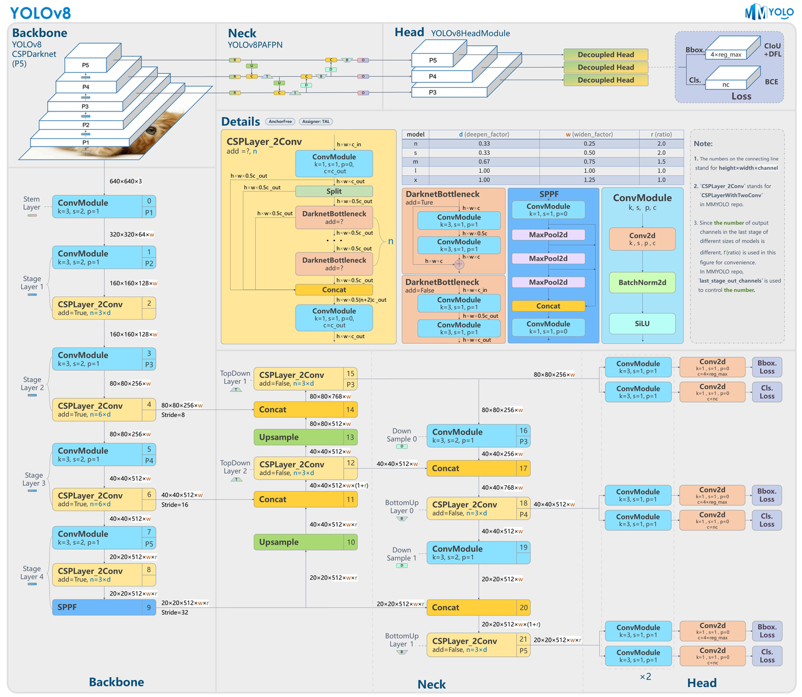

## 引言

随着城市化进程的不断推进，全球范围内机动车数量急剧增加，交通管理和安全问题日益凸显。如何高效、准确地进行车辆检测，成为解决交通拥堵、减少交通事故、提升公共安全的重要手段。传统的交通监控手段，如路口摄像头和人工巡逻，已经无法满足现代城市对实时、高效、智能化交通管理的需求。通过车辆检测技术，可以实现对车辆流量的实时监控，及时发现和处理交通异常情况，从而提高道路通行效率，减少交通事故的发生。近年来，深度学习技术特别是卷积神经网络（CNN）的快速发展，极大地推动了目标检测技术的进步。其中，YOLO（You Only Look Once）系列模型在目标检测具备极高的使用率和高精度检测能力。经过YOLO版本的不断迭代和升级，已经到yolov8版本，具备分类、检测、分割、追踪、姿态等功能，同时具有更好的准确性和快速性。

## YOLOV8网络介绍

YOLOv8是 YOLO 系列的最新版本，在准确性和速度方面提供了尖端性能。基于以前 YOLO 版本的改进，YOLOv8引入了新的特性和优化，使其成为广泛应用中各种目标检测任务的理想选择。🔺主要包括高级骨干和颈部架构、无锚点分割 Ultralytics 头部、优化精度-速度权衡、各种预训练模型等。

| **主要特点**                | **描述**                                                     |
| --------------------------- | ------------------------------------------------------------ |
| 高级骨干和颈部架构          | YOLOv8采用了最先进的骨干和颈部架构，提高了特征提取和目标检测性能。 |
| 无锚点分割 Ultralytics 头部 | YOLOv8采用了无锚分离超声头，与基于锚的方法相比，有助于提高准确性和更有效的检测过程。 |
| 优化精度-速度权衡           | YOLOv8专注于保持精度和速度之间的最佳平衡，适用于不同应用领域的实时目标检测任务。 |
| 各种预训练模型              | YOLOv8提供了一系列预训练模型，以满足各种任务和性能需求，使您更容易为特定用例找到合适的模型。 |

YOLOv8模型主要由四个部分组成，分别为输入端、主干网络、颈部和检测头。YOLOv8输入端采用自适应缩放策略，在缩放输入图片时能够自适应地添加最少的补充边，从而减少冗余信息，对实际车辆检测任务中不同大小的输入图片具有较强的适应性。YOLOv8主干特征提取网络采用一系列卷积层来提取图像特征，同时采用了瓶颈结构和残差连接来降低模型大小和提高网络性能。该部分由C2f、CBS、SPPF三种模块构成。与YOLOv5的C3模块相比，C2f模块参数量更少、特征提取能力更强。在特征融合的颈部，YOLOv8相比YOLOv5减去了两个卷积连接层，沿用了YOLOv5的PAN-FPN结构，通过自顶向下和自底向上的双向跨层连接，进行多尺度的特征融合。🔺

