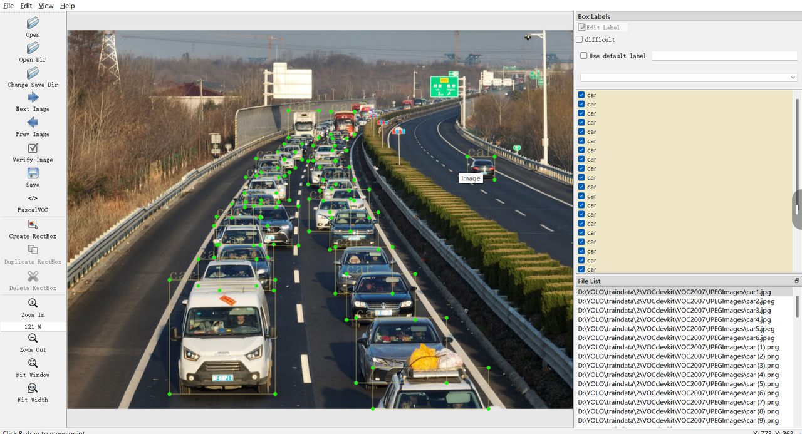
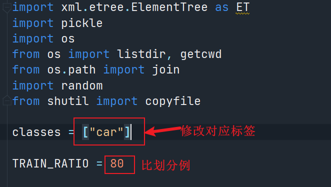
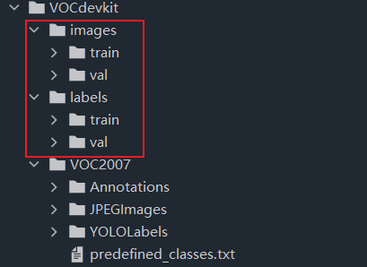

## 数据集收集划分

文件格式：

| 格式 | 描述                               |
| ---- | ---------------------------------- |
| VOC  | 使用labelimg标记保存的数据文件格式 |
| TXT  | yolo训练需要的数据文件格式         |

### 标记数据集

#### 安装labelimg

```Python
pip install labelimg
```

#### 创建文件结构

创建文件夹结构---创建文件夹VOCdevkit，再次文件夹下新建VOC2007，其他如下：

├── VOC2007

│├── JPEGImages  存放需要打标签的图片文件

│├── Annotations  存放标注的标签文件

│├── predefined_classes.txt  定义自己要标注的所有类别

根据上面标注，把照片放到`JPEGImages`文件夹，将要标注的所有类别放在`predefined_classes.txt`文件


**一些常用快捷键：**

- A：切换到上一张图片
- D：切换到下一张图片
- W：调出标注十字架
- del ：删除标注框框
- Ctrl+u：选择标注的图片文件夹
- Ctrl+r：选择标注好的label标签存在的文件夹



### 划分数据集

#### 更新目录

更改目录如下，新建 **`select.py`** 文件，与VOC2007同一文件夹

├── VOCdevkit

│├──`select.py`

│├── VOC2007

││├── JPEGImages  存放需要打标签的图片文件

││├── Annotations  存放标注的标签文件

││├── predefined_classes.txt  定义自己要标注的所有类别

#### 修改参数



#### 检验数据

划分完成以后的目录结构：

