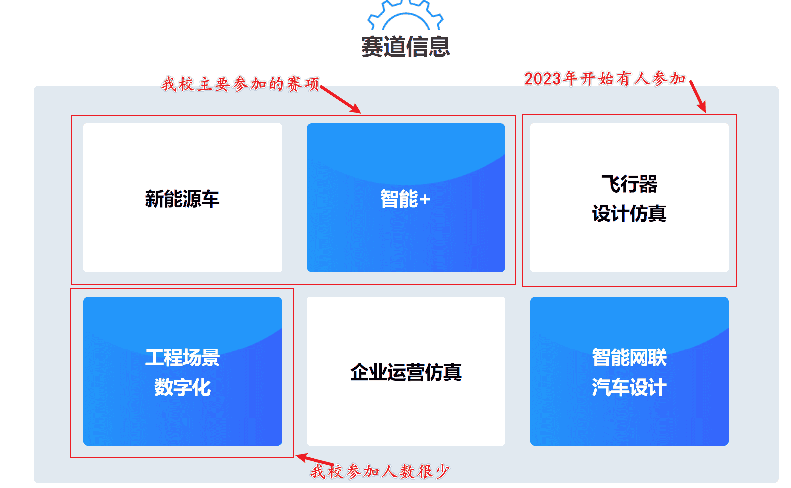
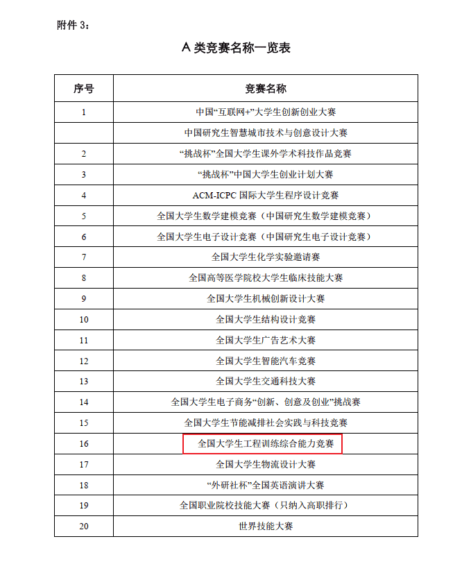
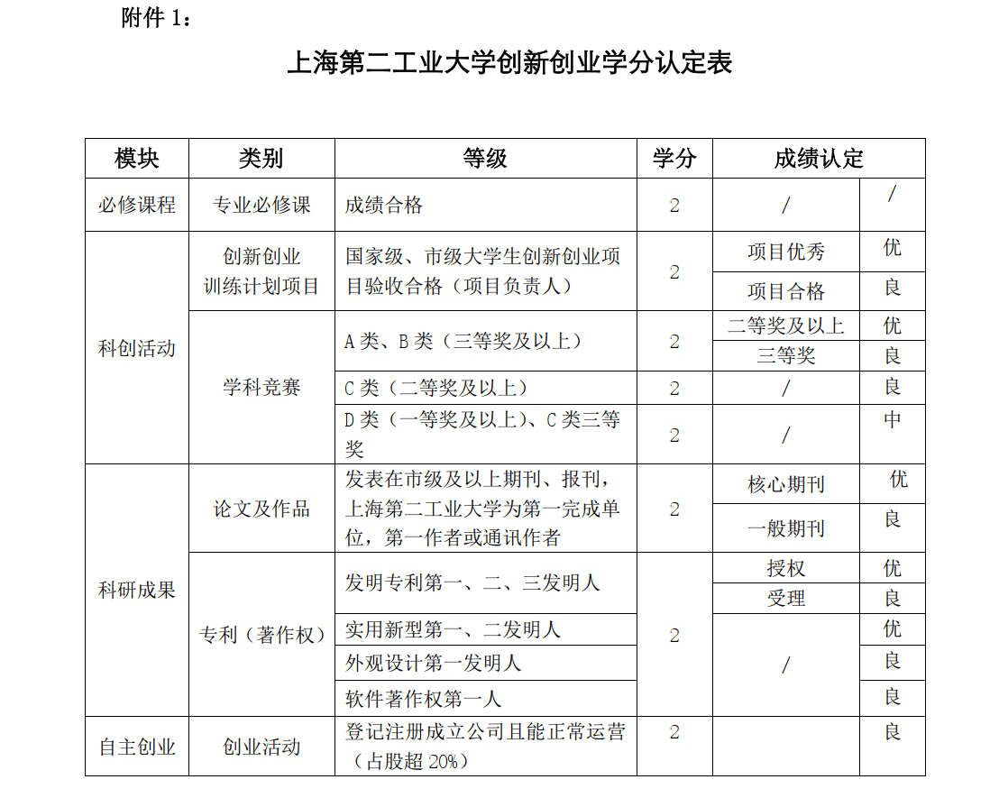
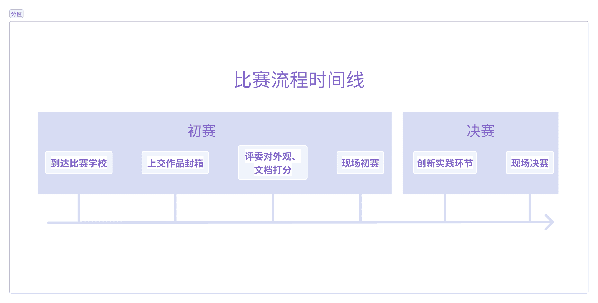

## 什么是工创赛

> 全国大学生工程实践与创新能力大赛原名全国大学生**工程训练综合能力竞赛**🤺🤺🤺
>
> 后面内容会简称其为**工创赛**。

**大赛的简介：**

全国大学生工程训练综合能力竞赛是公益性的大学生[科技创新](https://baike.baidu.com/item/科技创新/1448199?fromModule=lemma_inlink)竞技活动，是有较大影响力的国家级大学生科技创新竞赛，是教育部、财政部资助的大学生竞赛项目，目的是加强学生[创新能力](https://baike.baidu.com/item/创新能力/5471826?fromModule=lemma_inlink)和实践能力培养，提高本科[教育水平](https://baike.baidu.com/item/教育水平/22647919?fromModule=lemma_inlink)和人才培养质量。为开办此项竞赛，经[教育部高等教育司](https://baike.baidu.com/item/教育部高等教育司/0?fromModule=lemma_inlink)批准，专门成立了全国大学生工程训练综合能力竞赛组织委员会和专家委员会。竞赛组委会秘书处设在[大连理工大学](https://baike.baidu.com/item/大连理工大学/0?fromModule=lemma_inlink)。**每两年一届。**

**2023工创赛的大赛主题与目的：**

本届大赛以**交叉融合**工程创新求卓越，守德崇劳**制造强国**勇担当为主题，面向适应全球可持续发展需求的工程师培养，服务于国家创新驱动与制造强国战略，强化**工程创新能力**，坚持理论实践结合、学科专业交叉、校企协同创新、理工人文融通，创建具有鲜明中国特色的高端工程创新赛事，建设引领世界工程实践教育发展方向的精品工程，构建面向工程实际、服务社会需求、校企协同创新的实践育人平台，培养服务制造强国的卓越工程技术后备人才，打造具有中国特色世界一流工程实践与创新教育体系。

**各大赛道参加情况：**

工创赛主要分以上六个赛道，其中“智能+”赛道分为物流小车和生活垃圾分类，主要考察嵌入式、视觉、目标检测、机械结构设计等技术。“新能源车”赛道分为太阳能和温差，主要考察凸轮设计、RFID等。其他赛道不太了解，可以去[官网](http://www.gcxl.edu.cn/new/index.html)看介绍文档。2023年我校参加的主要就是标注的四个赛道，其中太阳能、生活垃圾分类、飞行器仿真都各有一队进入国赛，取得两铜一银的[成绩](https://www.sspu.edu.cn/2023/1226/c2964a146806/page.htm)。

## 工创赛含金量

**首先**，全国大学生工程实践与创新能力大赛即工创赛的**国赛**，属于大学生竞赛中的[A类赛事](https://blog.csdn.net/qq_42898149/article/details/130682821)。大学生竞赛主要分为ABCD类竞赛，A类竞赛含金量和认可度为最高，如大家了解比较多的**互联网+、挑战杯、数学建模、电赛**等等同属A类竞赛，我们学校对于A类竞赛同样有说明：

这个表格来源于学习**上海第二工业大学创新创业学分管理办法** 文档，在大四每个专业都有一门创新创业课程需要上，而这门课有一种免修办法，只要满足条件的同学便可以提出免修申请，条件如下：

⚠⚠⚠--这里需要注意一点，A类赛事指的是某类赛事的国赛，该赛事的市赛只是C类或者是B类。例如**上海第二工业大学创新创业学分管理办法** 文档明确指出**全国大学生机械创新设计大赛**为A类，而**上海市大学生机械工程创新大赛**是C类赛事。

总的来说，工创赛作为A类赛事含金量还是很足的，对于个人技术的实践创新和团队组织能力都是一种挑战。

## 工创赛比赛形式

像机械创新设计大赛、挑战杯等比赛是带着创新作品参与答辩评分，对于作品的形式、种类没有要求，或者只会规定一个大概的方向。如机创会规定一个农业机械和仿生主题，其他自由发挥。而工创赛不同其他一些创新创业类的比赛，工创赛会规定一个应用场景和装置需要完成的任务，以及一些尺寸电压的细致要求；最后的比赛形式**没有答辩**，比赛过程分为初赛和决赛，初赛分数由两部分组成：

- **文档、外观、创意设计**占30%
- 装置自动 **完成指定任务** ，根据准确率评分，占70%

通过初赛决定出决赛名单，然后决赛团队进入**创新实践环节**环节，根据比赛要求更改装置的某一个结构(现场公布，比赛前并不知道)，此环节非常考验赛前准备和应变能力。-----**占分30%**

后面是现场决赛，跟初赛一样完成**指定任务**，会比初赛难。-----**占分70%**

**关于现场初赛与现场决赛**：

现场初赛和决赛是基本一样的，不同赛项具体差异参考赛道的说明文档。现场比赛有两次机会，每次开始前有一定准备时间，2023**市赛**准备时间：**第一轮5分钟，第二轮3分钟**；2023**国赛**准备时间：**第一轮3分钟，第二轮3分钟.**且智能+赛道都有**时间限制**，要特别注意。

> ⚠一定要仔细阅读赛道说明文档，很重要，不要出现违规。

