## 机械结构设计

> 先说一说机械结构设计吧，毕竟用了很长的时间。

### 材料选择

**铝材：** 结构一定要稳定，因为要考虑后续去其他学校比赛的时候要长途运输，特别是国赛跨省运过去会掉很多螺丝。所以作品 **骨骼** 框架用欧标20的铝材，最好不要用30或40以上除非结构需要，因为真的很重。长度不对可以使用工训中心一楼的铣床钻断。

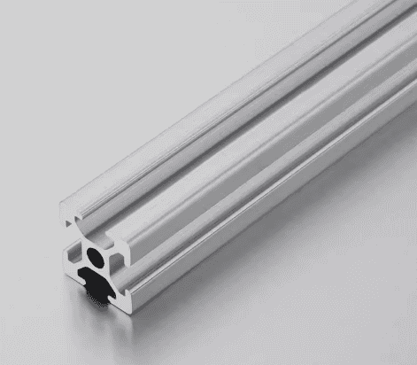

**铝材连接键**：建议使用这种直角角码；我们也用过一些内置的连接件并不好用，当时考虑装亚克力板好装但恰恰相反，所以不推荐，直角角码相对安装更简单。

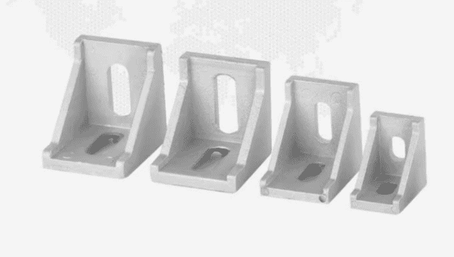

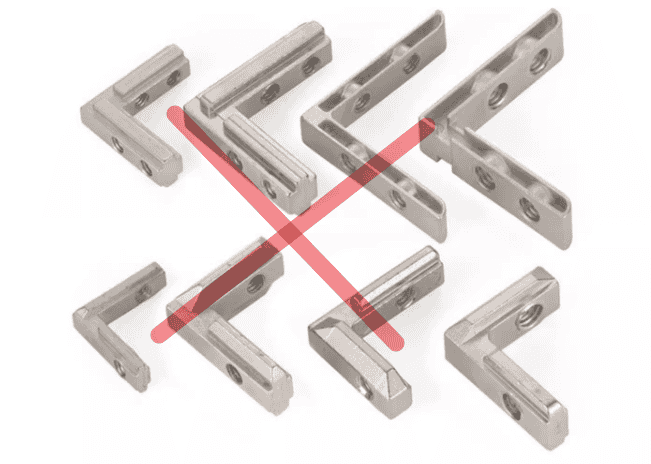

前面提到运输过程中螺丝容易掉，所以在铝材底部用直角铁固定，防止结构变型。

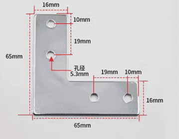

**亚克力板**，根据不同用处对于亚克力板的厚度选择有一点选择：

- **4mm**，--->用于外壳装配或小程度支撑面。
- **4mm以上**，--->用于需要支撑重量较大的地方。
- **8mm以上**，--->用于压缩抵挡面，需要承受1000N以上的力。

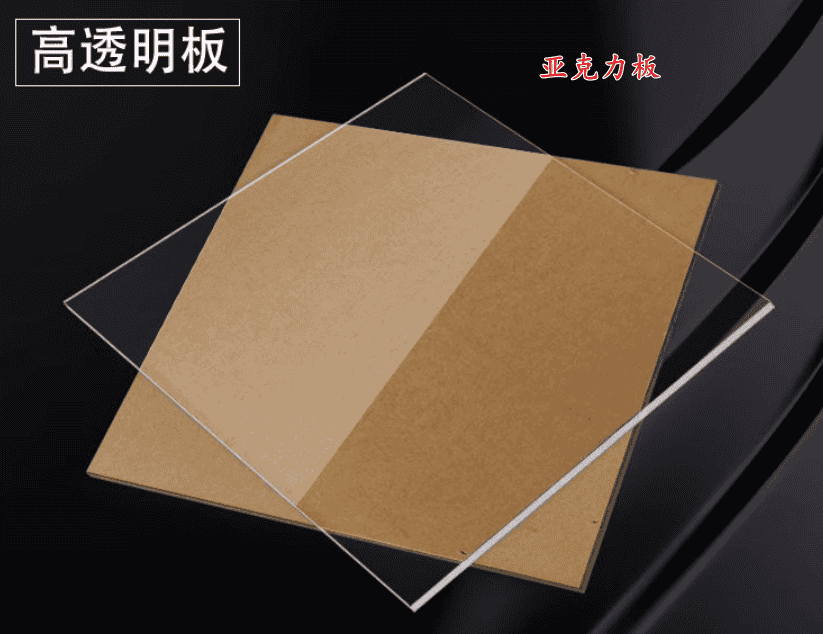

### 结构设计

> 下面是结构设计方案，从下往上介绍。

装配图：

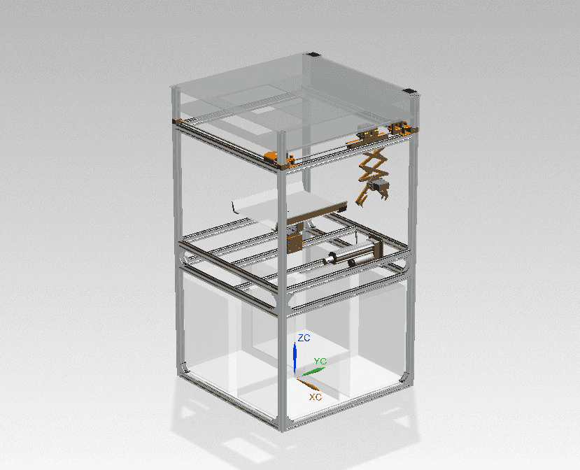

**垃圾桶**，四个桶尺寸一样，比规定尺寸要大一些具体多少忘记了，可以量一量。建议比我们的桶小一些。

**压缩装置**，使用[路易24V电动推杆平底座](https://item.taobao.com/item.htm?id=545827512337&spm=pc_detail.27183998/evo365560b447259.202206.2.29c67dd6VCTesE)，有很多速度和推力可选，结合需求选购。

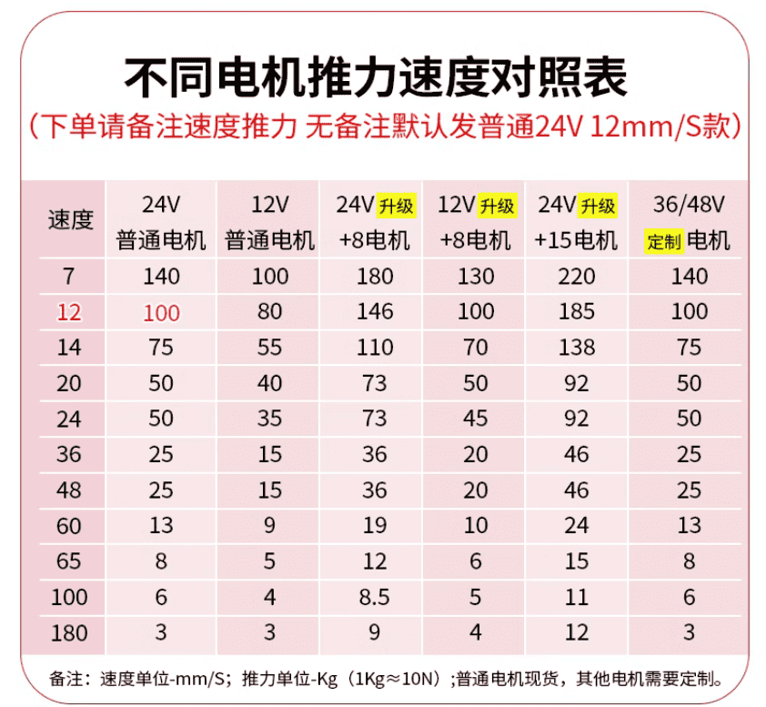

**分类装置**，用亚克力板拼装的，尺寸看我的UG图纸就好，表面铺的A4纸。做的比较简陋，这里 **不建议继续采用** ，国赛吉大给的土豆很小而且是湿的(必须吐槽一下吉大🤣)，很容易沾上面。

> 很多东西参考实验室的实物会更清楚一些。

## 控制结构设计

> 控制结构分初赛和决赛，初赛较为简单，决赛就是把分类方法改为了机械臂抓取。由于初赛决赛最好是一个成品，所以放在一起说。区分方法为垃圾个数，垃圾为一个即初赛，垃圾多个即决赛。

### 硬件选择

#### 主控选择

控制板选择的是 **Arduino mega** (物料小车部分有提到)，关于Arduino mega：

Arduino Mega 2560是基于ATmega2560的主控开发板。Arduino Mega2560是采用USB接口的核心电路板。具有54路数字输入输出，适合需要大量IO接口的设计。处理器核心是ATmega2560,同时具有54路数字输入/输出口，16路模拟输入，4路UART接口，一个16MHz晶体振荡器，一个USB口，一个电源插座，一个ICSP header和一个复位按钮。板上有支持一个主控板的所有资源。Arduino Mega2560也能兼容为Arduino NUO设计的扩展板。可以自动选择3中供电方式：外部直流电源通过电源插座供电；电池连接电源连接器的GND和VIN引脚；USB接口直流供电。

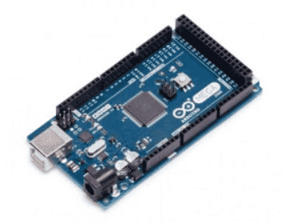

#### 分类装置控制选择

1. **单种垃圾** 分类选择二轴云台控制，即两个舵机完成翻转运动；要选择高精度舵机，20kg价格在70~90之间。

可以试试亚博智能的舵机：[亚博智能15/20/25kg金属数字舵机](https://detail.tmall.com/item.htm?abbucket=11&id=624218042549&ns=1&spm=a21n57.1.0.0.1d60523ckabwS6)

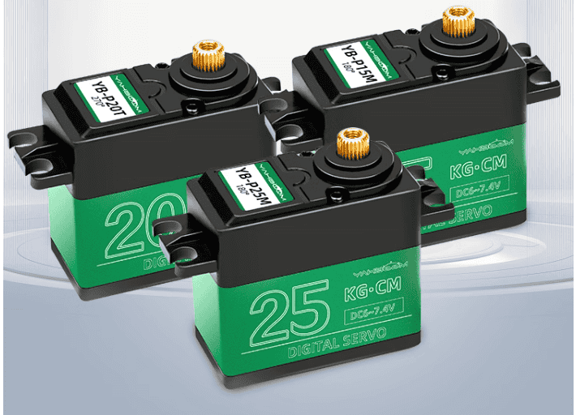

2. **多种垃圾** 是采用两个步进电机控制机械臂x、y轴运动，然后由4个舵机控制抓取。步进电机选用好一些的但也不需要很大，这里推荐我们使用的步进电机：[42步进电机](https://item.taobao.com/item.htm?abbucket=11&id=582210006047&ns=1&spm=a21n57.1.0.0.1d60523ckabwS6) ，经过使用测试，质量是够用的。防止步进电机丢步情况，步进电机须配备闭环控制器：[42步进闭环电机驱动器模块](https://item.taobao.com/item.htm?abbucket=11&id=635439412574&ns=1&spm=a21n57.1.0.0.1d60523ckabwS6)，选用 **3D打印套餐** 即可。

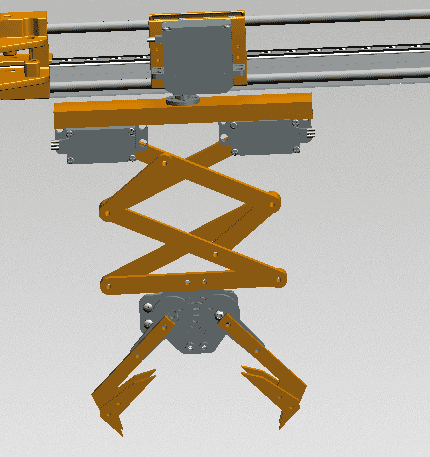

#### 满载检测

选用超声波，根据测距判断是否满载。因为垃圾桶规定为透明，红外测距会受到影响，超声波则不会受到影响。

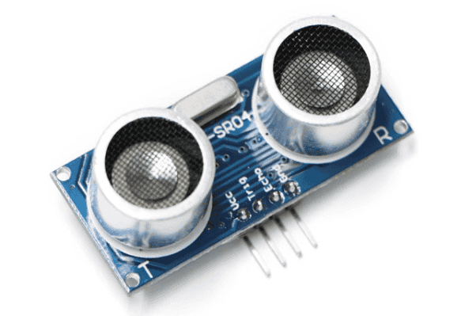

### 驱动选择

> 驱动方面主要就是涉及到舵机、步进电机、稳压。

#### 舵机拓展板

> 装置涉及到的舵机达到了10个左右，所以配备一个舵机拓展板控制更简单且方便，幻尔科技和亚博智能的拓展板功能多一些，具备串口或蓝牙调试功能(对于机械臂更有用)，价格也更高一些；第三个链接则便宜一些，不具备串口或蓝牙调试功能。

[幻尔科技16路舵机控制器](https://item.taobao.com/item.htm?ali_refid=a3_430582_1006:1104166432:N:WHux2QBZPmZN5cA0zdwOaDVt9Q0NFo+R:dd29ba326e47e84a8e79131e1ba60692&ali_trackid=1_dd29ba326e47e84a8e79131e1ba60692&id=23334420583&spm=a21n57.1.0.0)

[亚博智能16路舵机驱动板](https://detail.tmall.com/item.htm?abbucket=11&id=648919288356&ns=1&spm=a21n57.1.0.0.1d60523ckabwS6)

[16路PWM Servo舵机驱动板模块](https://detail.tmall.com/item.htm?abbucket=11&id=624505789589&ns=1&spm=a21n57.1.0.0.1d60523ckabwS6)

> 舵机拓展板需要通过电池稳压接入电源，而舵机电源一般为5~8V，调到6.5V个人认为较合适。舵机数量增加会导致电流增高，所以稳压模块的输出电流要尽可能高，推荐最后一个链接的稳压模块。

[数显8A带稳压降压模块](https://detail.tmall.com/item.htm?abbucket=11&id=621270751162&ns=1&spm=a21n57.1.0.0.1d60523ckabwS6)

#### 步进电机闭环驱动

> 步进电机用于决赛抓取，精度要求很高，闭环驱动板属于必备！

[42步进闭环电机驱动器模块](https://item.taobao.com/item.htm?abbucket=11&id=635439412574&ns=1&spm=a21n57.1.0.0.1d60523ckabwS6)

## 目标检测环境搭建

### 硬件选择

视觉采用 **树莓派4B** + **USB摄像头** + **7寸电容屏**

> 树莓派推荐了两家，亚博智能是大厂，价格会贵一些也会送一些资料和交流群(个人感觉资料用处不大，不如上网查)，不过现在树莓派降价了，也可以接受。后一家会便宜一些，我后面都是在这一家买的，售后也有解决过一些问题。

树莓派4B-4GB：[树莓派4B Raspberry Pi 4 ](https://item.taobao.com/item.htm?abbucket=11&id=621469430002&ns=1&spm=a21n57.1.0.0.1d60523ckabwS6&skuId=4398973969748)，[亚博智能 Raspberry Pi树莓派4B ](https://detail.tmall.com/item.htm?abbucket=11&id=608798378397&ns=1&spm=a21n57.1.0.0.1d60523ckabwS6)

> 这个树莓派教程算是听不错的，基础配置会教，嵌入式开发也会教，不过这个系列好像没有更新完，不过看完就对树莓派了解不少了。另外，我用树莓派引脚情况很少，更多是做视觉，只需要一个摄像头就好了，座椅不需要过多学习，但要了解Linux命令，用多了就熟练了。

树莓派视频学习：[树莓派十分钟玩转系列入门篇_](https://www.bilibili.com/video/BV16U4y1879Q/?spm_id_from=333.1007.top_right_bar_window_custom_collection.content.click&vd_source=9360af603fa540663a17ba65dbad6a7d)

> 摄像头其实一开始用的是官方二代摄像头，但是校赛前一天晚上突然坏了，当时临时借的一个摄像头，重新调试角度完成的比赛；后来买了一个又莫名其妙的坏了，所以后来换了USB摄像头，不容易坏。

树莓派官方摄像头：[树莓派官方原装摄像头Pi ](https://item.taobao.com/item.htm?abbucket=11&id=43818975625&ns=1&spm=a21n57.1.0.0.1d60523ckabwS6&skuId=5080403811329)

> 树莓派官方二代摄像头像素是800万，其实够用，这个USB摄像头是1200万，很清晰。我还是 **推荐** 树莓派官方二代摄像头，只有他不出奇怪问题还是很好用的。(提醒一下 **不要买3代** ，它仅支持最新系统，很多配置都不方便，找不到教程)

USB摄像头：[1200万电脑摄影头USB工业摄像头4K](https://detail.tmall.com/item.htm?id=728497114308&skuId=5053096577058&spm=a1z10.1-b-s.w4004-25044152529.11.217fccc9kjp3b7)

> 显示屏一般有两种，一种数据线接口在后面一种在侧面，**推荐** 买在侧面的。最好选触摸款，调试代码方便。

7寸显示屏：[树莓派显示屏 4B 7寸 超清触摸屏](https://detail.tmall.com/item.htm?abbucket=11&id=599265218230&ns=1&spm=a21n57.1.0.0.60e3523ceNBalO)

### 目标检测模型

> 上一节说了硬件选型，完成以后就可以准备软件方面了。

最后的视觉方案是[YOLOv5-Lite](https://github.com/ppogg/YOLOv5-Lite) + [onnx](https://github.com/onnx/models)推理加速

### 训练环境搭建（有修改）

> 解释一下，yolo是一种目标检测模型，有很多版本，yolov5是他的一个官方版本，而yolov5-lite是由一位大佬改良后的一种更轻量级模型，为什么需要轻量级呢，因为太大的模型计算量大，树莓派带不动，算力不够，就会导致视频画面很卡，检测速度也慢。**本质上yolov5和yolov5-lite使用方式是一样的。**

完整的视频教程，搭建yolov5-lite模型训练环境：[手把手教你搭建自己的yolov5目标检测平台](https://www.bilibili.com/video/BV1f44y187Xg/)

完整的博客文档：[目标检测--手把手教你搭建自己的YOLOv5目标检测平台_炮哥带你学的博客-CSDN博客](https://blog.csdn.net/didiaopao/category_11321656.html)

以上教程设计到内容包括：

- 搭建yolov5-lite训练环境。
- 数据集的标注。
- 训练自定义数据集，导出pt文件。

在`export.py`文件目录终端可以运行下列代码 **进行模型转换(.pt->.onnx)** ：

> 第一版文档这里有个错误，文字描述错误，以此版为主。

```shell
python export.py --weights best.pt
```

### 树莓派环境搭建

经过上一个过程，我们就已经把我们的模型训练完成， **后续需要** 的是通过代码解析这个pt文件，然后通过它去检测摄像头一帧一帧的图像数据，分析我们目标的种类。步骤如下：

#### 配置树莓派环境

[树莓派4b安装yolov5实现实时目标检测_树莓派4b跑yolov5帧率低-CSDN博客](https://blog.csdn.net/m0_55833308/article/details/122633544)，这个好像需要会员看了

[基于树莓派4B的YOLOv5-Lite目标检测的移植与部署（含训练教程）_树莓派yolo-CSDN博客](https://blog.csdn.net/black_sneak/article/details/131374492)

[树莓派-快速目标检测yoloV5-lite训练与移植_哔哩哔哩_bilibili](https://www.bilibili.com/video/BV14r4y1578r/?spm_id_from=333.337.search-card.all.click&vd_source=9360af603fa540663a17ba65dbad6a7d)

**以上仅作参考，因为他们有些库可能安装不上，且推理代码由些许BUG，大家根据我的流程并参考他们的一起看，我会把我修改过的推理代码放在这里。**

> 其实本来由很多资料、镜像、库文件我保存好了，但是比赛的时候我把存资料的U盘丢了，资料也丢了😭😭😭，我新买的U盘还是😣😣😣。不过问题不大，我手敲一遍过程，再找一遍资料。

**树莓派开机，完成基础配置。**

这里是我购买树莓派获得的亚博智能的资料，免费分给大家：

链接：https://pan.baidu.com/s/1Jm9qrot5CN4mZSJJhASeXg?pwd=cmzz 
提取码：cmzz

完成 **基础设置** 部分既可。需要特别注意的是 **设置开机自启动程序** ，比赛要求一键启动，所以要在自启动文件里面把我们的程序启动。

#### yolov5-lite移植

> 由于手边没有树莓派，所以部分内容我用虚拟机演示，实际是基本一致的。

1. **克隆yolov5-lite**

访问Github的yolov5-lite地址(记得使用魔法)：[下载YOLOv5-Lite](https://github.com/ppogg/YOLOv5-Lite)

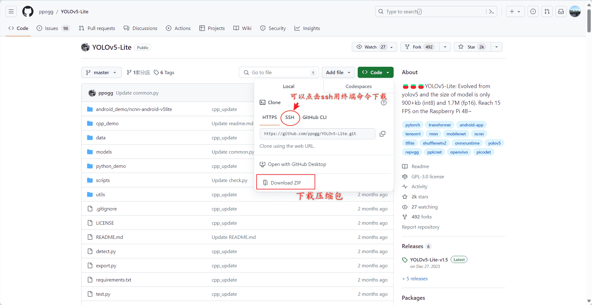

**推荐** 直接下载压缩包把压缩包传到树莓派，直接右键解压或 **终端解压** ，图示的文件将都会存在于文件夹。

```shell
unzip your_file.zip # 解压
```

解压以后的文件结构如下图，YOLO-Lite-master是文件夹名称，后续就称之为 **yolov5-lite文件夹**

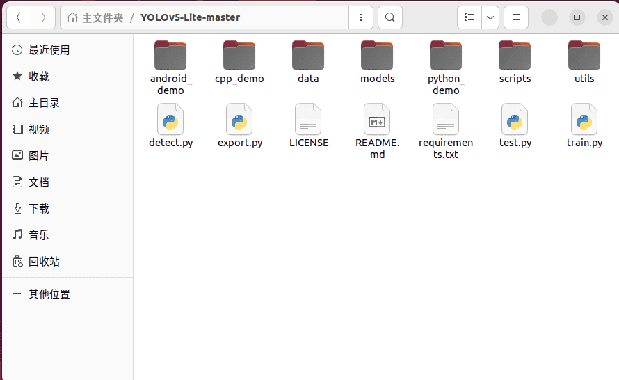

解释一下 **文件夹下打开终端** ，例如：在 **yolov5-lite文件夹** 下打开终端，即终端位置在 **yolov5-lite文件夹** 位置。

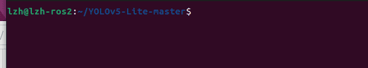

操作方法为默认终端输入`cd + your_path`，例如：

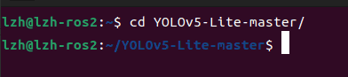

> 可以敲前几个字母，用Tab键补齐。 **后续会直接说在某一个文件夹下打开终端，找到路径自行操作。**

2. **安装pytorch**

安装依赖

```shell
sudo apt-get install libopenblas-dev libblas-dev m4 cmake cython python3-dev python3-yaml python3-setuptools python3-wheel python3-pillow python3-numpy
```

在我的资料包找到pytorch安装包，通过文件传输助手 **WinSCP** 传输到树莓派(4个文件都传输，后面都要有)，在 **pytorch安装文件的目录下打开终端** ，执行下面命令安装pytorch：

```shell
pip3 install torch-1.8.0a0+56b43f4-cp37-cp37m-linux_armv7l.whl
pip3 install torchvision-0.9.0a0+8fb5838-cp37-cp37m-linux_armv7l.whl
```

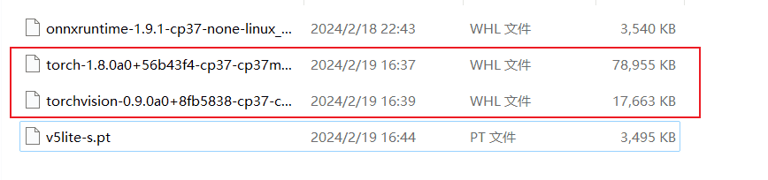

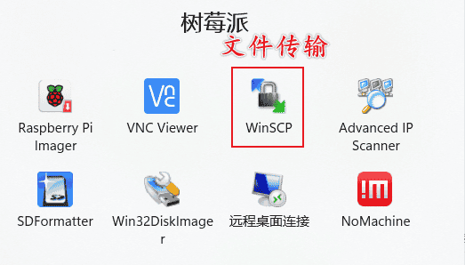

3. **安装依赖**

**yolov5-lite文件夹** 下找到 **requirements.txt** ，这里是需要安装的库的版本，把我们已经安装过的torch和torchvision注释掉，然后 **文件夹下打开终端** 执行安装命令：

```shell
pip3 install -r requirements.txt
```

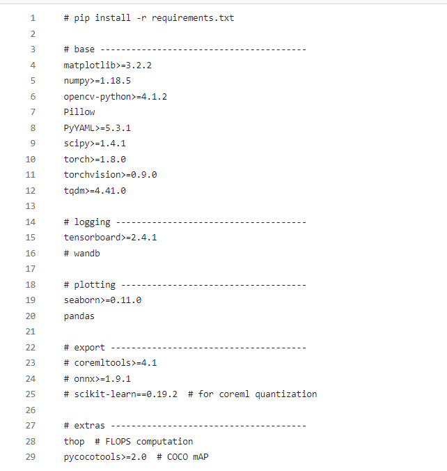

将 **v5lite-s.pt** 文件转移到树莓派下 **yolov5-lite文件夹**下

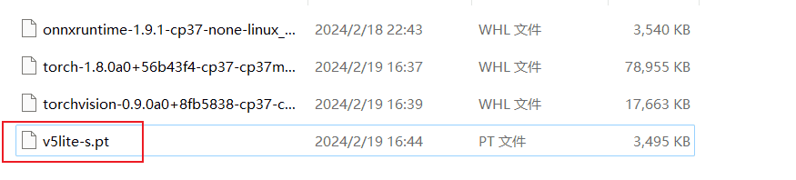

4. **摄像头配置**

检测树莓派是否有 **opencv** ，打开终端，输入`python3`调出python终端，输入`import cv2`不报错即可

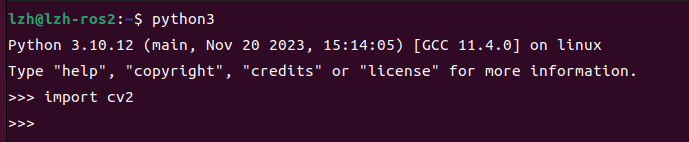

新建PyProjects文件夹，文件夹下新建文件cv_test.py

```shell
mkdir PyProjects
cd PyProjects
touch cv_test.py
```

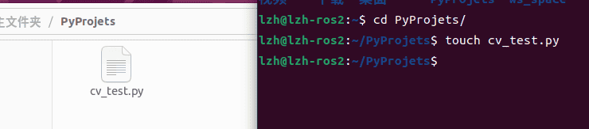

复制下面代码到cv_test.py文件。

```python
import cv2

# 创建摄像头对象
cap = cv2.VideoCapture(-1)  # 0 表示默认摄像头，如果有多个摄像头，可以尝试不同的编号

# 检查摄像头是否成功打开
if not cap.isOpened():
    print("无法打开摄像头")
    exit()

# 设置摄像头分辨率（可选）
# cap.set(cv2.CAP_PROP_FRAME_WIDTH, 640)
# cap.set(cv2.CAP_PROP_FRAME_HEIGHT, 480)

while True:
    # 从摄像头读取一帧图像
    ret, frame = cap.read()

    # 检查帧是否成功读取
    if not ret:
        print("无法读取帧")
        break

    # 在窗口中显示图像
    cv2.imshow('摄像头测试', frame)

    # 按下 'q' 键退出循环
    if cv2.waitKey(1) & 0xFF == ord('q'):
        break

# 释放摄像头资源
cap.release()

# 关闭所有窗口
cv2.destroyAllWindows()
```

打开终端，运行代码，可以看到摄像头画面则没有问题。

```shell
python3 cv_test.py
```

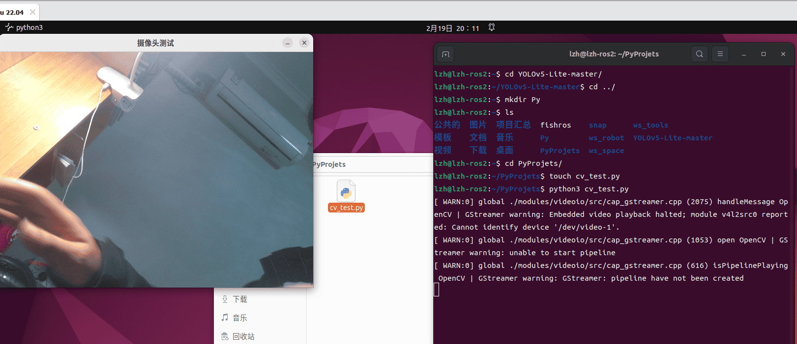

Ctrl+c退出，输入`ls /dev/video*`查看摄像头设备，一般是0/1

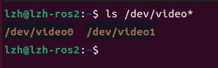

5. **推理**

yolov5-lite的根目录下，打开终端尝试推理：

```
python3 detect.py --source 0
```

> source 0不行可以试试source 1，取决于摄像头设备。

#### onnx推理

**安装onnxruntime**

在我的资料包里， **onnx推理** 文件夹下有一个onnxruntime库的安装文件，通过文件传输助手WinSCP传输到树莓派，执行下面命令安装：

```shell
pip3 install onnxruntime-1.9.1-cp37-none-linux_armv7l.whl
```

注意：onnxruntime的安装需要python3.7 和 numpy 1.21以上

```shell
pip3 install numpy # 安装numpy
```

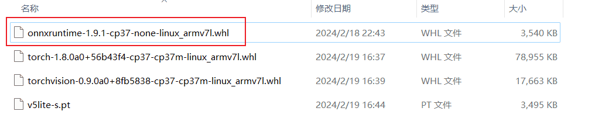

**onnx推理**

新建文件yolo.py，`python3 yolo.py`运行即可。

```python
import random

import cv2
import numpy as np
import onnxruntime as ort
import time


def plot_one_box(x, img, color=None, label=None, line_thickness=None):
    """
    description: Plots one bounding box on image img,
                 this function comes from YoLov5 project.
    param: 
        x:      a box likes [x1,y1,x2,y2]
        img:    a opencv image object
        color:  color to draw rectangle, such as (0,255,0)
        label:  str
        line_thickness: int
    return:
        no return
    """
    tl = (
            line_thickness or round(0.002 * (img.shape[0] + img.shape[1]) / 2) + 1
    )  # line/font thickness
    color = color or [random.randint(0, 255) for _ in range(3)]
    x = x.squeeze()
    c1, c2 = (int(x[0]), int(x[1])), (int(x[2]), int(x[3]))
    cv2.rectangle(img, c1, c2, color, thickness=tl, lineType=cv2.LINE_AA)
    if label:
        tf = max(tl - 1, 1)  # font thickness
        t_size = cv2.getTextSize(label, 0, fontScale=tl / 3, thickness=tf)[0]
        c2 = c1[0] + t_size[0], c1[1] - t_size[1] - 3
        cv2.rectangle(img, c1, c2, color, -1, cv2.LINE_AA)  # filled
        cv2.putText(
            img,
            label,
            (c1[0], c1[1] - 2),
            0,
            tl / 3,
            [225, 255, 255],
            thickness=tf,
            lineType=cv2.LINE_AA,
        )


def _make_grid(nx, ny):
    xv, yv = np.meshgrid(np.arange(ny), np.arange(nx))
    return np.stack((xv, yv), 2).reshape((-1, 2)).astype(np.float32)


def cal_outputs(outs, nl, na, model_w, model_h, anchor_grid, stride):
    row_ind = 0
    grid = [np.zeros(1)] * nl
    for i in range(nl):
        h, w = int(model_w / stride[i]), int(model_h / stride[i])
        length = int(na * h * w)
        if grid[i].shape[2:4] != (h, w):
            grid[i] = _make_grid(w, h)

        outs[row_ind:row_ind + length, 0:2] = (outs[row_ind:row_ind + length, 0:2] * 2. - 0.5 + np.tile(
            grid[i], (na, 1))) * int(stride[i])
        outs[row_ind:row_ind + length, 2:4] = (outs[row_ind:row_ind + length, 2:4] * 2) ** 2 * np.repeat(
            anchor_grid[i], h * w, axis=0)
        row_ind += length
    return outs


def post_process_opencv(outputs, model_h, model_w, img_h, img_w, thred_nms, thred_cond):
    conf = outputs[:, 4].tolist()
    c_x = outputs[:, 0] / model_w * img_w
    c_y = outputs[:, 1] / model_h * img_h
    w = outputs[:, 2] / model_w * img_w
    h = outputs[:, 3] / model_h * img_h
    p_cls = outputs[:, 5:]
    if len(p_cls.shape) == 1:
        p_cls = np.expand_dims(p_cls, 1)
    cls_id = np.argmax(p_cls, axis=1)

    p_x1 = np.expand_dims(c_x - w / 2, -1)
    p_y1 = np.expand_dims(c_y - h / 2, -1)
    p_x2 = np.expand_dims(c_x + w / 2, -1)
    p_y2 = np.expand_dims(c_y + h / 2, -1)
    areas = np.concatenate((p_x1, p_y1, p_x2, p_y2), axis=-1)

    areas = areas.tolist()
    ids = cv2.dnn.NMSBoxes(areas, conf, thred_cond, thred_nms)
    if len(ids) > 0:
        return np.array(areas)[ids], np.array(conf)[ids], cls_id[ids]
    else:
        return [], [], []


def infer_img(img0, net, model_h, model_w, nl, na, stride, anchor_grid, thred_nms=0.4, thred_cond=0.5):
    # 图像预处理
    img = cv2.resize(img0, (model_w, model_h), interpolation=cv2.INTER_AREA)
    img = cv2.cvtColor(img, cv2.COLOR_BGR2RGB)
    img = img.astype(np.float32) / 255.0
    blob = np.expand_dims(np.transpose(img, (2, 0, 1)), axis=0)

    # 模型推理
    outs = net.run(None, {net.get_inputs()[0].name: blob})[0].squeeze(axis=0)

    # 输出坐标矫正
    outs = cal_outputs(outs, nl, na, model_w, model_h, anchor_grid, stride)

    # 检测框计算
    img_h, img_w, _ = np.shape(img0)
    boxes, confs, ids = post_process_opencv(outs, model_h, model_w, img_h, img_w, thred_nms, thred_cond)

    return boxes, confs, ids


# 得到中心坐标
def get_centre(x_list):
    c_x = (x_list[0] + x_list[2]) / 2
    c_y = (x_list[1] + x_list[3]) / 2
    # c_x = c_x*np.cos(np.radians(45))-c_y*np.sin(np.radians(45))
    # c_y = c_y*np.cos(np.radians(45))+c_x*np.sin(np.radians(45))
    c_list = [c_x, c_y]
    # 返回中心坐标列表
    return c_list


# 得到面积
def get_area(label_list):
    length = label_list[2] - label_list[0]
    height = label_list[3] - label_list[1]
    area = []
    # 面积
    area.append(length * height)
    area.append(length/height)
    return area


# 得到最大面积的坐标
def get_data(c_list, ids_, scores_):

    # 获取坐标识别标签个数
    coordinate_length = len(c_list)
    # 中心坐标列表
    centre_list = []
    area_list = []
    l_h_list = []
    # 分别读取每个标签的数据
    for i in range(int(coordinate_length)):
        # 获取每个标签的坐标列表
        coordinate = c_list[i]
        # 获取面积和长宽比
        area, l_h = get_area(coordinate)
        # 中心点坐标列表
        centre_list.append(get_centre(coordinate))
        # 面积列表
        area_list.append(area)
        # 获取长宽比()
        l_h_list.append(l_h)
    if area_list:
        max_area = max(area_list)
        # 读取面积最大的标签的 索引
        area_index = area_list.index(max_area)
        # 根据索引获取面积最大的标签的数据
        target = centre_list[area_index]
        label = dic_labels[ids_[area_index]]
        score = scores_[area_index]
        box = c_list[area_index]
        l_h = l_h_list[area_index]
        return box, target, label, score, l_h, len(area_list)
    else:
        return None, None, None, None, None, None


if __name__ == "__main__":

    # 模型加载
    model_pb_path = "FINAL.onnx"
    so = ort.SessionOptions()
    net = ort.InferenceSession(model_pb_path, so)

    # 标签字典
    dic_labels = {
        0: '0-plastic_bottle',
        1: '0-drink_can',
        2: '0-paper',
        3: '0-carton',
        4: '0-milkCarton',
        5: '1-pericarp',
        6: '1-vegetable_leaf',
        7: '1-radish',
        8: '1-potato',
        9: '1-fruits',
        10: '2-battery',
        11: '2-Expired_drug',
        12: '2-button cell',
        13: '2-thermometer',
        14: '3-tile',
        15: '3-cobblestone',
        16: '3-brick',
        17: '3-paperCup',
        18: '3-tableware',
        19: '3-chopsticks',
        20: '3-butt',
        21: '3-mask'

    }

    # 模型参数
    model_h = 320
    model_w = 320
    nl = 3
    na = 3
    stride = [8., 16., 32.]
    anchors = [[10, 13, 16, 30, 33, 23], [30, 61, 62, 45, 59, 119], [116, 90, 156, 198, 373, 326]]
    anchor_grid = np.asarray(anchors, dtype=np.float32).reshape(nl, -1, 2)

    video = 1
    cap = cv2.VideoCapture(video)
    flag_det = True  # 初始化设为False，收到信号则变为True
    while True:
        success, img0 = cap.read()
        # 取感兴趣区域
        # img0 = img0[20:220, 30: 290]

        if success:

            if flag_det:
                t1 = time.time()
                det_boxes, scores, ids = infer_img(img0, net, model_h, model_w, nl, na, stride, anchor_grid,
                                                   thred_nms=0.4, thred_cond=0.5)
                time.sleep(0.02)
                t2 = time.time()
                # print(det_boxes)
                # print(ids)
                print("-"*100)
                box, target, label, score, l_h, lens = get_data(det_boxes, ids, scores)
                print(f"box:{box}\ntarget:{target}\nlabel:{label}\nscore:{score}\n L-h:{l_h}\nlongs:{lens}")
                print("-" * 100)
                str_FPS = f"FPS: {(1 / (t2 - t1)):.2f}"
                if label:
                    label = f"{label}:{score:.2f}"
                    plot_one_box(box.astype(np.int16), img0, color=(255, 0, 0), label=label, line_thickness=1)
                    cv2.putText(img0, "str_FPS", (20, 20), cv2.FONT_HERSHEY_COMPLEX, 0.5, (0, 255, 0), 1)


            cv2.imshow("video", img0)
        key = cv2.waitKey(1) & 0xFF
        if key == ord('q'):
            break

    cap.release()

```

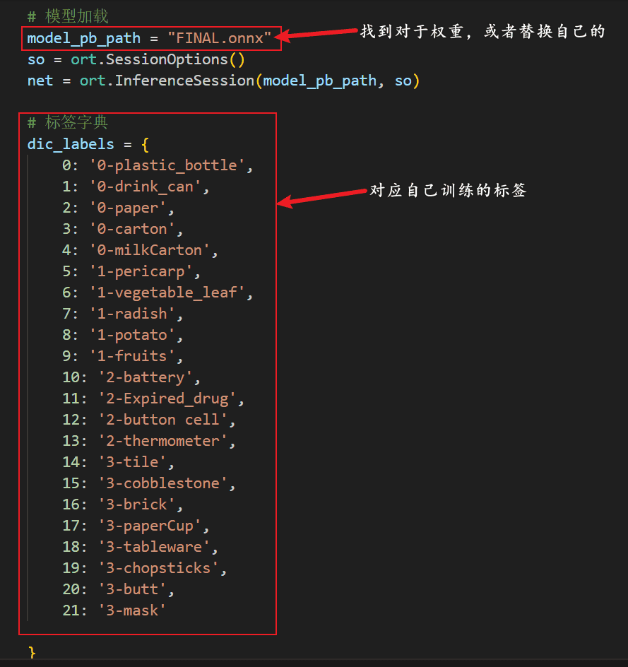

> 如果可以正常识别检测目标，环境搭建就没有问题，后续根据比赛要求添加通信代码就可以了。

### 自启动程序

打开终端，输入`sudo nano /etc/rc.local`，修改代码为一下形式，其中`#my codes`为主要添加代码，`autoboot.sh`为启动程序文件，自己命名即可。

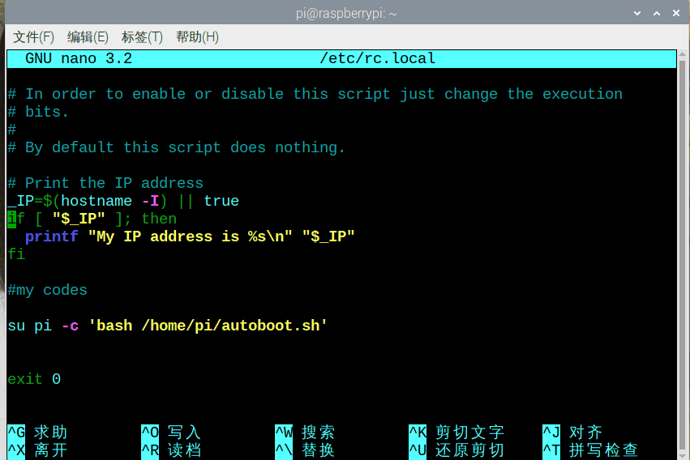

根据目录创建`autoboot.sh`文件，并添加一下内容

```shell
#!/bin/bash

export DISPLAY=:0
startx

# 日志
exec &>> /home/pi/logfile.log
echo "Script started at: $(date)"

# 市赛
python3 /home/pi/Py_Projects/Municipal_contest.py
# 初赛
# python3 /home/pi/Py_Projects/preliminary_contest.py
```

其中`#!/bin/bash`为必须内容，`export DISPLAY=:0	startx`是我摸索很久，可以实现QT界面开机显示的必须内容，否则开机QT界面无法正常显示。日志部分建议填写，方便开机自启出问题找原因，输出的日志会在`/home/pi/logfile.log`目录下。`python3 /home/pi/Py_Projects/Municipal_contest.py`为需要运行的代码。

## 显示屏界面设计

> 没什么可讲的，自己去学一学pyqt5，简单设计一个就可以了。

### python环境搭建(windows)

Python环境配置：

链接：https://pan.baidu.com/s/1WBBtduC-grJw9ZM88HqXfg?pwd=cmzz 
提取码：cmzz

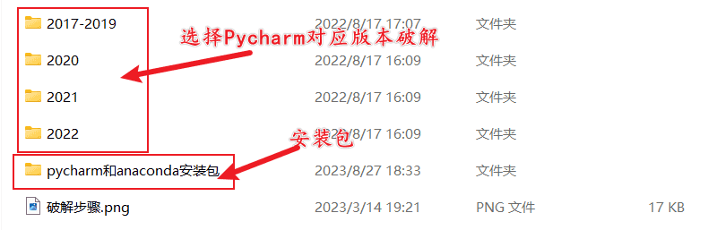

PyQt5环境配置：[界面开发（1） --- PyQt5环境配置_pyqt5 配置-CSDN博客](https://blog.csdn.net/WYKB_Mr_Q/article/details/129265121)

QT学习：[Python Qt 简介 | 白月黑羽 (byhy.net)](https://www.byhy.net/tut/py/gui/qt_01/)

界面设计主要需要注意的呢就两点：

1. 是否显示摄像头画面，我选择是显示，因为我看到画面安心一些，也知道哪些检测错了再去优化数据集。我用的就是一帧一帧的图像，以照片的形式显示出来。(QImage）
2. 视频的播放，一开始用的Pyqt5的player组件，但是移植到树莓派会一直报错，并且会导致分解树莓派算力使用，导致目标检测推理更慢。后来选用了树莓派的一个播放软件omxplayer，安装他的python库，用代码控制播放。

### 代码格式

这是一个 **第一版界面设计** ，没有加串口通信、视频、目标检测。

```python
from pathlib import Path
from threading import Thread
from PyQt5.QtCore import Qt
from PyQt5.QtMultimediaWidgets import QVideoWidget
from PyQt5.QtWidgets import *
from PyQt5.QtGui import QIcon, QPixmap, QFont
from PyQt5.QtMultimedia import QMediaPlayer, QMediaPlaylist, QMediaContent
from PyQt5.Qt import QUrl
import sys
import time


def is_mp4(file_path):
    # 使用Path类创建文件路径对象
    path = Path(file_path)

    # 检查文件是否存在
    if not path.exists():
        return False

    # 检查文件扩展名是否为.mp4
    if path.suffix.lower() == '.mp4':
        return True
    return False


class Demo:
    def __init__(self):

        """控件初始化"""
        self.ui = QMainWindow()
        # self.player = QMediaPlayer(self.ui)
        self.label = QLabel(self.ui)
        self.map_label = QLabel(self.ui)
        self.map2_label = QLabel(self.ui)
        # self.playlist = QMediaPlaylist(self.ui)
        # self.video_widget = QVideoWidget(self.ui)

        # self.slider = QSlider(Qt.Horizontal, self.ui)
        self.video_button = QPushButton("选择视频文件", self.ui)
        self.map_button = QPushButton("选择图片文件", self.ui)

        # self.textLabel = QLabel(self.ui)
        self.list = QListWidget(self.ui)
        # 创建表格
        rows = 4  # 行
        columns = 2  # 列
        self.table = QTableWidget(rows, columns, self.ui)
        thread_text = Thread(
            target=self.Text_time
        )
        # 属性初始化函数调用
        self.LayoutInit()
        self.WidgetInit()
        self.tabel_items()
        self.add_list_items()
        # self.Player()
        self.Signal()
        thread_text.start()

    # 视频播放函数
    # def Player(self):
    #     self.player.setVideoOutput(self.video_widget)  # 设置视频输出
    #     self.player.setPlaylist(self.playlist)
    #     self.playlist.addMedia(QMediaContent(QUrl.fromLocalFile("bak.mp4")))
    #     self.playlist.addMedia(QMediaContent(QUrl.fromLocalFile("lajifenlei.mp4")))
    #     self.playlist.setPlaybackMode(QMediaPlaylist.Loop)
    #
    #     self.player.setVolume(50)
    #
    #     self.player.play()

    # Layout界面
    def LayoutInit(self):
        central_widget = QWidget(self.ui)
        self.ui.setCentralWidget(central_widget)
        layout_v = QVBoxLayout(central_widget)
        layout_h = QHBoxLayout(central_widget)
        layout_h2 = QHBoxLayout(central_widget)
        layout_h3 = QHBoxLayout(central_widget)

        layout_h.addWidget(self.label)
        layout_h.addWidget(self.video_button)
        layout_h.addWidget(self.map_button)
        layout_h.setStretch(0, 5)
        layout_h.setStretch(1, 1)
        layout_h.setStretch(2, 1)
        layout_h.setSpacing(170)

        layout_h2.addWidget(self.map2_label)
        layout_h2.addWidget(self.map_label)
        layout_h2.setStretch(0, 5)
        layout_h2.setStretch(1, 5)
        layout_h2.setSpacing(0)

        layout_h3.addWidget(self.table)
        layout_h3.addWidget(self.list)
        layout_h3.setStretch(0, 1)
        layout_h3.setStretch(1, 3)
        layout_h3.setSpacing(50)

        layout_v.addLayout(layout_h)
        layout_v.addLayout(layout_h2)
        # layout_v.addWidget(self.slider)
        layout_v.addLayout(layout_h3)
        layout_v.setStretch(0, 1)
        layout_v.setStretch(1, 5)
        layout_v.setStretch(2, 1)
        layout_v.setStretch(3, 3)

        self.ui.setLayout(layout_v)


    def Text_time(self):
        while True:
            text = "❤❤❤❤❤地球环保卫士❤❤❤❤❤"
            for i in range(108):
                self.label.setText(text)
                time.sleep(0.1)
                text = ' ' + text


    def tabel_items(self):
        font_tabel = self.table.font()
        font_tabel.setPointSize(20)
        self.table.setFont(font_tabel)
        self.item1 = QTableWidgetItem("可回收垃圾")
        self.table.setItem(0, 0, self.item1)
        self.item2 = QTableWidgetItem("有害垃圾")
        self.table.setItem(1, 0, self.item2)
        self.item3 = QTableWidgetItem("厨余垃圾")
        self.table.setItem(2, 0, self.item3)
        self.item4 = QTableWidgetItem("其他垃圾")
        self.table.setItem(3, 0, self.item4)
        self.item5 = QTableWidgetItem("未满载")
        self.item6 = QTableWidgetItem("未满载")
        self.item7 = QTableWidgetItem("未满载")
        self.item8 = QTableWidgetItem("未满载")
        self.table.setItem(0, 1, self.item5)
        self.table.setItem(1, 1, self.item6)
        self.table.setItem(2, 1, self.item7)
        self.table.setItem(3, 1, self.item8)

    def add_list_items(self):
        for i in range(10):
            print(self.list.count())
            news = QListWidgetItem("可回收垃圾")
            self.list.addItem(news)
            self.list.scrollToItem(news, QListWidget.PositionAtBottom)

    # 控件初始化
    def WidgetInit(self):
        self.ui.setWindowTitle("播放视频")
        self.ui.resize(177 * 4, 400)
        self.label.setFrameStyle(QFrame.Panel | QFrame.Sunken)
        self.table.setShowGrid(False)  # 是否显示网格
        self.table.setHorizontalHeaderLabels(["类别", "是否满载"])
        self.table.horizontalHeader().setSectionResizeMode(QHeaderView.Stretch)
        font_list = self.list.font()
        font_list.setPointSize(18)
        self.list.setFont(font_list)
        # self.label.setAlignment(Qt.AlignCenter)
        map_widget = QPixmap("../../pictures/bu2.jpg")
        map_widget = map_widget.scaled(177 * 3, 300)
        self.map_label.setPixmap(map_widget)
        self.map_label.setScaledContents(True)

    # 信号槽函数初始化
    def Signal(self):
        # self.slider.sliderMoved.connect(self.GetMoved)
        # self.player.durationChanged.connect(self.GetDuration)
        # self.player.positionChanged.connect(self.GetPosition)
        self.video_button.clicked.connect(self.GetMap2)
        self.map_button.clicked.connect(self.GetMap)

    # 槽函数
    # def GetDuration(self, d):
    #     if d:
    #         self.slider.setRange(0, d)
    #         seconds = int(d / 1000)
    #         minutes = int(seconds / 60)
    #         seconds -= minutes * 60
    #         # self.label.setText(f"总时长：{minutes}:{seconds}")
    #         print(f"总时长：{minutes}:{seconds}")

    # def GetPosition(self, time):
    #     if time:
    #         self.slider.setValue(time)
    #
    # def GetMoved(self, time):
    #     self.player.setPosition(time)

    # def GetFiles(self):
    #     video = QFileDialog()
    #     url = video.getOpenFileUrl()[0].toLocalFile()
    #     self.playlist.addMedia(QMediaContent(QUrl.fromLocalFile(url)))
    #     if is_mp4(url):
    #         num = self.playlist.mediaCount()
    #         for i in range(num):
    #             files = []
    #             file = self.playlist.media(i).canonicalUrl().toString()
    #             files.append(file)
    #             print(files)
    #
    #         self.playlist.setCurrentIndex(num - 1)
    #     else:
    #         QMessageBox.warning(self.ui, "警告", "所选数据类型不是'.MP4！'", QMessageBox.Yes | QMessageBox.No)

    def GetMap2(self):
        video = QFileDialog()
        url = video.getOpenFileUrl()[0].toLocalFile()
        map_widget = QPixmap(url)
        map_widget = map_widget.scaled(177 * 3, 300)
        self.map2_label.setPixmap(map_widget)
        self.map2_label.setScaledContents(True)

    def GetMap(self):
        video = QFileDialog()
        url = video.getOpenFileUrl()[0].toLocalFile()
        map_widget = QPixmap(url)
        map_widget = map_widget.scaled(177 * 3, 300)
        self.map_label.setPixmap(map_widget)
        self.map_label.setScaledContents(True)


if __name__ == "__main__":
    while 1:
        app = QApplication(sys.argv)
        app.setWindowIcon(QIcon("../ico/social-gears.ico"))
        bar = Demo()

        bar.ui.show()
        bar.ui.showFullScreen()
        sys.exit(app.exec_())

```

**这里不推荐我这种代码格式，修改起来很麻烦，到后面几百号的代码在一个文件里，修改起来很不方便。** 推荐的方式是每一个功能单独一个python文件，建立一系列的函数库，最后写一个单独的调用文件；当某个功能出问题以后就可以在其文件里修改，代码量少，且更直观。

下面展示一下我后面写的一个粗糙版QT登录界面，展示一下函数库运用：

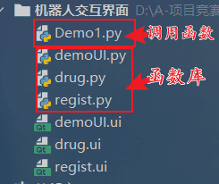

**函数库：**

`demoUI.py`

```python
# -*- coding: utf-8 -*-

# Form implementation generated from reading ui file 'demoUI.ui'
#
# Created by: PyQt5 UI code generator 5.15.9
#
# WARNING: Any manual changes made to this file will be lost when pyuic5 is
# run again.  Do not edit this file unless you know what you are doing.


from PyQt5 import QtCore, QtGui, QtWidgets


class Ui_Form(object):
    def setupUi(self, Form):
        Form.setObjectName("Form")
        Form.resize(640, 480)
        self.resign = QtWidgets.QPushButton(Form)
        self.resign.setGeometry(QtCore.QRect(210, 230, 91, 41))
        font = QtGui.QFont()
        font.setPointSize(11)
        self.resign.setFont(font)
        self.resign.setObjectName("resign")
        self.forget = QtWidgets.QPushButton(Form)
        self.forget.setGeometry(QtCore.QRect(340, 230, 91, 41))
        font = QtGui.QFont()
        font.setPointSize(11)
        self.forget.setFont(font)
        self.forget.setObjectName("forget")
        self.label_username = QtWidgets.QLabel(Form)
        self.label_username.setGeometry(QtCore.QRect(210, 120, 72, 30))
        font = QtGui.QFont()
        font.setPointSize(12)
        self.label_username.setFont(font)
        self.label_username.setObjectName("label_username")
        self.label_passwd = QtWidgets.QLabel(Form)
        self.label_passwd.setGeometry(QtCore.QRect(230, 160, 72, 30))
        font = QtGui.QFont()
        font.setPointSize(12)
        self.label_passwd.setFont(font)
        self.label_passwd.setTabletTracking(False)
        self.label_passwd.setObjectName("label_passwd")
        self.UserName = QtWidgets.QLineEdit(Form)
        self.UserName.setGeometry(QtCore.QRect(290, 120, 141, 31))
        self.UserName.setObjectName("UserName")
        self.Passwd = QtWidgets.QLineEdit(Form)
        self.Passwd.setGeometry(QtCore.QRect(290, 160, 141, 31))
        self.Passwd.setObjectName("Passwd")
        self.Inter = QtWidgets.QPushButton(Form)
        self.Inter.setGeometry(QtCore.QRect(270, 290, 91, 41))
        font = QtGui.QFont()
        font.setPointSize(12)
        self.Inter.setFont(font)
        self.Inter.setStyleSheet("background-color: rgb(0, 85, 255);")
        self.Inter.setObjectName("Inter")
        self.label = QtWidgets.QLabel(Form)
        self.label.setGeometry(QtCore.QRect(220, 30, 201, 51))
        font = QtGui.QFont()
        font.setPointSize(20)
        self.label.setFont(font)
        self.label.setStyleSheet("background-color: rgb(255, 170, 255);")
        self.label.setObjectName("label")

        self.retranslateUi(Form)
        QtCore.QMetaObject.connectSlotsByName(Form)

    def retranslateUi(self, Form):
        _translate = QtCore.QCoreApplication.translate
        Form.setWindowTitle(_translate("Form", "人机交互界面"))
        self.resign.setText(_translate("Form", "注册账号"))
        self.forget.setText(_translate("Form", "忘记密码"))
        self.label_username.setText(_translate("Form", "用户名："))
        self.label_passwd.setText(_translate("Form", "密码："))
        self.Inter.setText(_translate("Form", "登录"))
        self.label.setText(_translate("Form", "用户登录界面"))

```

`drug.py`

```python
# -*- coding: utf-8 -*-

# Form implementation generated from reading ui file 'drug.ui'
#
# Created by: PyQt5 UI code generator 5.15.9
#
# WARNING: Any manual changes made to this file will be lost when pyuic5 is
# run again.  Do not edit this file unless you know what you are doing.


from PyQt5 import QtCore, QtGui, QtWidgets


class Ui_drug(object):
    def setupUi(self, Form):
        Form.setObjectName("Form")
        Form.resize(640, 480)
        self.label = QtWidgets.QLabel(Form)
        self.label.setGeometry(QtCore.QRect(210, 40, 211, 61))
        font = QtGui.QFont()
        font.setPointSize(20)
        self.label.setFont(font)
        self.label.setStyleSheet("background-color: rgb(255, 170, 255);")
        self.label.setObjectName("label")
        self.red = QtWidgets.QPushButton(Form)
        self.red.setGeometry(QtCore.QRect(140, 150, 121, 81))
        font = QtGui.QFont()
        font.setPointSize(20)
        self.red.setFont(font)
        self.red.setStyleSheet("background-color: rgb(255, 36, 17);")
        self.red.setObjectName("red")
        self.green = QtWidgets.QPushButton(Form)
        self.green.setGeometry(QtCore.QRect(140, 280, 121, 81))
        font = QtGui.QFont()
        font.setPointSize(20)
        self.green.setFont(font)
        self.green.setStyleSheet("background-color: rgb(29, 255, 29);")
        self.green.setObjectName("green")
        self.title = QtWidgets.QPushButton(Form)
        self.title.setGeometry(QtCore.QRect(360, 150, 121, 81))
        font = QtGui.QFont()
        font.setPointSize(20)
        self.title.setFont(font)
        self.title.setStyleSheet("background-color: rgb(31, 24, 255);")
        self.title.setObjectName("title")
        self.crey = QtWidgets.QPushButton(Form)
        self.crey.setGeometry(QtCore.QRect(360, 280, 121, 81))
        font = QtGui.QFont()
        font.setPointSize(20)
        self.crey.setFont(font)
        self.crey.setStyleSheet("background-color: rgb(102, 240, 255);")
        self.crey.setObjectName("crey")

        self.retranslateUi(Form)
        QtCore.QMetaObject.connectSlotsByName(Form)

    def retranslateUi(self, Form):
        _translate = QtCore.QCoreApplication.translate
        Form.setWindowTitle(_translate("Form", "Form"))
        self.label.setText(_translate("Form", "药品仓库示意"))
        self.red.setText(_translate("Form", "1号"))
        self.green.setText(_translate("Form", "3号"))
        self.title.setText(_translate("Form", "2号"))
        self.crey.setText(_translate("Form", "4号"))

```

`regist.py`

```python
# -*- coding: utf-8 -*-

# Form implementation generated from reading ui file 'regist.ui'
#
# Created by: PyQt5 UI code generator 5.15.9
#
# WARNING: Any manual changes made to this file will be lost when pyuic5 is
# run again.  Do not edit this file unless you know what you are doing.


from PyQt5 import QtCore, QtGui, QtWidgets


class Ui_regist(object):
    def setupUi(self, widget):
        widget.setObjectName("widget")
        widget.resize(640, 480)
        self.regist_user = QtWidgets.QLabel(widget)
        self.regist_user.setGeometry(QtCore.QRect(180, 90, 91, 31))
        self.regist_user.setMinimumSize(QtCore.QSize(0, 0))
        self.regist_user.setBaseSize(QtCore.QSize(0, 0))
        font = QtGui.QFont()
        font.setPointSize(12)
        self.regist_user.setFont(font)
        self.regist_user.setObjectName("regist_user")
        self.text_user = QtWidgets.QLineEdit(widget)
        self.text_user.setGeometry(QtCore.QRect(280, 90, 141, 31))
        font = QtGui.QFont()
        font.setPointSize(12)
        self.text_user.setFont(font)
        self.text_user.setObjectName("text_user")
        self.text_passwd = QtWidgets.QLineEdit(widget)
        self.text_passwd.setGeometry(QtCore.QRect(280, 150, 141, 31))
        font = QtGui.QFont()
        font.setPointSize(12)
        self.text_passwd.setFont(font)
        self.text_passwd.setObjectName("text_passwd")
        self.text_passwd_Q = QtWidgets.QLineEdit(widget)
        self.text_passwd_Q.setGeometry(QtCore.QRect(280, 210, 141, 31))
        font = QtGui.QFont()
        font.setPointSize(12)
        self.text_passwd_Q.setFont(font)
        self.text_passwd_Q.setObjectName("text_passwd_Q")
        self.regist_passwd_Q = QtWidgets.QLabel(widget)
        self.regist_passwd_Q.setGeometry(QtCore.QRect(180, 210, 91, 31))
        self.regist_passwd_Q.setMinimumSize(QtCore.QSize(0, 0))
        self.regist_passwd_Q.setBaseSize(QtCore.QSize(0, 0))
        font = QtGui.QFont()
        font.setPointSize(12)
        self.regist_passwd_Q.setFont(font)
        self.regist_passwd_Q.setObjectName("regist_passwd_Q")
        self.regist_passwd = QtWidgets.QLabel(widget)
        self.regist_passwd.setGeometry(QtCore.QRect(180, 150, 91, 31))
        self.regist_passwd.setMinimumSize(QtCore.QSize(0, 0))
        self.regist_passwd.setBaseSize(QtCore.QSize(0, 0))
        font = QtGui.QFont()
        font.setPointSize(12)
        self.regist_passwd.setFont(font)
        self.regist_passwd.setObjectName("regist_passwd")
        self.Regist = QtWidgets.QPushButton(widget)
        self.Regist.setGeometry(QtCore.QRect(250, 280, 111, 41))
        font = QtGui.QFont()
        font.setPointSize(12)
        self.Regist.setFont(font)
        self.Regist.setStyleSheet("background-color: rgb(0, 0, 255);")
        self.Regist.setObjectName("Regist")

        self.retranslateUi(widget)
        QtCore.QMetaObject.connectSlotsByName(widget)

    def retranslateUi(self, widget):
        _translate = QtCore.QCoreApplication.translate
        widget.setWindowTitle(_translate("widget", "注册"))
        self.regist_user.setText(_translate("widget", "输入账号:"))
        self.regist_passwd_Q.setText(_translate("widget", "确认密码:"))
        self.regist_passwd.setText(_translate("widget", "输入密码:"))
        self.Regist.setText(_translate("widget", "注册"))

```

调用函数`Demo1.py`：

```python
import sys
# 这部分就是自定义函数库，from 文件名 import 函数名/类
from demoUI import Ui_Form
from regist import Ui_regist
from drug import Ui_drug
#
from PyQt5.QtWidgets import QApplication, QMainWindow


class MainWindow(QMainWindow, Ui_Form):
    def __init__(self):
        super(MainWindow, self).__init__()
        self.setupUi(self)


class Register(QMainWindow, Ui_regist):
    def __init__(self, parent=None):
        super(Register, self).__init__(parent)
        self.setupUi(self)

    def Open(self):
        self.show()


class Drug(QMainWindow, Ui_drug):
    def __init__(self, parent=None):
        super(Drug, self).__init__(parent)
        self.setupUi(self)

    def Open(self):
        self.show()


if __name__ == "__main__":
    app = QApplication(sys.argv)
    main = MainWindow()
    register = Register()
    drug = Drug()
    main.resign.clicked.connect(register.Open)
    main.Inter.clicked.connect(drug.Open)
    main.show()
    sys.exit(app.exec_())

```
