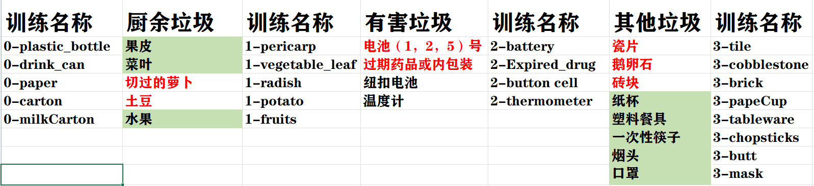
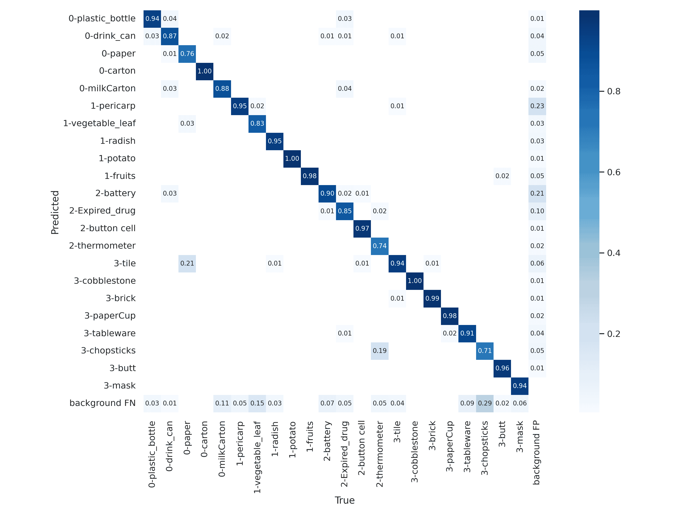
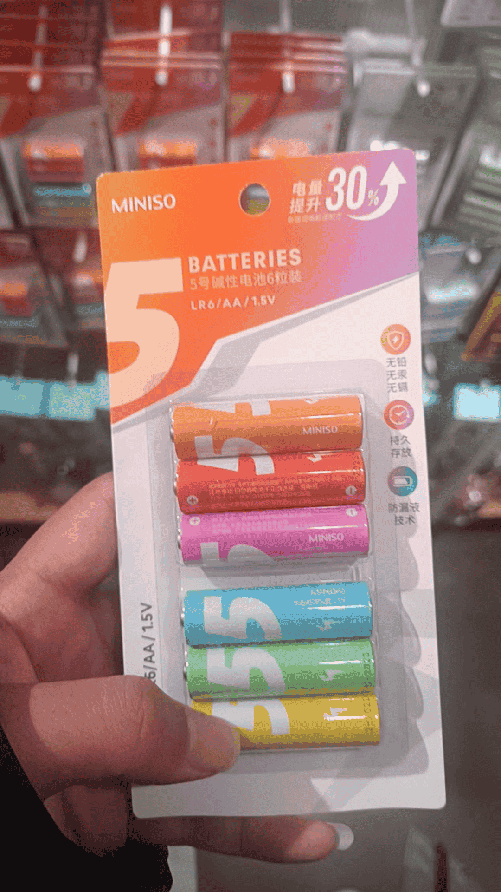
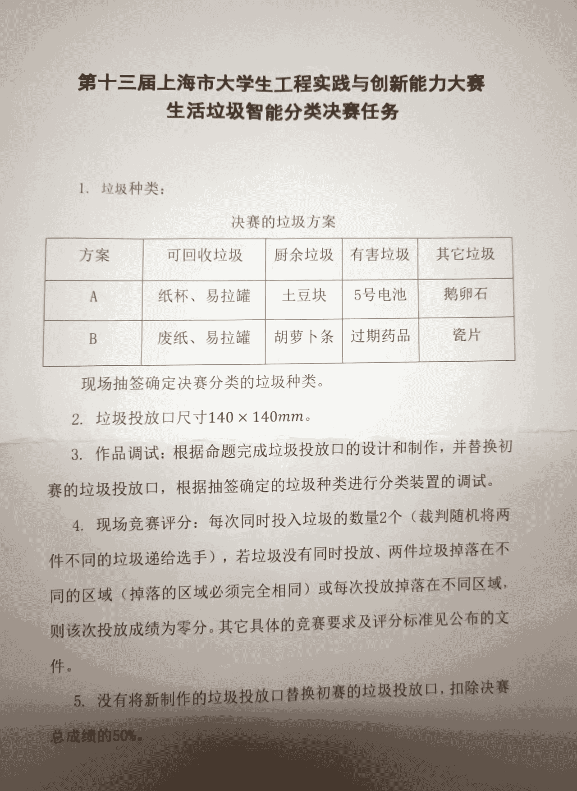

## 重要说明

**重点说明：**

标红的是文档明确说明的种类，其他为我们自己添加的种类。**但是，有几点重要说明：**

- **无论是市赛还是国赛，初赛期间垃圾种类都没有超过标红范围。**
- **市赛的决赛，多出来的垃圾为废纸团和纸杯。**
- **国赛初赛有一些比较抽象的垃圾。**

国赛抽象垃圾：

1. 小米橙色电池，很容易识别成胡萝卜。

2. 纯白色瓷片
3. 小土豆，很小，且是湿的。

**训练模型注重文档说明的垃圾种类，注重种类，比如电池，找各种各样的电池，其次才是数量。**

## 市赛的决赛任务

> 这些任务中，我们当时基本都已经准备好了，除了纸杯和废纸是文档中没有说明的，不过问题不大，其他组准备的也不完美。

