## 通信协议

- **通信的目的:**  将一个设备的数据传送到另一个设备，扩展硬件系统
- **通信协议:** 制定通信的规则，通信双方按照协议规则进行数据收发

| **名称** | **引脚**             | **双工** | **时钟** | **电平** | **设备** |
| -------- | -------------------- | -------- | -------- | -------- | -------- |
| USART    | TX、RX               | 全双工   | 异步     | 单端     | 点对点   |
| I2C      | SCL、SDA             | 半双工   | 同步     | 单端     | 多设备   |
| SPI      | SCLK、MOSI、MISO、CS | 全双工   | 同步     | 单端     | 多设备   |
| CAN      | CAN_H、CAN_L         | 半双工   | 异步     | 差分     | 多设备   |
| USB      | DP、DM               | 半双工   | 异步     | 差分     | 点对点   |

> 双工：指通信双方是否可以同时进行双向通信（发送和接收）。
>
> 单工：数据只能从一个设备到另一个设备，不能反着来。
>
> 时钟： I2C 和 SPI 有单独的时钟线，所以是同步。
>
> 电平：单端信号，即引脚的高低电平是相对GND的电压差，所以需要共地。

## 串口通信简介

- 串口是一种应用十分广泛的通讯接口，串口成本低、容易使用、通信线路简单，可实现两个设备的互相通信
- 单片机的串口可以使单片机与单片机、单片机与电脑、单片机与各式各样的模块互相通信，极大地扩展了单片机的应用范围，增强了单片机系统的硬件实力

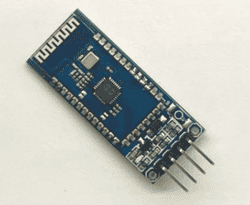

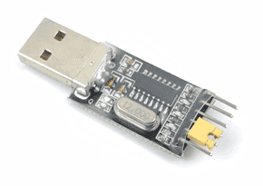

### 硬件电路

- 简单双向串口通信有两根通信线（发送端TX和接收端RX）
- TX与RX要交叉连接
- 当只需单向的数据传输时，可以只接一根通信线
- 当电平标准不一致时，需要加电平转换芯片

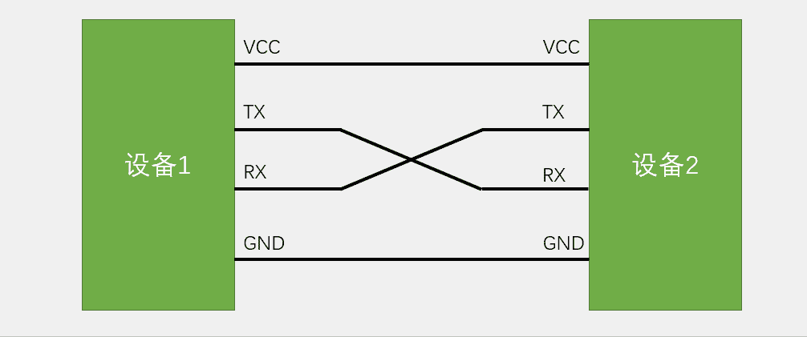

### 电平标准

- 电平标准是数据1和数据0的表达方式，是传输线缆中人为规定的电压与数据的对应关系，串口常用的电平标准有如下三种：
- TTL电平：+3.3V或+5V表示1，0V表示0
- RS232电平：-3 至 -15V表示1，+3 至 +15V表示0
- RS485电平：两线压差+2至+6V表示1，-2 至 -6V表示0（差分信号）

### 串口参数及时序

- **波特率：** 串口通信的速率
- **起始位：** 标志一个数据帧的开始，**固定为低电平**
- **数据位：** 数据帧的有效载荷，1为高电平，0为低电平，低位先行
- **校验位：** 用于数据验证，根据数据位计算得来(无校验、奇校验--即保持二进制数据1的个数为奇数、偶校验)
- **停止位：** 用于数据帧间隔，**固定为高电平**

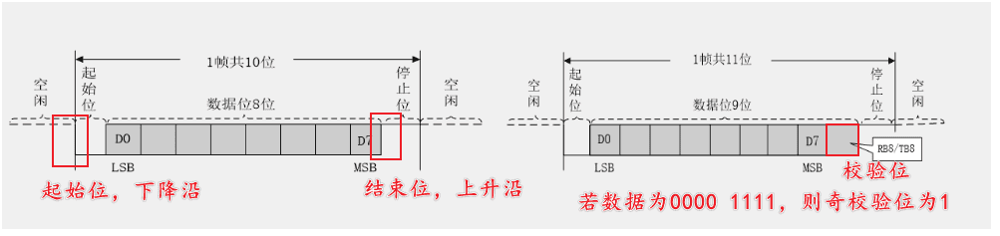

### 串口时序

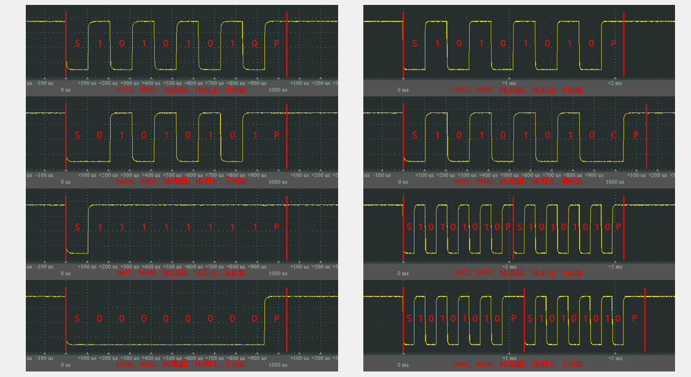

## USART简介

- USART（Universal Synchronous/Asynchronous Receiver/Transmitter）通用同步/异步收发器
- USART是STM32内部集成的硬件外设，可根据数据寄存器的一个字节数据自动生成数据帧时序，从TX引脚发送出去，也可自动接收RX引脚的数据帧时序，拼接为一个字节数据，存放在数据寄存器里
- 自带波特率发生器，最高达4.5Mbits/s
- 可配置数据位长度（8/9）、停止位长度（0.5/1/1.5/2）
- 可选校验位（无校验/奇校验/偶校验）
- 支持同步模式、硬件流控制、DMA、智能卡、IrDA、LIN
- STM32F103C8T6 USART资源： USART1、 USART2、 USART3

### USART框图

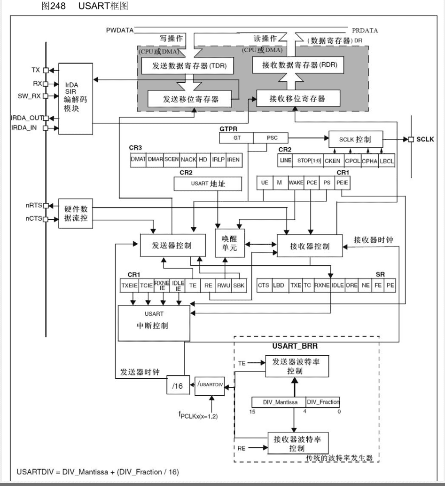

### USART基本结构

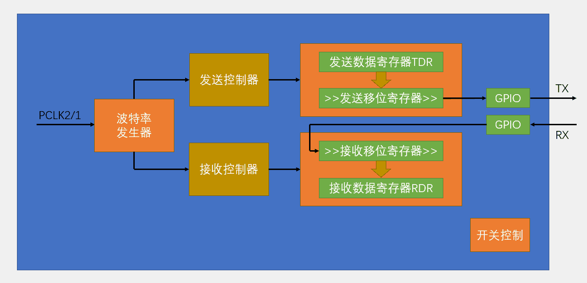

### 数据帧

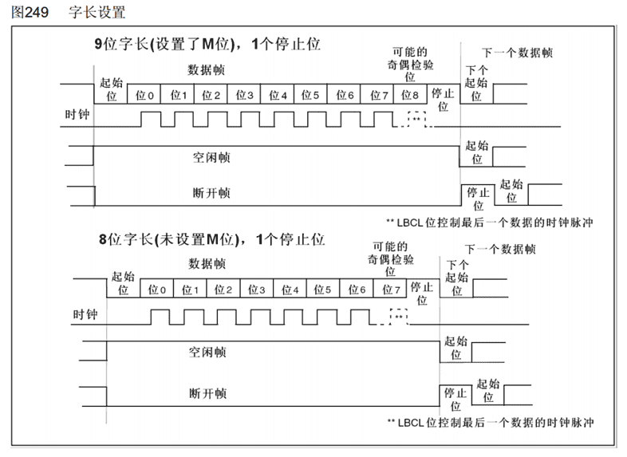

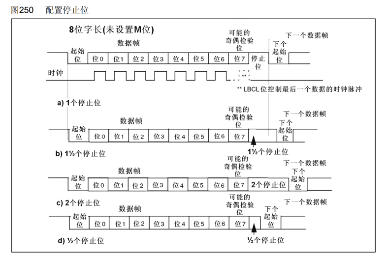

### 起始位侦测

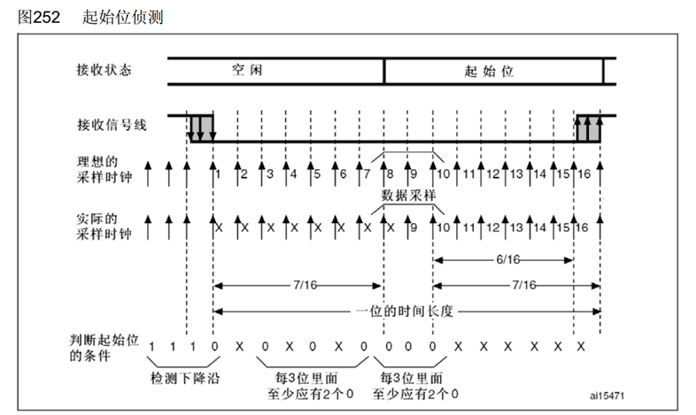

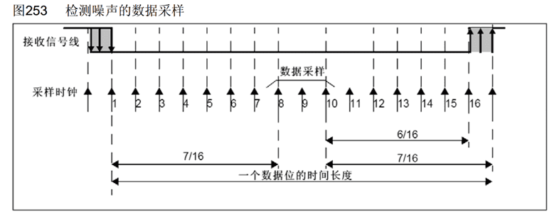

### 波特率发生器

- 发送器和接收器的波特率由波特率寄存器BRR里的DIV确定
- 计算公式：波特率 = f_PCLK2/1 / (16 * DIV)​

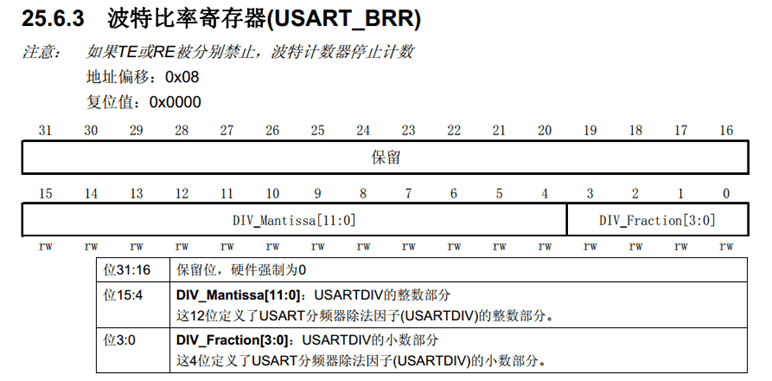

## USART代码示例

```C
#include "stm32f10x.h"                  // Device header
#include <stdio.h>
#include <stdarg.h>

uint8_t Serial_RxData;		//定义串口接收的数据变量
uint8_t Serial_RxFlag;		//定义串口接收的标志位变量

/**
  * 函    数：串口初始化
  * 参    数：无
  * 返 回 值：无
  */
void Serial_Init(void)
{
	/*开启时钟*/
	RCC_APB2PeriphClockCmd(RCC_APB2Periph_USART1, ENABLE);	//开启USART1的时钟
	RCC_APB2PeriphClockCmd(RCC_APB2Periph_GPIOA, ENABLE);	//开启GPIOA的时钟
	
	/*GPIO初始化*/
	GPIO_InitTypeDef GPIO_InitStructure;
	GPIO_InitStructure.GPIO_Mode = GPIO_Mode_AF_PP;
	GPIO_InitStructure.GPIO_Pin = GPIO_Pin_9;
	GPIO_InitStructure.GPIO_Speed = GPIO_Speed_50MHz;
	GPIO_Init(GPIOA, &GPIO_InitStructure);					//将PA9引脚初始化为复用推挽输出
	
	GPIO_InitStructure.GPIO_Mode = GPIO_Mode_IPU;
	GPIO_InitStructure.GPIO_Pin = GPIO_Pin_10;
	GPIO_InitStructure.GPIO_Speed = GPIO_Speed_50MHz;
	GPIO_Init(GPIOA, &GPIO_InitStructure);					//将PA10引脚初始化为上拉输入
	
	/*USART初始化*/
	USART_InitTypeDef USART_InitStructure;					//定义结构体变量
	USART_InitStructure.USART_BaudRate = 9600;				//波特率
	USART_InitStructure.USART_HardwareFlowControl = USART_HardwareFlowControl_None;	//硬件流控制，不需要
	USART_InitStructure.USART_Mode = USART_Mode_Tx | USART_Mode_Rx;	//模式，发送模式和接收模式均选择
	USART_InitStructure.USART_Parity = USART_Parity_No;		//奇偶校验，不需要
	USART_InitStructure.USART_StopBits = USART_StopBits_1;	//停止位，选择1位
	USART_InitStructure.USART_WordLength = USART_WordLength_8b;		//字长，选择8位
	USART_Init(USART1, &USART_InitStructure);				//将结构体变量交给USART_Init，配置USART1
	
	/*中断输出配置*/
	USART_ITConfig(USART1, USART_IT_RXNE, ENABLE);			//开启串口接收数据的中断
	
	/*NVIC中断分组*/
	NVIC_PriorityGroupConfig(NVIC_PriorityGroup_2);			//配置NVIC为分组2
	
	/*NVIC配置*/
	NVIC_InitTypeDef NVIC_InitStructure;					//定义结构体变量
	NVIC_InitStructure.NVIC_IRQChannel = USART1_IRQn;		//选择配置NVIC的USART1线
	NVIC_InitStructure.NVIC_IRQChannelCmd = ENABLE;			//指定NVIC线路使能
	NVIC_InitStructure.NVIC_IRQChannelPreemptionPriority = 1;		//指定NVIC线路的抢占优先级为1
	NVIC_InitStructure.NVIC_IRQChannelSubPriority = 1;		//指定NVIC线路的响应优先级为1
	NVIC_Init(&NVIC_InitStructure);							//将结构体变量交给NVIC_Init，配置NVIC外设
	
	/*USART使能*/
	USART_Cmd(USART1, ENABLE);								//使能USART1，串口开始运行
}

/**
  * 函    数：串口发送一个字节
  * 参    数：Byte 要发送的一个字节
  * 返 回 值：无
  */
void Serial_SendByte(uint8_t Byte)
{
	USART_SendData(USART1, Byte);		//将字节数据写入数据寄存器，写入后USART自动生成时序波形
	while (USART_GetFlagStatus(USART1, USART_FLAG_TXE) == RESET);	//等待发送完成
	/*下次写入数据寄存器会自动清除发送完成标志位，故此循环后，无需清除标志位*/
}

/**
  * 函    数：串口发送一个数组
  * 参    数：Array 要发送数组的首地址
  * 参    数：Length 要发送数组的长度
  * 返 回 值：无
  */
void Serial_SendArray(uint8_t *Array, uint16_t Length)
{
	uint16_t i;
	for (i = 0; i < Length; i ++)		//遍历数组
	{
		Serial_SendByte(Array[i]);		//依次调用Serial_SendByte发送每个字节数据
	}
}

/**
  * 函    数：串口发送一个字符串
  * 参    数：String 要发送字符串的首地址
  * 返 回 值：无
  */
void Serial_SendString(char *String)
{
	uint8_t i;
	for (i = 0; String[i] != '\0'; i ++)//遍历字符数组（字符串），遇到字符串结束标志位后停止
	{
		Serial_SendByte(String[i]);		//依次调用Serial_SendByte发送每个字节数据
	}
}

/**
  * 函    数：次方函数（内部使用）
  * 返 回 值：返回值等于X的Y次方
  */
uint32_t Serial_Pow(uint32_t X, uint32_t Y)
{
	uint32_t Result = 1;	//设置结果初值为1
	while (Y --)			//执行Y次
	{
		Result *= X;		//将X累乘到结果
	}
	return Result;
}

/**
  * 函    数：串口发送数字
  * 参    数：Number 要发送的数字，范围：0~4294967295
  * 参    数：Length 要发送数字的长度，范围：0~10
  * 返 回 值：无
  */
void Serial_SendNumber(uint32_t Number, uint8_t Length)
{
	uint8_t i;
	for (i = 0; i < Length; i ++)		//根据数字长度遍历数字的每一位
	{
		Serial_SendByte(Number / Serial_Pow(10, Length - i - 1) % 10 + '0');	//依次调用Serial_SendByte发送每位数字
	}
}

/**
  * 函    数：使用printf需要重定向的底层函数
  * 参    数：保持原始格式即可，无需变动
  * 返 回 值：保持原始格式即可，无需变动
  */
int fputc(int ch, FILE *f)
{
	Serial_SendByte(ch);			//将printf的底层重定向到自己的发送字节函数
	return ch;
}

/**
  * 函    数：自己封装的prinf函数
  * 参    数：format 格式化字符串
  * 参    数：... 可变的参数列表
  * 返 回 值：无
  */
void Serial_Printf(char *format, ...)
{
	char String[100];				//定义字符数组
	va_list arg;					//定义可变参数列表数据类型的变量arg
	va_start(arg, format);			//从format开始，接收参数列表到arg变量
	vsprintf(String, format, arg);	//使用vsprintf打印格式化字符串和参数列表到字符数组中
	va_end(arg);					//结束变量arg
	Serial_SendString(String);		//串口发送字符数组（字符串）
}

/**
  * 函    数：获取串口接收标志位
  * 参    数：无
  * 返 回 值：串口接收标志位，范围：0~1，接收到数据后，标志位置1，读取后标志位自动清零
  */
uint8_t Serial_GetRxFlag(void)
{
	if (Serial_RxFlag == 1)			//如果标志位为1
	{
		Serial_RxFlag = 0;
		return 1;					//则返回1，并自动清零标志位
	}
	return 0;						//如果标志位为0，则返回0
}

/**
  * 函    数：获取串口接收的数据
  * 参    数：无
  * 返 回 值：接收的数据，范围：0~255
  */
uint8_t Serial_GetRxData(void)
{
	return Serial_RxData;			//返回接收的数据变量
}

/**
  * 函    数：USART1中断函数
  * 参    数：无
  * 返 回 值：无
  * 注意事项：此函数为中断函数，无需调用，中断触发后自动执行
  *           函数名为预留的指定名称，可以从启动文件复制
  *           请确保函数名正确，不能有任何差异，否则中断函数将不能进入
  */
void USART1_IRQHandler(void)
{
	if (USART_GetITStatus(USART1, USART_IT_RXNE) == SET)		//判断是否是USART1的接收事件触发的中断
	{
		Serial_RxData = USART_ReceiveData(USART1);				//读取数据寄存器，存放在接收的数据变量
		Serial_RxFlag = 1;										//置接收标志位变量为1
		USART_ClearITPendingBit(USART1, USART_IT_RXNE);			//清除USART1的RXNE标志位
																//读取数据寄存器会自动清除此标志位
																//如果已经读取了数据寄存器，也可以不执行此代码
	}
}

```

## 数据包接收

### 数据模式

- HEX模式/十六进制模式/二进制模式：以原始数据的形式显示
- 文本模式/字符模式：以原始数据编码后的形式显示

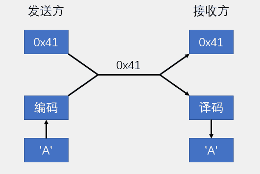

### HEX数据包

- **固定包长，含包头包尾**

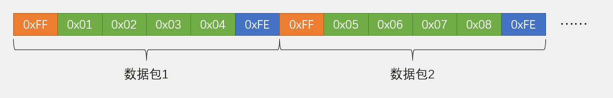

- **可变包长，含包头包尾**

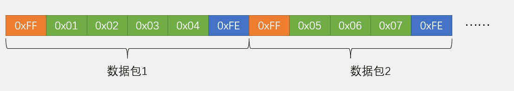

### 文本数据包

- **固定包长，含包头包尾**

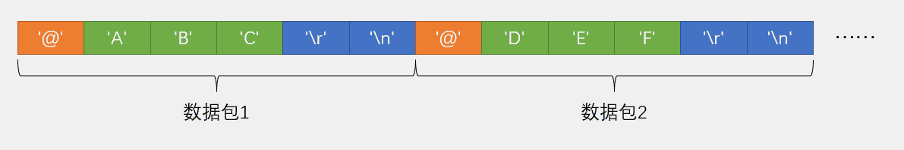

- **可变包长，含包头包尾**

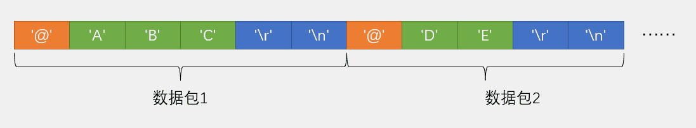

### HEX数据包接收

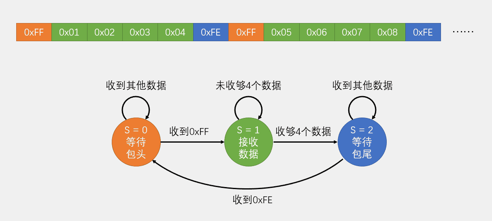

### 文本数据包接收

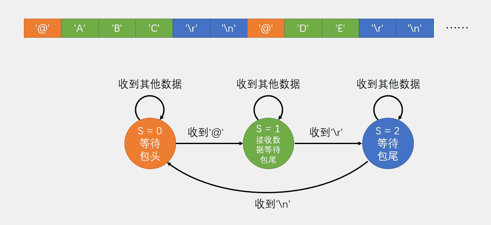

## 数据包代码示例

### HEX数据包

```C
void USART1_IRQHandler(void)
{
	static uint8_t RxState = 0;		//定义表示当前状态机状态的静态变量
	static uint8_t pRxPacket = 0;	//定义表示当前接收数据位置的静态变量
	if (USART_GetITStatus(USART1, USART_IT_RXNE) == SET)		//判断是否是USART1的接收事件触发的中断
	{
		uint8_t RxData = USART_ReceiveData(USART1);				//读取数据寄存器，存放在接收的数据变量
		
		/*使用状态机的思路，依次处理数据包的不同部分*/
		
		/*当前状态为0，接收数据包包头*/
		if (RxState == 0)
		{
			if (RxData == 0xFF)			//如果数据确实是包头
			{
				RxState = 1;			//置下一个状态
				pRxPacket = 0;			//数据包的位置归零
			}
		}
		/*当前状态为1，接收数据包数据*/
		else if (RxState == 1)
		{
			Serial_RxPacket[pRxPacket] = RxData;	//将数据存入数据包数组的指定位置
			pRxPacket ++;				//数据包的位置自增
			if (pRxPacket >= 4)			//如果收够4个数据
			{
				RxState = 2;			//置下一个状态
			}
		}
		/*当前状态为2，接收数据包包尾*/
		else if (RxState == 2)
		{
			if (RxData == 0xFE)			//如果数据确实是包尾部
			{
				RxState = 0;			//状态归0
				Serial_RxFlag = 1;		//接收数据包标志位置1，成功接收一个数据包
			}
		}
		
		USART_ClearITPendingBit(USART1, USART_IT_RXNE);		//清除标志位
	}
}

```

### 文本数据包

```C
void USART1_IRQHandler(void)
{
	static uint8_t RxState = 0;		//定义表示当前状态机状态的静态变量
	static uint8_t pRxPacket = 0;	//定义表示当前接收数据位置的静态变量
	if (USART_GetITStatus(USART1, USART_IT_RXNE) == SET)	//判断是否是USART1的接收事件触发的中断
	{
		uint8_t RxData = USART_ReceiveData(USART1);			//读取数据寄存器，存放在接收的数据变量
		
		/*使用状态机的思路，依次处理数据包的不同部分*/
		
		/*当前状态为0，接收数据包包头*/
		if (RxState == 0)
		{
			if (RxData == '@' && Serial_RxFlag == 0)		//如果数据确实是包头，并且上一个数据包已处理完毕
			{
				RxState = 1;			//置下一个状态
				pRxPacket = 0;			//数据包的位置归零
			}
		}
		/*当前状态为1，接收数据包数据，同时判断是否接收到了第一个包尾*/
		else if (RxState == 1)
		{
			if (RxData == '\r')			//如果收到第一个包尾
			{
				RxState = 2;			//置下一个状态
			}
			else						//接收到了正常的数据
			{
				Serial_RxPacket[pRxPacket] = RxData;		//将数据存入数据包数组的指定位置
				pRxPacket ++;			//数据包的位置自增
			}
		}
		/*当前状态为2，接收数据包第二个包尾*/
		else if (RxState == 2)
		{
			if (RxData == '\n')			//如果收到第二个包尾
			{
				RxState = 0;			//状态归0
				Serial_RxPacket[pRxPacket] = '\0';			//将收到的字符数据包添加一个字符串结束标志
				Serial_RxFlag = 1;		//接收数据包标志位置1，成功接收一个数据包
			}
		}
		
		USART_ClearITPendingBit(USART1, USART_IT_RXNE);		//清除标志位
	}
}
```

- 