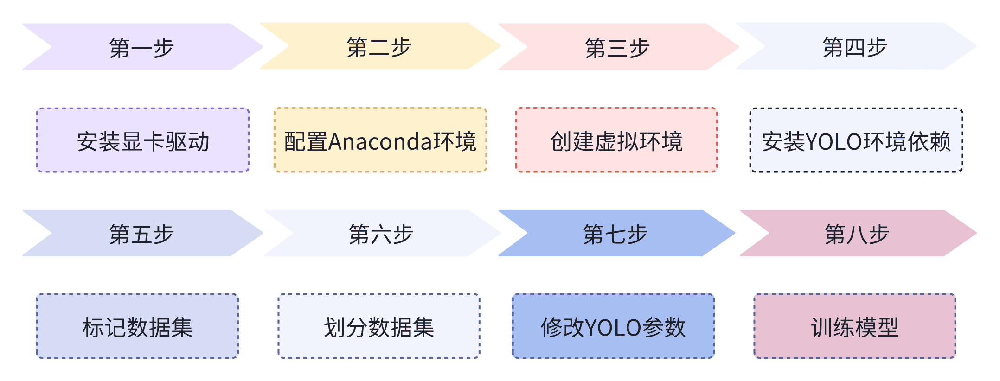
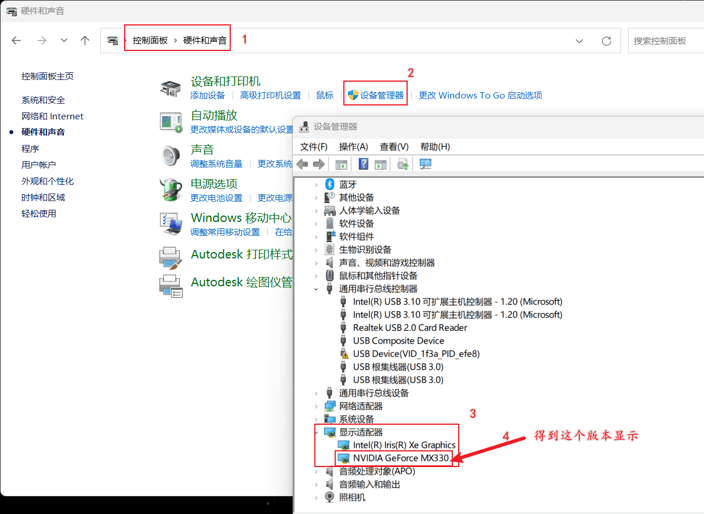
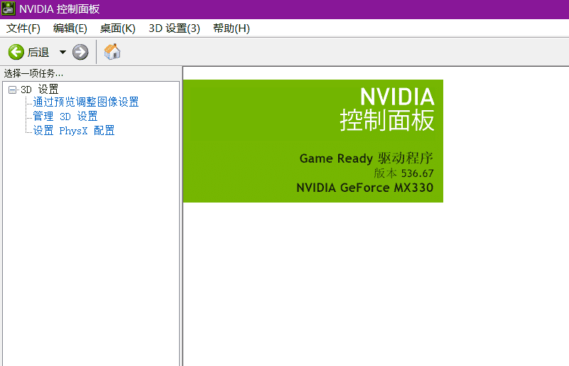
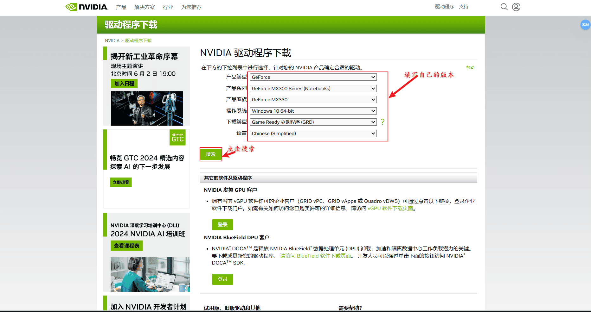
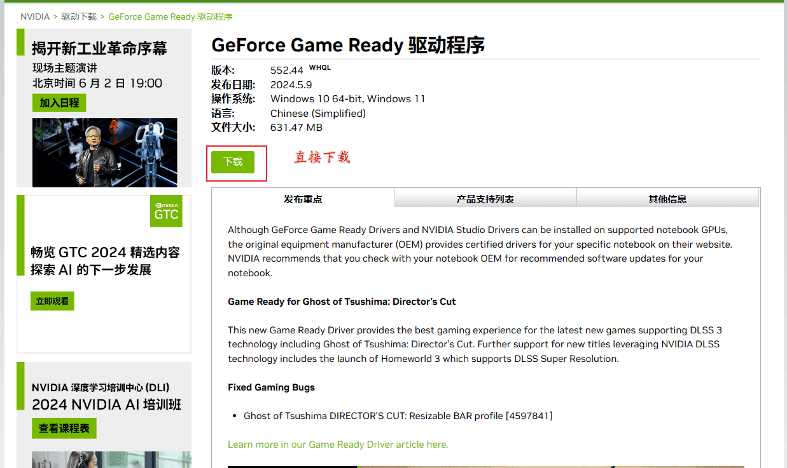
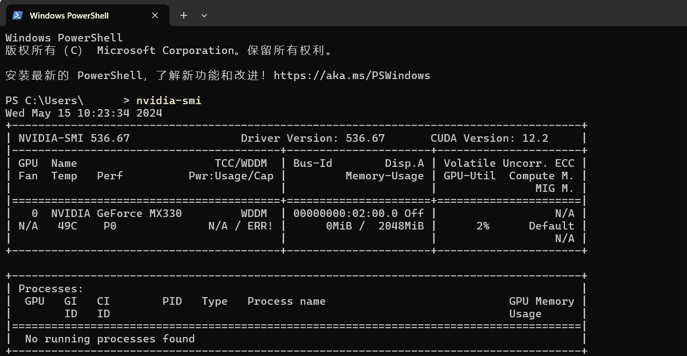
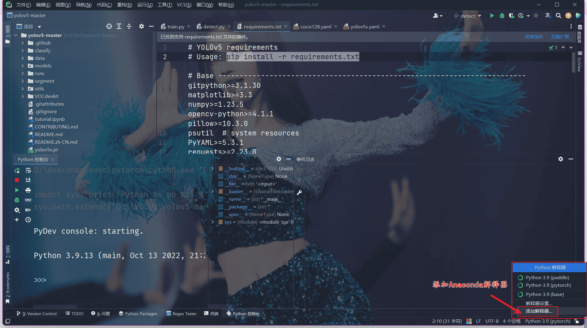
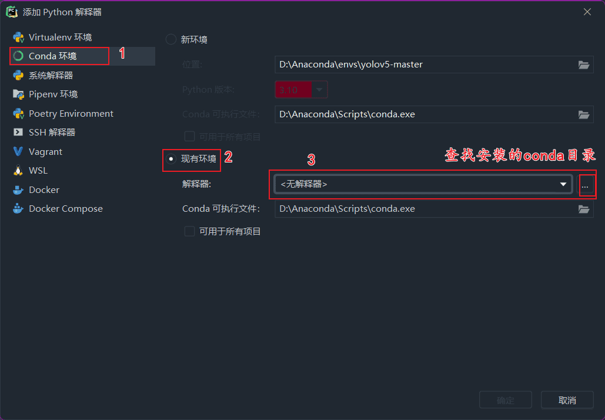
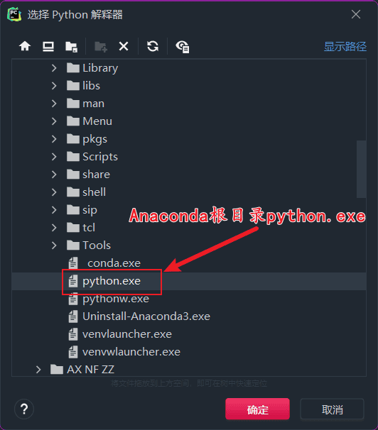

> [ YOLOv5 🚀](https://github.com/ultralytics/yolov5?tab=readme-ov-file)是一种深度学习模型，用于物体检测任务。它的全称是“你只看一次”（You Only Look Once），可以快速且准确地识别图像中的物体并标记它们的位置。

## Yolov5的配置使用思路



## 安装显卡驱动

> 电脑版本不同可能有些名称不一样，主要是找到设备管理器。

### 确定显卡版本

找到控制面板-->硬件与声音-->**设备管理器**-->显示适配器-->显卡版本

这里显示版本，说明电脑有英伟达的显卡



然后可以去英伟达驱动控制面板，再查看一下具体版本号。



### 安装显卡驱动

下载地址L：[官方驱动 | NVIDIA](https://www.nvidia.cn/Download/index.aspx?lang=cn#)





   安装（更新）好了显卡驱动以后。按下win+R组合键，打开cmd命令窗口，查看最高支持的CUDA版本

```undefined
nvidia-smi
```



## Anaconda环境配置

> Python环境配置：
>
> 链接：https://pan.baidu.com/s/1WBBtduC-grJw9ZM88HqXfg?pwd=cmzz 
> 提取码：cmzz

**添加解释器**






