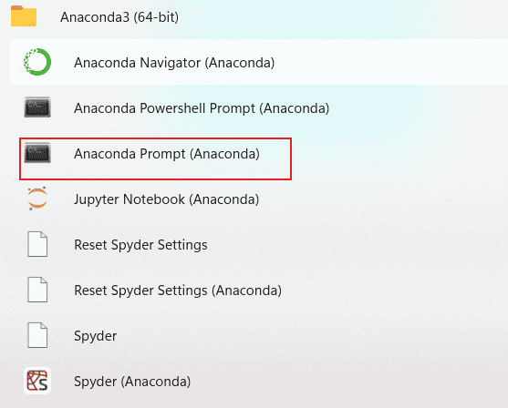
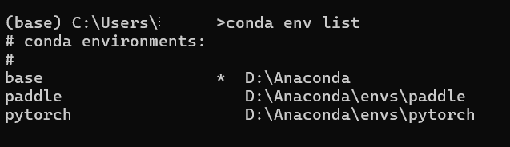
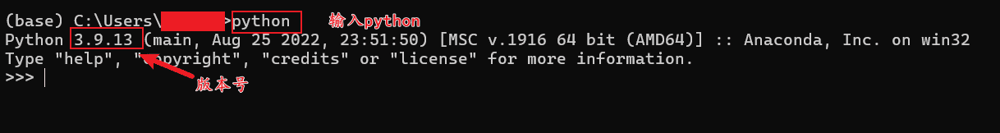
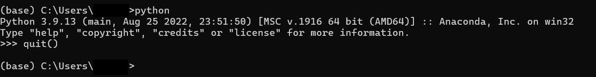
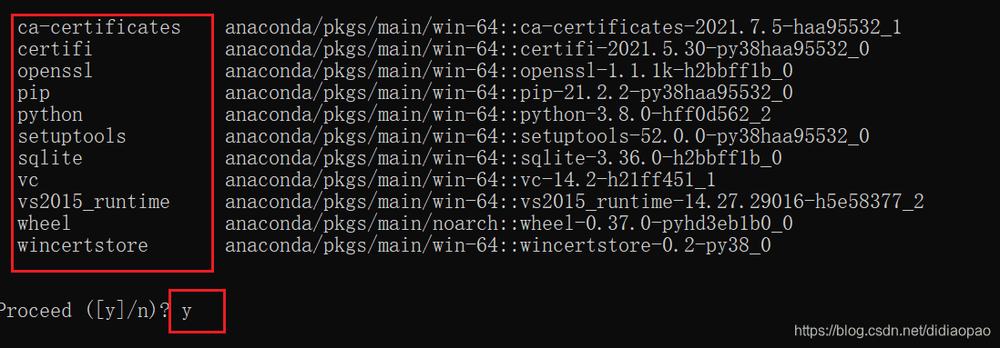
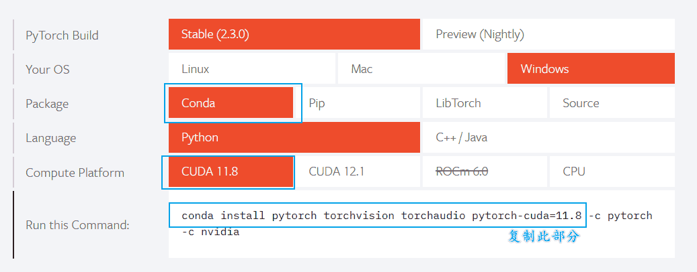
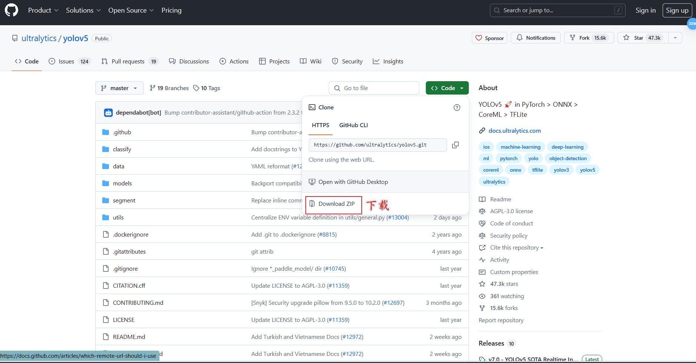
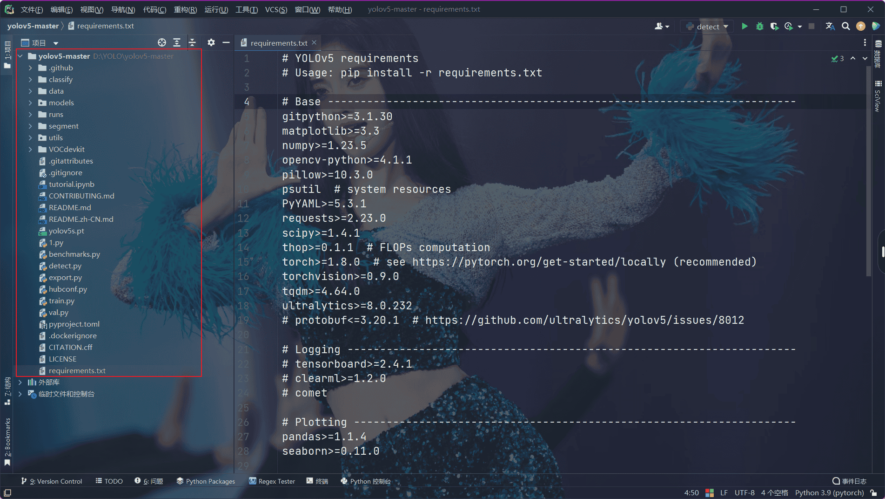
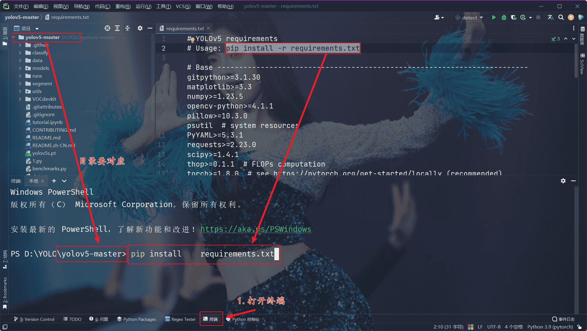
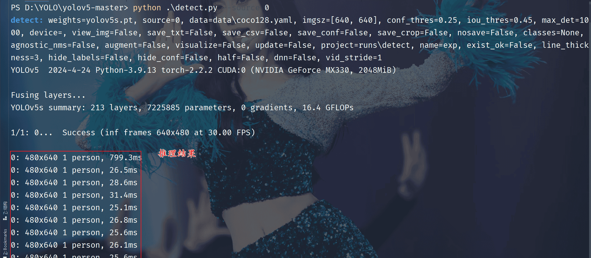

## 创建虚拟环境

### 查看虚拟环境



这里有一个重要命令，查看当前的虚拟环境数量，默认只有一个`base`(我这里安装过其他虚拟环境)

```shell
conda env list
```



### 创建pytorch虚拟环境

！！！首先查看一下自己python版本



输入以下代码退出python

```python
quit()
```



创建虚拟环境，输入以下命令，注意python版本和自己的一致

```shell
conda create -n pytorch python=3.11.9
```

输入y



再次用前面的命令查看会多一个环境，使用下面命令激活环境

```shell
conda activate pytorch
```

### 更换镜像源

清华源

```
conda config --add channels https://mirrors.tuna.tsinghua.edu.cn/anaconda/pkgs/free/
conda config --add channels https://mirrors.tuna.tsinghua.edu.cn/anaconda/pkgs/main/
conda config --add channels https://mirrors.tuna.tsinghua.edu.cn/anaconda/cloud/pytorch/
conda config --set show_channel_urls yes
```

### 下载pytorch

> 官网：[PyTorch](https://pytorch.org/)



等待下载完成即可。

### 切换解释器

使用`Anaconda环境配置`部分内容添加解释器，并切换到pytorch解释器。

## 安装yolov5依赖

### 下载yolov5源代码

yolov5下载地址：[ YOLOv5 🚀](https://github.com/ultralytics/yolov5)



### 安装依赖

以工程打开yolov5文件夹



安装依赖



如果下载比较慢，可以使用中科大镜像源，永久替换

```shell
pip config set global.index-url https://pypi.mirrors.ustc.edu.cn/simple
```

### 验证

终端输入命令

```shell
python detect.py --source 0
```

