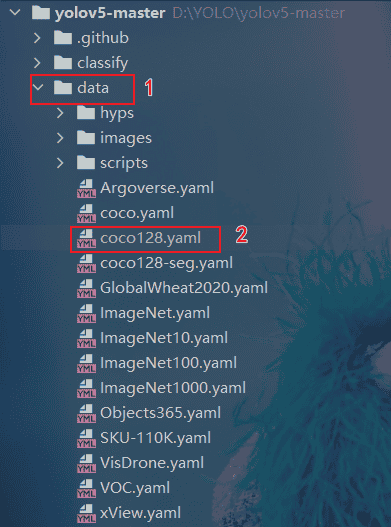
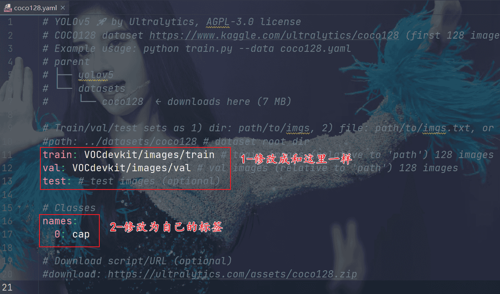
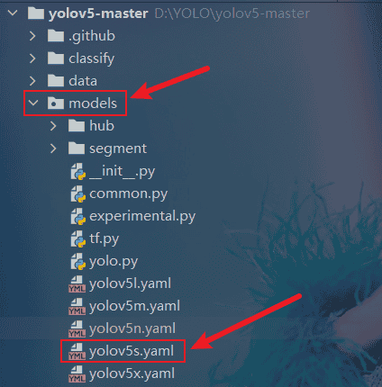
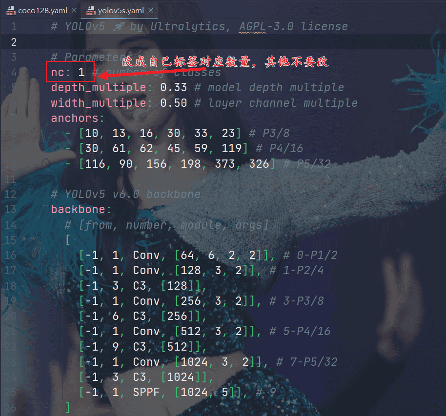
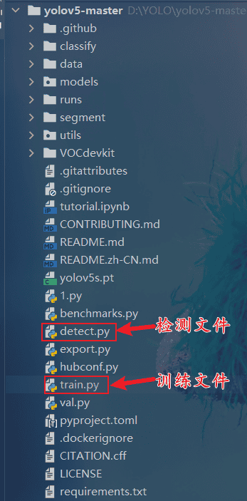
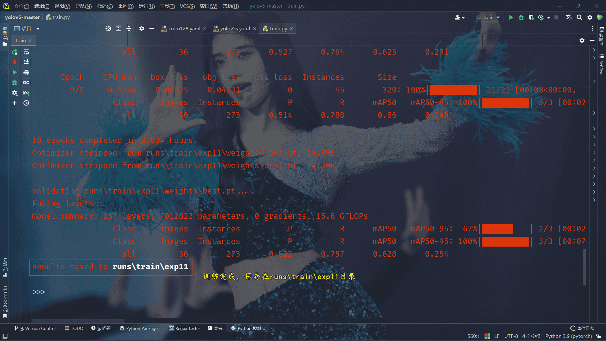
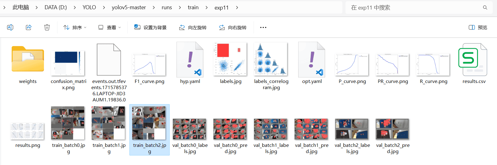
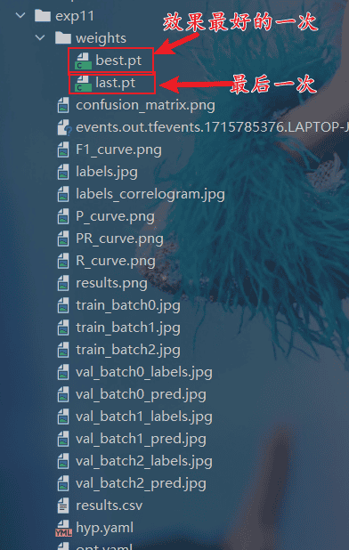
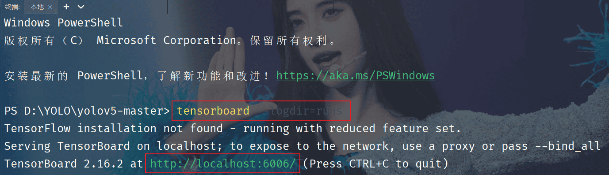
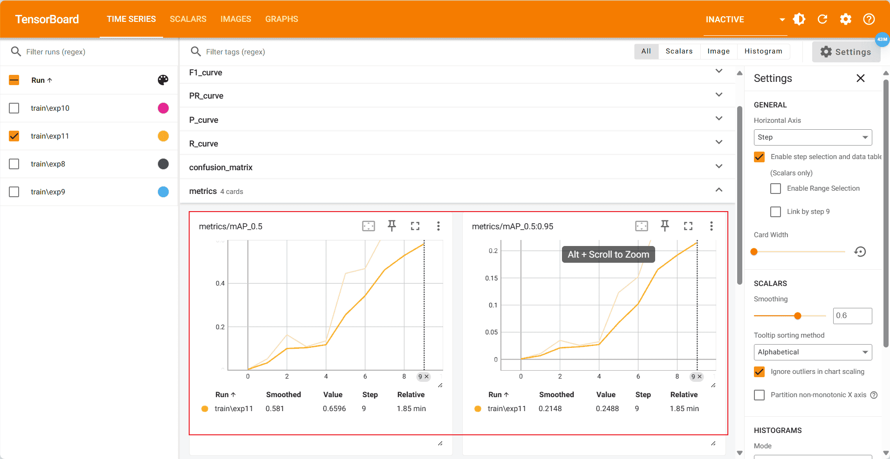

## 修改yolo文件参数

找到`data`文件夹下的`coco128.yaml`文件



修改文件参数



找到`models`文件夹下的yolov5s.yaml文件

> 这里还有n、x等类型的，具体区别可以参考Github的数据曲线。



修改标签数量参数：



打开`train.py`文件



找到`parse_opt`函数，这里面有模型的主要参数：

```python
def parse_opt(known=False):
    """Parses command-line arguments for YOLOv5 training, validation, and testing."""
    parser = argparse.ArgumentParser()
    parser.add_argument("--weights", type=str, default=ROOT / "yolov5s.pt", help="initial weights path")
    parser.add_argument("--cfg", type=str, default="", help="model.yaml path")
    parser.add_argument("--data", type=str, default=ROOT / "data/coco128.yaml", help="dataset.yaml path")
    parser.add_argument("--hyp", type=str, default=ROOT / "data/hyps/hyp.scratch-low.yaml", help="hyperparameters path")
    parser.add_argument("--epochs", type=int, default=10, help="total training epochs")
    parser.add_argument("--batch-size", type=int, default=8, help="total batch size for all GPUs, -1 for autobatch")
    parser.add_argument("--imgsz", "--img", "--img-size", type=int, default=320, help="train, val image size (pixels)")
    parser.add_argument("--rect", action="store_true", help="rectangular training")
    parser.add_argument("--resume", nargs="?", const=True, default=False, help="resume most recent training")
    parser.add_argument("--nosave", action="store_true", help="only save final checkpoint")
    parser.add_argument("--noval", action="store_true", help="only validate final epoch")
    parser.add_argument("--noautoanchor", action="store_true", help="disable AutoAnchor")
    parser.add_argument("--noplots", action="store_true", help="save no plot files")
    parser.add_argument("--evolve", type=int, nargs="?", const=300, help="evolve hyperparameters for x generations")
    parser.add_argument(
        "--evolve_population", type=str, default=ROOT / "data/hyps", help="location for loading population"
    )
    parser.add_argument("--resume_evolve", type=str, default=None, help="resume evolve from last generation")
    parser.add_argument("--bucket", type=str, default="", help="gsutil bucket")
    parser.add_argument("--cache", type=str, nargs="?", const="ram", help="image --cache ram/disk")
    parser.add_argument("--image-weights", action="store_true", help="use weighted image selection for training")
    parser.add_argument("--device", default="", help="cuda device, i.e. 0 or 0,1,2,3 or cpu")
    parser.add_argument("--multi-scale", action="store_true", help="vary img-size +/- 50%%")
    parser.add_argument("--single-cls", action="store_true", help="train multi-class data as single-class")
    parser.add_argument("--optimizer", type=str, choices=["SGD", "Adam", "AdamW"], default="SGD", help="optimizer")
    parser.add_argument("--sync-bn", action="store_true", help="use SyncBatchNorm, only available in DDP mode")
    parser.add_argument("--workers", type=int, default=8, help="max dataloader workers (per RANK in DDP mode)")
    parser.add_argument("--project", default=ROOT / "runs/train", help="save to project/name")
    parser.add_argument("--name", default="exp", help="save to project/name")
    parser.add_argument("--exist-ok", action="store_true", help="existing project/name ok, do not increment")
    parser.add_argument("--quad", action="store_true", help="quad dataloader")
    parser.add_argument("--cos-lr", action="store_true", help="cosine LR scheduler")
    parser.add_argument("--label-smoothing", type=float, default=0.0, help="Label smoothing epsilon")
    parser.add_argument("--patience", type=int, default=100, help="EarlyStopping patience (epochs without improvement)")
    parser.add_argument("--freeze", nargs="+", type=int, default=[0], help="Freeze layers: backbone=10, first3=0 1 2")
    parser.add_argument("--save-period", type=int, default=-1, help="Save checkpoint every x epochs (disabled if < 1)")
    parser.add_argument("--seed", type=int, default=0, help="Global training seed")
    parser.add_argument("--local_rank", type=int, default=-1, help="Automatic DDP Multi-GPU argument, do not modify")

    # Logger arguments
    parser.add_argument("--entity", default=None, help="Entity")
    parser.add_argument("--upload_dataset", nargs="?", const=True, default=False, help='Upload data, "val" option')
    parser.add_argument("--bbox_interval", type=int, default=-1, help="Set bounding-box image logging interval")
    parser.add_argument("--artifact_alias", type=str, default="latest", help="Version of dataset artifact to use")

    # NDJSON logging
    parser.add_argument("--ndjson-console", action="store_true", help="Log ndjson to console")
    parser.add_argument("--ndjson-file", action="store_true", help="Log ndjson to file")

    return parser.parse_known_args()[0] if known else parser.parse_args()

```

参数的具体解析如下：

```python
"""
    opt模型主要参数解析：
    --weights：初始化的权重文件的路径地址
    --cfg：模型yaml文件的路径地址
    --data：数据yaml文件的路径地址
    --hyp：超参数文件路径地址
    --epochs：训练轮次
    --batch-size：喂入批次文件的多少
    --img-size：输入图片尺寸
    --rect:是否采用矩形训练，默认False
    --resume:接着打断训练上次的结果接着训练
    --nosave:不保存模型，默认False
    --notest:不进行test，默认False
    --noautoanchor:不自动调整anchor，默认False
    --evolve:是否进行超参数进化，默认False
    --bucket:谷歌云盘bucket，一般不会用到
    --cache-images:是否提前缓存图片到内存，以加快训练速度，默认False
    --image-weights：使用加权图像选择进行训练
    --device:训练的设备，cpu；0(表示一个gpu设备cuda:0)；0,1,2,3(多个gpu设备)
    --multi-scale:是否进行多尺度训练，默认False
    --single-cls:数据集是否只有一个类别，默认False
    --adam:是否使用adam优化器
    --sync-bn:是否使用跨卡同步BN,在DDP模式使用
    --local_rank：DDP参数，请勿修改
    --workers：最大工作核心数
    --project:训练模型的保存位置
    --name：模型保存的目录名称
    --exist-ok：模型目录是否存在，不存在就创建
"""
```

### 常用的参数

`weights`预训练权重`yolov5s.pt`，与前面修改的文件要一致。

```python
parser.add_argument("--weights", type=str, default=ROOT / "yolov5s.pt", help="initial weights path")
```

`data`数据yaml文件的路径地址，同样与前面修改的文件保持一致。

```python
parser.add_argument("--data", type=str, default=ROOT / "data/coco128.yaml", help="dataset.yaml path")
```

`epochs`训练轮数，要达到曲线拟合，最好从100或300轮开始。

`batch-size`批次文件的多少,这个看电脑的性能。

`img-size`照片的尺寸，一般就选320。

```python
parser.add_argument("--epochs", type=int, default=10, help="total training epochs")
parser.add_argument("--batch-size", type=int, default=8, help="total batch size for all GPUs, -1 for autobatch")
parser.add_argument("--imgsz", "--img", "--img-size", type=int, default=320, help="train, val image size (pixels)")
```

`workers`最大工作核心数，这个看电脑的性能。

```python
parser.add_argument("--workers", type=int, default=8, help="max dataloader workers (per RANK in DDP mode)")
```

## 训练模型

直接运行`train.py`



### 训练结果

这里文件夹下有测试结果，训练结果曲线等信息。



**权重文件**（最后要获得就是这个文件，取**best.pt**做推理使用的权重）



### 用tensorbord查看训练结果

打开pycharm终端，输入如下命令：

```shell
tensorboard --logdir=runs/train
```



ctrl点击网址，跳转浏览器：



