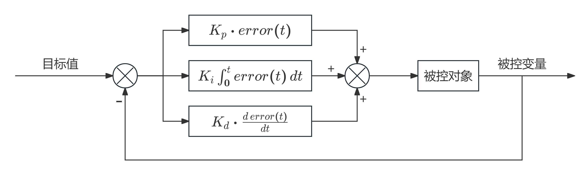

## 1. PID原理

### 1.1 PID简介

- **PID是比例（Proportional）、积分（Integral）、微分（Differential）的缩写。**
- **PID是一种闭环控制算法，它动态改变施加到被控对象的输出值（Out），使得被控对象某一物理量的实际值（Actual），能够快速、准确、稳定地跟踪到指定的目标值（Target）。**
- **PID是一种基于误差（Error）调控的算法，其中规定：误差=目标值-实际值，PID的任务是使误差始终为 0 。**
- **PID对被控对象模型要求低，无需建模，即使被控对象内部运作规律不明确，PID也能进行调控。**

### 1.2 PID公式

**误差：** 

$$
error(t) = target(t) - actual(t)
$$

**输出值：**

$$
out(t) = K_p \cdot error(t) + K_i \int_0^t error(t) \, dt + K_d \cdot \frac{d \, error(t)}{dt}
$$

若用控制的语言表达则如下结构图：

### 1.3 PID各项作用

**比例项（P）**

- 只含有比例项的PID输出值：

$$
out(t) = K_p \cdot error(t)
$$

- 比例项的输出值仅取决于 **当前时刻的误差** ，与历史时刻无关。
- 当前存在误差时，比例项输出一个与误差呈正比的值，当前不存在误差时，比例项输出 0 。
- 比例项权重越大，系统响应越快，但超调也会随之增加。
- 纯比例项控制时，系统一般会存在稳态误差，比例项越大，稳态误差越小，但并不能完全消除稳态误差。

!!!danger  
    由于纯比例项控制中，稳态误差难以完全消除，因此引入积分项。

**积分项（I）**

- 含有比例项和积分项的PID输出值：

$$
out(t) = K_p \cdot error(t) + K_i \int_0^t error(t) \, dt
$$

- 积分项的输出值取决于0~t所有时刻误差的积分， **与历史时刻有关** 。
- 积分项将历史所有时刻的误差累积，乘上积分项系数后作为积分项输出值。
- 积分项用于弥补纯比例项产生的稳态误差，若系统持续产生误差，则积分项会不断累积误差，直到控制器产生动作，让稳态误差消失。
- 积分项权重越大，稳态误差消失越快，但系统滞后性也会随之增加。

!!!danger  
    滞后性是因为纯积分项不能很地根据目标值改变输出力度，而是缓慢改变，因此这是积分项的一个缺陷；但对于电机速度控制来说PI项足矣，而电机位置控制则需要加上D项。

**微分项（D）**

- 含有比例项、积分项和微分项的PID输出值：

$$
out(t) = K_p \cdot error(t) + K_i \int_0^t error(t) \, dt + K_d \cdot \frac{d \, error(t)}{dt}
$$

- 微分项的输出值取决于当前时刻误差变化的斜率，与当前时刻附近 **误差变化的趋势有关** 。
- 当误差急剧变化时，微分项会负反馈输出相反的作用力，阻碍误差急剧变化。
- 斜率一定程度上反映了误差未来的变化趋势，这使得微分项具有 **“预测未来，提前调控”** 的特性。
- 微分项给系统增加阻尼，可以有效防止系统超调，尤其是惯性比较大的系统。
- 微分项权重越大，系统阻尼越大，但系统卡顿现象也会随之增加。

## 2. 离散化PID

### 2.1 PID离散化

设采样周期T，每个T时刻读取一次误差值：

- P项：系数 × 第 k 个 T时刻误差值
- I项：系数 × 周期T × 误差的累加和
- D项：系数 × 第 k 个T时刻的误差斜率（ 即（本次误差 -上次误差） / 周期T ）

因此，PID离散化后的公式如下：

$$
out(k) = K_p \cdot error(k) + K_i \cdot T \sum_{j=0}^k error(j) + K_d \cdot \frac{error(k) - error(k-1)}{T}
$$

若将T的值融入到各项系数中，则为另一个形式的公式：

$$
out(k) = K_p \cdot error(k) + K_i \cdot \sum_{j=0}^k error(j) + K_d \cdot ({error(k) - error(k-1)})
$$

### 2.2 位置式PID

位置式PID就是PID离散化后的PID公式：

$$
out(k) = K_p \cdot error(k) + K_i \cdot \sum_{j=0}^k error(j) + K_d \cdot ({error(k) - error(k-1)})
$$

### 2.3 增量式PID

第k个T时刻：

$$
out(k) = K_p \cdot error(k) + K_i \cdot \sum_{j=0}^k error(j) + K_d \cdot ({error(k) - error(k-1)})
$$

第k-1个T时刻：

$$
out(k-1) = K_p \cdot error(k-1) + K_i \cdot \sum_{j=0}^{k-1} error(j) + K_d \cdot ({error(k-1) - error(k-2)})
$$

两式相减，得到增量式PID：

$$
\Delta out(k) = K_p \cdot (error(k) - error(k-1)) + K_i\cdot error(k) + K_d \cdot (error(k) - 2 \cdot error(k-1) + error(k-2))
$$

### 2.4 两种PID差异

- 位置式PID直接输出的为本次输出值的全量；以占空比为例：20%、22%、18%。
- 增量式PID直接输出的为本次输出值相对于上一次输出值的增量；以占空比为例：+0%、+2%、-4%。

