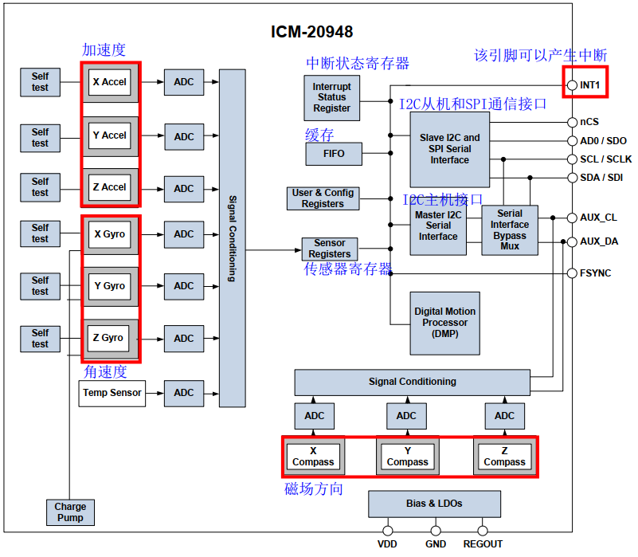
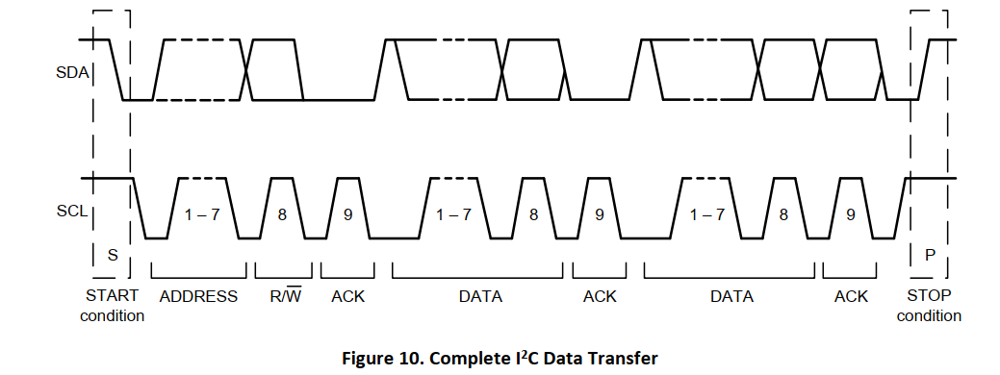
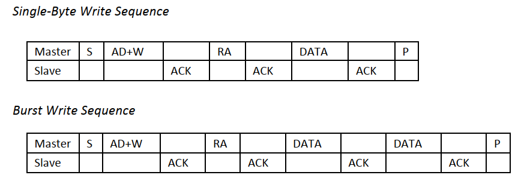
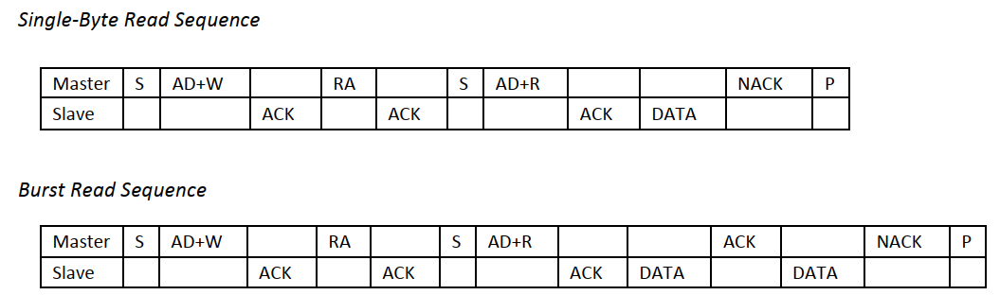
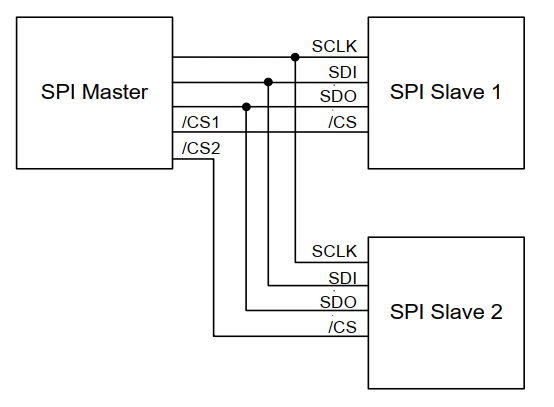

## 1.1 概述

ICM-20948是一个多芯片模块(MCM)，由两个芯片集成到一个单QFN封装中。其中一个芯片包含一个三轴陀螺仪、三轴加速度计和一个数字运动处理器。™(DMP)。另一个芯片封装了来自旭化成微器件公司的AK09916(3轴磁力计)。

## 1.2 ICM20948框图



## 1.3 I2C接口

### 1.3.1 从机地址

ICM-20948 的从机地址为 <kbd>1101 00X</kbd> 的 7 Bit长度，其中AD0引脚可以控制 “X” 位，若AD0为低电平则从机地址为 <kbd>1101 000</kbd>，而当AD0为高电平时则从机地址为 <kbd>1101 001</kbd>。  

### 1.3.1 I2C时序

起始条件以后：

- 主机发送 7 Bit的从机地址（ **1101000** ），第 8 Bit为读写位。然后，主机释放SDA并等待从机设备的应答位。
- 每一个字节传输完，必须跟随一个应答位。
- 从机设备在SCL高电平期间，拉低SDA并保持SDA为Low，表示应答。
- 数据传输必须由主机发送结束条件终止。



### 1.3.2 写ICM20948寄存器

- 主机发送起始条件，紧跟着 7 Bit ICM20948地址和写位(0)。
- 从机设备ICM20948 发送应答位。
- 主机发送寄存器地址。
- 从机设备ICM20948 发送应答位。
- 主机发送需要写入的数据。
- 从机设备ICM20948 发送应答位。
- 主机发送结束条件，一个字节数据传输终止。



### 1.3.3 读ICM20948寄存器

- 主机发送起始条件，紧跟着 7 Bit ICM20948地址和写位(0)。
- 从机设备ICM20948 发送应答位。
- 主机发送寄存器地址。
- 从机设备ICM20948 发送应答位。
- 主机再次发送起始条件，紧跟着7 Bit ICM20948地址和读位(1)。
- 从机设备ICM20948 发送应答位，并返回寄存器数据。
- 通信以无应答和主机发送结束条件终止。



## 1.4 SPI接口

- 数据高位先行，即MSB 首先，LSB 最后。
- 数据被锁定在 SCLK 的上升沿。
- 数据应在 SCLK 的下降沿上转换。
- SCLK的最大频率为7 MHz。
- 第一个字节包含SPI地址，后面的字节包含SPI数据。第一个字节的第一个位包含读写位，表示读取(1)或写入(0)操作。后面的7位包含寄存器地址。





## 1.5 I2C接口驱动

### 1.5.1 软件模拟I2C通信

源码和软件模拟原理在我的个人网站：[软件模拟I2C](https://tonmoon.top/study/STM32/10.I2C通信/#102-i2c)

模拟的GPIO口自定义，不过多赘述。

### 1.5.2 测试模拟I2C

核心测试程序，放在初始化之后就行，原理就是ICM20948 芯片是否有应答：

- 输入正确的地址应该有应答返回 ack=0 
- 输入错误的地址应该无应答返回 ack=1 (一定要测试无应答这部分)

```C
uint8_t ack;
I2C_Start();
I2C_WriteByte(0xD0);
ack = I2C_ReceiveAck();
I2C_Stop();
OLED_ShowNum(0, 0, ack, 1, 16);
```

### 1.5.3 完整驱动

> 其实是该部分并不完整，想要模拟I2C可以看SPI部分，完善缺失的部分。

`icm20948.c`

```C
#include "icm20948.h"
#include "oled.h"


#define I2C

#ifdef I2C

static void ICM20948_WriteByte(uint8_t SlaveAddress, uint8_t RegisterAddress, uint8_t RegisterData) {
    I2C_Start();
    I2C_WriteByte(SlaveAddress|0x00);
    I2C_ReceiveAck();
    I2C_WriteByte(RegisterAddress);
    I2C_ReceiveAck();
    I2C_WriteByte(RegisterData);
    I2C_ReceiveAck();
    I2C_Stop();
}


static uint8_t ICM20948_ReadByte(uint8_t SlaveAddress, uint8_t RegisterAddress) {
    uint8_t RegisterData;
    I2C_Start();
    I2C_WriteByte(SlaveAddress|0x00);
    I2C_ReceiveAck();
    I2C_WriteByte(RegisterAddress);
    I2C_ReceiveAck();

    I2C_Start();
    I2C_WriteByte(SlaveAddress|0x01);
    I2C_ReceiveAck();
    RegisterData = I2C_ReadByte();
    I2C_WriteAcK(1);
    I2C_Stop();
    return RegisterData;
}

#endif


/* 切换寄存器BANK */
static void ICM20948_SelectBank(uint8_t BankX) {
    switch (BankX) {
        case 0:
            /* 0000 0000 */
            ICM20948_WriteByte(ICM20948_ADDRESS, ICM20948_REG_BANK_SEL, 0x00);
            break;
        case 1:
            /* 0001 0000 */
            ICM20948_WriteByte(ICM20948_ADDRESS, ICM20948_REG_BANK_SEL, 0x10);
            break;
        case 2:
            /* 0010 0000 */
            ICM20948_WriteByte(ICM20948_ADDRESS, ICM20948_REG_BANK_SEL, 0x20);
            break;
        case 3:
            /* 0011 0000 */
            ICM20948_WriteByte(ICM20948_ADDRESS, ICM20948_REG_BANK_SEL, 0x30);
            break;
        default:
            ICM20948_WriteByte(ICM20948_ADDRESS, ICM20948_REG_BANK_SEL, 0x00);
    }
}

/* ICM20948初始化 */
void ICM20948_Init(void) {
    /* BANK 0 */
    /* 选择bank0 */
    ICM20948_SelectBank(0);
    /* 复位寄存器,取消睡眠模式 */
    ICM20948_WriteByte(ICM20948_ADDRESS, ICM20948_PWR_MGMT_1, 0x80);
    vTaskDelay(100);
    /* 自动选择合适的时钟源 */
    ICM20948_WriteByte(ICM20948_ADDRESS, ICM20948_PWR_MGMT_1, 0x01);
    /* 开启陀螺仪和加速度计的所有轴 */
    ICM20948_WriteByte(ICM20948_ADDRESS, ICM20948_PWR_MGMT_2, 0x00);
    /* BANK 1 NONE */
    /* BANK 2 */
    /* 选择bank2 */
    ICM20948_SelectBank(2);
    /* 配置陀螺仪采样频率 1.1kHZ/(0x04+1) = 220HZ */
    ICM20948_WriteByte(ICM20948_ADDRESS, ICM20948_GYRO_SMPLRT_DIV, 0x04);
    /* 陀螺仪Config,使用DLPF(低通滤波),DLPFCFG=3,设置量程为 ±2000dps */
    ICM20948_WriteByte(ICM20948_ADDRESS, ICM20948_GYRO_CONFIG_1, 0x1F);
    ICM20948_WriteByte(ICM20948_ADDRESS, ICM20948_GYRO_CONFIG_2, 0x00);
    /* 配置加速度计采样频率 1.125kHZ/(0x000A+1) = 102HZ */
    ICM20948_WriteByte(ICM20948_ADDRESS, ICM20948_ACCEL_SMPLRT_DIV_1, 0x00);
    ICM20948_WriteByte(ICM20948_ADDRESS, ICM20948_ACCEL_SMPLRT_DIV_2, 0x0A);
    /* 加速度计Config,使用DLPF(低通滤波),DLPFCFG=3,设置量程为 ±8g */
    ICM20948_WriteByte(ICM20948_ADDRESS, ICM20948_ACCEL_CONFIG, 0x1D);
    ICM20948_WriteByte(ICM20948_ADDRESS, ICM20948_ACCEL_CONFIG_2, 0x00);
    /* BANK 3 NONE */
}


/* IMU单元应答测试 */
void ICM20948_AckTest(void) {
    uint8_t ack;
    I2C_Start();
    I2C_WriteByte(0xD0);
    ack = I2C_ReceiveAck();
    I2C_Stop();
    OLED_ShowNum(0, 0, ack, 1, 16);
}

uint8_t ICM20948_ReadDeviceID(void) {
    ICM20948_SelectBank(0);
    return ICM20948_ReadByte(ICM20948_ADDRESS, ICM20948_WHO_AM_I);
}

void ICM20948_Address_Change(void) {
    HAL_GPIO_WritePin(IMU_AD0_GPIO_Port, IMU_AD0_Pin, GPIO_PIN_SET);
}

/* 读取加速度计、陀螺仪数据 */
void ICM20948_ReadData(ImuData* data) {
    /* 加速度真实值: 寄存器值/4095 ; 4095 = 65535/16 = 16位ADC/量程
     * 角速度真实值: 寄存器值/16.4 ; 16.4 = 65535/4000 = 16位ADC/量程
     * */
    ICM20948_SelectBank(0);
    uint8_t accX_H = ICM20948_ReadByte(ICM20948_ADDRESS, ICM20948_ACCEL_XOUT_H);
    uint8_t accX_L = ICM20948_ReadByte(ICM20948_ADDRESS, ICM20948_ACCEL_XOUT_L);
    data->AccX = ((accX_H << 8) | accX_L);

    uint8_t accY_H = ICM20948_ReadByte(ICM20948_ADDRESS, ICM20948_ACCEL_YOUT_H);
    uint8_t accY_L = ICM20948_ReadByte(ICM20948_ADDRESS, ICM20948_ACCEL_YOUT_L);
    data->AccY = ((accY_H << 8) | accY_L);

    uint8_t accZ_H = ICM20948_ReadByte(ICM20948_ADDRESS, ICM20948_ACCEL_ZOUT_H);
    uint8_t accZ_L = ICM20948_ReadByte(ICM20948_ADDRESS, ICM20948_ACCEL_ZOUT_L);
    data->AccZ = ((accZ_H << 8) | accZ_L);

    uint8_t GyroX_H = ICM20948_ReadByte(ICM20948_ADDRESS, ICM20948_GYRO_XOUT_H);
    uint8_t GyroX_L = ICM20948_ReadByte(ICM20948_ADDRESS, ICM20948_GYRO_XOUT_L);
    data->GyroX = ((GyroX_H << 8) | GyroX_L);

    uint8_t GyroY_H = ICM20948_ReadByte(ICM20948_ADDRESS, ICM20948_GYRO_YOUT_H);
    uint8_t GyroY_L = ICM20948_ReadByte(ICM20948_ADDRESS, ICM20948_GYRO_YOUT_L);
    data->GyroY = ((GyroY_H << 8) | GyroY_L);

    uint8_t GyroZ_H = ICM20948_ReadByte(ICM20948_ADDRESS, ICM20948_GYRO_ZOUT_H);
    uint8_t GyroZ_L = ICM20948_ReadByte(ICM20948_ADDRESS, ICM20948_GYRO_ZOUT_L);
    data->GyroZ = ((GyroZ_H << 8) | GyroZ_L);
}

```

`icm20948.h`

```C
#ifndef __ICM20948_H
#define __ICM20948_H

#include "sw_iic.h"
#include "icm10948_reg.h"

typedef struct {
    int16_t AccX;
    int16_t AccY;
    int16_t AccZ;
    int16_t GyroX;
    int16_t GyroY;
    int16_t GyroZ;
} ImuData;


void ICM20948_Init(void);
void AK09916_Init(void);
uint8_t ICM20948_ReadDeviceID(void);
uint8_t AK09916_ReadDeviceID(void);
void ICM20948_Address_Change(void);
void ICM20948_ReadData(ImuData* data);
void ICM20948_AckTest(void);

#endif

```

## 1.6 SPI接口驱动

> 完整版

```C
#include "icm20948.h"


#ifdef I2C

static void ICM20948_WriteByte(uint8_t RegisterAddress, uint8_t RegisterData) {
    I2C_Start();
    I2C_WriteByte(ICM20948_ADDRESS|0x00);
    I2C_ReceiveAck();
    I2C_WriteByte(RegisterAddress);
    I2C_ReceiveAck();
    I2C_WriteByte(RegisterData);
    I2C_ReceiveAck();
    I2C_Stop();
}

static uint8_t ICM20948_ReadByte(uint8_t RegisterAddress) {
    uint8_t RegisterData;
    I2C_Start();
    I2C_WriteByte(ICM20948_ADDRESS|0x00);
    I2C_ReceiveAck();
    I2C_WriteByte(RegisterAddress);
    I2C_ReceiveAck();

    I2C_Start();
    I2C_WriteByte(ICM20948_ADDRESS|0x01);
    I2C_ReceiveAck();
    RegisterData = I2C_ReadByte();
    I2C_WriteAcK(1);
    I2C_Stop();
    return RegisterData;
}

/* 切换寄存器BANK */
static void ICM20948_SelectBank(uint8_t BankX) {
    switch (BankX) {
        case 0:
            /* 0000 0000 */
            ICM20948_WriteByte( ICM20948_REG_BANK_SEL, 0x00);
            break;
        case 1:
            /* 0001 0000 */
            ICM20948_WriteByte(ICM20948_REG_BANK_SEL, 0x10);
            break;
        case 2:
            /* 0010 0000 */
            ICM20948_WriteByte(ICM20948_REG_BANK_SEL, 0x20);
            break;
        case 3:
            /* 0011 0000 */
            ICM20948_WriteByte(ICM20948_REG_BANK_SEL, 0x30);
            break;
        default:
            ICM20948_WriteByte(ICM20948_REG_BANK_SEL, 0x00);
    }
}

/* ICM20948初始化 */
void ICM20948_Init(void) {
    /* BANK 0 */
    /* 选择bank0 */
    ICM20948_SelectBank(0);
    /* 复位寄存器,取消睡眠模式 */
    ICM20948_WriteByte(ICM20948_PWR_MGMT_1, 0x80);
    vTaskDelay(100);
    /* 自动选择合适的时钟源 */
    ICM20948_WriteByte(ICM20948_PWR_MGMT_1, 0x01);
    /* 开启陀螺仪和加速度计的所有轴 */
    ICM20948_WriteByte(ICM20948_PWR_MGMT_2, 0x00);
    /* BANK 1 NONE */
    /* BANK 2 */
    /* 选择bank2 */
    ICM20948_SelectBank(2);
    /* 配置陀螺仪采样频率 1.1kHZ/(0x04+1) = 220HZ */
    ICM20948_WriteByte(ICM20948_GYRO_SMPLRT_DIV, 0x04);
    /* 陀螺仪Config,使用DLPF(低通滤波),DLPFCFG=3,设置量程为 ±2000dps */
    ICM20948_WriteByte(ICM20948_GYRO_CONFIG_1, 0x1F);
    ICM20948_WriteByte(ICM20948_GYRO_CONFIG_2, 0x00);
    /* 配置加速度计采样频率 1.125kHZ/(0x000A+1) = 102HZ */
    ICM20948_WriteByte(ICM20948_ACCEL_SMPLRT_DIV_1, 0x00);
    ICM20948_WriteByte(ICM20948_ACCEL_SMPLRT_DIV_2, 0x0A);
    /* 加速度计Config,使用DLPF(低通滤波),DLPFCFG=3,设置量程为 ±8g */
    ICM20948_WriteByte(ICM20948_ACCEL_CONFIG, 0x1D);
    ICM20948_WriteByte(ICM20948_ACCEL_CONFIG_2, 0x00);
    /* BANK 3 NONE */
}

/* IMU单元应答测试 */
void ICM20948_AckTest(void) {
    uint8_t ack;
    I2C_Start();
    I2C_WriteByte(0xD0);
    ack = I2C_ReceiveAck();
    I2C_Stop();
    OLED_ShowNum(0, 0, ack, 1, 16);
}

uint8_t ICM20948_ReadDeviceID(void) {
    ICM20948_SelectBank(0);
    return ICM20948_ReadByte(ICM20948_WHO_AM_I);
}

void ICM20948_Address_Change(void) {
    HAL_GPIO_WritePin(IMU_AD0_GPIO_Port, IMU_AD0_Pin, GPIO_PIN_SET);
}

/* 读取加速度计、陀螺仪数据 */
void ICM20948_ReadData(ImuAccel* accData, ImuGyro* gyroData) {
    /* 加速度真实值: 寄存器值/4095 ; 4095 = 65535/16 = 16位ADC/量程
     * 角速度真实值: 寄存器值/16.4 ; 16.4 = 65535/4000 = 16位ADC/量程
     * */
    ICM20948_SelectBank(0);
    uint8_t accX_H = ICM20948_ReadByte(ICM20948_ACCEL_XOUT_H);
    uint8_t accX_L = ICM20948_ReadByte(ICM20948_ACCEL_XOUT_L);
    accData->AccX = (int16_t)((accX_H << 8) | accX_L);

    uint8_t accY_H = ICM20948_ReadByte(ICM20948_ACCEL_YOUT_H);
    uint8_t accY_L = ICM20948_ReadByte(ICM20948_ACCEL_YOUT_L);
    accData->AccY = (int16_t)((accY_H << 8) | accY_L);

    uint8_t accZ_H = ICM20948_ReadByte(ICM20948_ACCEL_ZOUT_H);
    uint8_t accZ_L = ICM20948_ReadByte(ICM20948_ACCEL_ZOUT_L);
    accData->AccZ = (int16_t)((accZ_H << 8) | accZ_L);

    uint8_t GyroX_H = ICM20948_ReadByte(ICM20948_GYRO_XOUT_H);
    uint8_t GyroX_L = ICM20948_ReadByte(ICM20948_GYRO_XOUT_L);
    gyroData->GyroX = (int16_t)((GyroX_H << 8) | GyroX_L);

    uint8_t GyroY_H = ICM20948_ReadByte(ICM20948_GYRO_YOUT_H);
    uint8_t GyroY_L = ICM20948_ReadByte(ICM20948_GYRO_YOUT_L);
    gyroData->GyroY = (int16_t)((GyroY_H << 8) | GyroY_L);

    uint8_t GyroZ_H = ICM20948_ReadByte(ICM20948_GYRO_ZOUT_H);
    uint8_t GyroZ_L = ICM20948_ReadByte(ICM20948_GYRO_ZOUT_L);
    gyroData->GyroZ = (int16_t)((GyroZ_H << 8) | GyroZ_L);
}

#endif

#ifdef SPI

static void ICM20948_Enable(void) {
    HAL_GPIO_WritePin(SPI2_NSS_GPIO_Port, SPI2_NSS_Pin, GPIO_PIN_RESET);
}

static void ICM20948_Disable(void) {
    HAL_GPIO_WritePin(SPI2_NSS_GPIO_Port, SPI2_NSS_Pin, GPIO_PIN_SET);
}

static void ICM20948_SelectBank(UserBank_t bank) {
    /* 缓存两个字节 */
    uint8_t write_reg[2];
    write_reg[0] = WRITE | ICM20948_REG_BANK_SEL;
    write_reg[1] = bank;
    /* 发送两个字节 */
    ICM20948_Enable();
    HAL_SPI_Transmit(&hspi2, write_reg, 2, 10);
    ICM20948_Disable();
}

static void ICM20948_WriteByte(UserBank_t bank, uint8_t RegisterAddress, uint8_t RegisterData) {
    /* 缓存两个字节 */
    uint8_t write_reg[2];
    write_reg[0] = (WRITE | RegisterAddress);
    write_reg[1] = RegisterData;
    /* 选择Bank */
    ICM20948_SelectBank(bank);
    /* 发送两个字节 */
    ICM20948_Enable();
    HAL_SPI_Transmit(&hspi2, write_reg, 2, 1000);
    ICM20948_Disable();
}

static uint8_t ICM20948_ReadByte(UserBank_t bank, uint8_t RegisterAddress) {
    uint8_t data;
    uint8_t read_reg = READ | RegisterAddress;
    /* 选择Bank */
    ICM20948_SelectBank(bank);
    /* 接收寄存器数据 */
    ICM20948_Enable();
    // 发送读指令和寄存器地址
    HAL_SPI_Transmit(&hspi2, &read_reg, 1, 1000);
    // 接收数据数据
    HAL_SPI_Receive(&hspi2, &data, 1, 1000);
    ICM20948_Disable();
    return data;
}

/* 写多个地址的数据，每写一次地址自动加一 */
static void ICM20948_WriteMultiple(UserBank_t bank, uint8_t RegisterAddress, uint8_t* RegisterData, uint8_t len)
{
    uint8_t write_reg = WRITE | RegisterAddress;
    ICM20948_SelectBank(bank);

    ICM20948_Enable();
    HAL_SPI_Transmit(&hspi2, &write_reg, 1, 1000);
    HAL_SPI_Transmit(&hspi2, RegisterData, len, 1000);
    ICM20948_Disable();
}

/* 读多个地址的数据 */
static uint8_t* ICM20948_ReadMultiple(UserBank_t bank, uint8_t RegisterAddress, uint8_t len) {
    uint8_t read_reg = READ | RegisterAddress;
    static uint8_t reg_val[6];
    ICM20948_SelectBank(bank);
    ICM20948_Enable();
    HAL_SPI_Transmit(&hspi2, &read_reg, 1, 1000);
    HAL_SPI_Transmit(&hspi2, reg_val, len, 1000);
    ICM20948_Disable();
    return reg_val;
}

/* 角速度校准 */
static void ICM20948_GyroCalibration(void) {
    ImuGyro temp;
    int32_t gyro_bias[3] = {0};
    uint8_t gyro_offset[6] = {0};

    for(int i = 0; i < 100; i++)
    {
        ICM20948_ReadGyro(&temp);
        gyro_bias[0] += temp.GyroX;
        gyro_bias[1] += temp.GyroY;
        gyro_bias[2] += temp.GyroZ;
    }

    gyro_bias[0] /= 100;
    gyro_bias[1] /= 100;
    gyro_bias[2] /= 100;

    gyro_offset[0] = (-gyro_bias[0] / 4  >> 8) & 0xFF;
    gyro_offset[1] = (-gyro_bias[0] / 4)       & 0xFF;
    gyro_offset[2] = (-gyro_bias[1] / 4  >> 8) & 0xFF;
    gyro_offset[3] = (-gyro_bias[1] / 4)       & 0xFF;
    gyro_offset[4] = (-gyro_bias[2] / 4  >> 8) & 0xFF;
    gyro_offset[5] = (-gyro_bias[2] / 4)       & 0xFF;

    ICM20948_WriteMultiple(Bank_2, ICM20948_XG_OFFS_USRH, gyro_offset, 6);
}

/* 加速度校准 */
static void ICM20948_AccelCalibration(void) {
    ImuAccel temp;
    uint8_t* temp2;
    uint8_t* temp3;
    uint8_t* temp4;
    int32_t accel_bias[3] = {0};
    int32_t accel_bias_reg[3] = {0};
    uint8_t accel_offset[6] = {0};

    for(int i = 0; i < 100; i++) {
        ICM20948_ReadAccel(&temp);
        accel_bias[0] += temp.AccX;
        accel_bias[1] += temp.AccY;
        accel_bias[2] += temp.AccZ;
    }

    accel_bias[0] /= 100;
    accel_bias[1] /= 100;
    accel_bias[2] /= 100;

    uint8_t mask_bit[3] = {0, 0, 0};
    temp2 = ICM20948_ReadMultiple(Bank_1, ICM20948_XA_OFFS_H, 2);
    accel_bias_reg[0] = (int32_t)(temp2[0] << 8 | temp2[1]);
    mask_bit[0] = temp2[1] & 0x01;

    temp3 = ICM20948_ReadMultiple(Bank_1, ICM20948_YA_OFFS_H, 2);
    accel_bias_reg[1] = (int32_t)(temp3[0] << 8 | temp3[1]);
    mask_bit[1] = temp3[1] & 0x01;

    temp4 = ICM20948_ReadMultiple(Bank_1, ICM20948_ZA_OFFS_H, 2);
    accel_bias_reg[2] = (int32_t)(temp4[0] << 8 | temp4[1]);
    mask_bit[2] = temp4[1] & 0x01;

    accel_bias_reg[0] -= (accel_bias[0] / 8);
    accel_bias_reg[1] -= (accel_bias[1] / 8);
    accel_bias_reg[2] -= (accel_bias[2] / 8);

    accel_offset[0] = (accel_bias_reg[0] >> 8) & 0xFF;
    accel_offset[1] = (accel_bias_reg[0])      & 0xFE;
    accel_offset[1] = accel_offset[1] | mask_bit[0];

    accel_offset[2] = (accel_bias_reg[1] >> 8) & 0xFF;
    accel_offset[3] = (accel_bias_reg[1])      & 0xFE;
    accel_offset[3] = accel_offset[3] | mask_bit[1];

    accel_offset[4] = (accel_bias_reg[2] >> 8) & 0xFF;
    accel_offset[5] = (accel_bias_reg[2])      & 0xFE;
    accel_offset[5] = accel_offset[5] | mask_bit[2];

    ICM20948_WriteMultiple(Bank_1, ICM20948_XA_OFFS_H, &accel_offset[0], 2);
    ICM20948_WriteMultiple(Bank_1, ICM20948_YA_OFFS_H, &accel_offset[0], 2);
    ICM20948_WriteMultiple(Bank_1, ICM20948_ZA_OFFS_H, &accel_offset[0], 2);

}

/* ICM20948初始化 */
void ICM20948_Init(void) {
    /* BANK 0 */
    /* 复位寄存器,取消睡眠模式 */
    ICM20948_WriteByte(Bank_0, ICM20948_PWR_MGMT_1, 0x80);
    vTaskDelay(100);
    /* 自动选择合适的时钟源 */
    ICM20948_WriteByte(Bank_0, ICM20948_PWR_MGMT_1, 0x01);
    /* 开启陀螺仪和加速度计的所有轴 */
    ICM20948_WriteByte(Bank_0, ICM20948_PWR_MGMT_2, 0x00);
    /* BANK 1 NONE */
    /* BANK 2 */
    /* 配置陀螺仪采样频率 1.1kHZ/(0x04+1) = 220HZ */
    ICM20948_WriteByte(Bank_2, ICM20948_GYRO_SMPLRT_DIV, 0x04);
    /* 配置加速度计采样频率 1.125kHZ/(0x000A+1) = 102HZ */
    ICM20948_WriteByte(Bank_2, ICM20948_ACCEL_SMPLRT_DIV_1, 0x00);
    ICM20948_WriteByte(Bank_2, ICM20948_ACCEL_SMPLRT_DIV_2, 0x0A);
    /* 角速度计需要校准 */
    ICM20948_GyroCalibration();
//    ICM20948_AccelCalibration();
    /* 陀螺仪Config,使用DLPF(低通滤波),DLPFCFG=3,设置量程为 ±2000dps */
    ICM20948_WriteByte(Bank_2, ICM20948_GYRO_CONFIG_1, 0x1F);
    ICM20948_WriteByte(Bank_2, ICM20948_GYRO_CONFIG_2, 0x00);
    /* 加速度计Config,使用DLPF(低通滤波),DLPFCFG=3,设置量程为 ±8g */
    ICM20948_WriteByte(Bank_2, ICM20948_ACCEL_CONFIG, 0x1D);
    ICM20948_WriteByte(Bank_2, ICM20948_ACCEL_CONFIG_2, 0x00);
    /* BANK 3 NONE */

}

uint8_t ICM20948_ReadDeviceID(void) {
    return ICM20948_ReadByte(Bank_0, ICM20948_WHO_AM_I);
}

/* 读取角速度数据 */
void ICM20948_ReadGyro(ImuGyro* gyroData) {
    uint8_t GyroX_H = ICM20948_ReadByte(Bank_0, ICM20948_GYRO_XOUT_H);
    uint8_t GyroX_L = ICM20948_ReadByte(Bank_0, ICM20948_GYRO_XOUT_L);
    gyroData->GyroX = (int16_t)((GyroX_H << 8) | GyroX_L);

    uint8_t GyroY_H = ICM20948_ReadByte(Bank_0, ICM20948_GYRO_YOUT_H);
    uint8_t GyroY_L = ICM20948_ReadByte(Bank_0, ICM20948_GYRO_YOUT_L);
    gyroData->GyroY = (int16_t)((GyroY_H << 8) | GyroY_L);

    uint8_t GyroZ_H = ICM20948_ReadByte(Bank_0, ICM20948_GYRO_ZOUT_H);
    uint8_t GyroZ_L = ICM20948_ReadByte(Bank_0, ICM20948_GYRO_ZOUT_L);
    gyroData->GyroZ = (int16_t)((GyroZ_H << 8) | GyroZ_L);
}

/* 读取加速度数据 */
void ICM20948_ReadAccel(ImuAccel* accData) {
    uint8_t accX_H = ICM20948_ReadByte(Bank_0, ICM20948_ACCEL_XOUT_H);
    uint8_t accX_L = ICM20948_ReadByte(Bank_0, ICM20948_ACCEL_XOUT_L);
    accData->AccX = (int16_t)((accX_H << 8) | accX_L);

    uint8_t accY_H = ICM20948_ReadByte(Bank_0, ICM20948_ACCEL_YOUT_H);
    uint8_t accY_L = ICM20948_ReadByte(Bank_0, ICM20948_ACCEL_YOUT_L);
    accData->AccY = (int16_t)((accY_H << 8) | accY_L);

    uint8_t accZ_H = ICM20948_ReadByte(Bank_0, ICM20948_ACCEL_ZOUT_H);
    uint8_t accZ_L = ICM20948_ReadByte(Bank_0, ICM20948_ACCEL_ZOUT_L);
    accData->AccZ = (int16_t)((accZ_H << 8) | accZ_L);
}

/* 获取陀螺仪、加速度计的真实值 */
void ICM20948_RealData(ImuReal* accReal, ImuReal* gyroReal) {
    /* 加速度真实值: 寄存器值/4096 ; 4096 = 65535/16 = 16位ADC/量程
     * 角速度真实值: 寄存器值/16.4 ; 16.4 = 65535/4000 = 16位ADC/量程
     * */
    ImuAccel accData;
    ImuGyro gyroData;
    /* 获取模拟值 */
    ICM20948_ReadAccel(&accData);
    ICM20948_ReadGyro(&gyroData);
    vTaskDelay(10);
    /* 换算真实值 */
    accReal->X = (float)(accData.AccX / 4096.0);
    accReal->Y = (float)(accData.AccY / 4096.0);
    accReal->Z = (float)(accData.AccZ / 4096.0);
    gyroReal->X = (float)(gyroData.GyroX / 16.4);
    gyroReal->Y = (float)(gyroData.GyroY / 16.4);
    gyroReal->Z = (float)(gyroData.GyroZ / 16.4);
}

static void AK09916_WriteByte(uint8_t RegisterAddress, uint8_t RegisterData) {
    ICM20948_WriteByte(Bank_3, ICM20948_I2C_SLV0_ADDR, WRITE | AK09916_ADDRESS);
    ICM20948_WriteByte(Bank_3, ICM20948_I2C_SLV0_REG, RegisterAddress);
    ICM20948_WriteByte(Bank_3, ICM20948_I2C_SLV0_DO, RegisterData);
    ICM20948_WriteByte(Bank_3, ICM20948_I2C_SLV0_CTRL, 0x81);
}

static uint8_t AK09916_ReadByte(uint8_t RegisterAddress) {
    ICM20948_WriteByte(Bank_3, ICM20948_I2C_SLV0_ADDR, READ | AK09916_ADDRESS);
    ICM20948_WriteByte(Bank_3, ICM20948_I2C_SLV0_REG, RegisterAddress);
    ICM20948_WriteByte(Bank_3, ICM20948_I2C_SLV0_CTRL, 0x81);
    vTaskDelay(1);
    return ICM20948_ReadByte(Bank_0, ICM20948_EXT_SLV_SENS_DATA_00);
}

/* 磁力计初始化 */
void AK09916_Init(void) {
    /* 复位并启用ICM20948的I2C主控功能
     * AK09916作为从设备挂载在ICM20948的I2C总线上，需通过主控模式进行通信。
     */
    uint8_t now_val = ICM20948_ReadByte(Bank_0, ICM20948_USER_CTRL);
    now_val |= 0x22;
    ICM20948_WriteByte(Bank_0, ICM20948_USER_CTRL, now_val);
    vTaskDelay(100);
    /* 设置I2C主控时钟频率，345.6kHZ */
    now_val = ICM20948_ReadByte(Bank_3, ICM20948_I2C_MST_CTRL);
    now_val |= 0x07;
    ICM20948_WriteByte(Bank_3, ICM20948_I2C_MST_CTRL, now_val);
    /* 发送软复位命令 */
    AK09916_WriteByte(AK09916_CNTL_3, 0x01);
    vTaskDelay(100);
    /* 设置磁力计为连续测量模式，采样率100Hz */
    AK09916_WriteByte(AK09916_CNTL_2, 0x08);
}

uint8_t AK09916_ReadDeviceID(void) {
    return AK09916_ReadByte(AK09916_WIA);
}

/* 读取数据 */
void AK09916_ReadMag(ImuMag* magData) {
    uint8_t magX_H = AK09916_ReadByte(AK09916_MGTR_XOUTH);
    uint8_t magX_L = AK09916_ReadByte(AK09916_MGTR_XOUTL);
    magData->MagX = (int16_t)((magX_H << 8) | magX_L);

    uint8_t magY_H = AK09916_ReadByte(AK09916_MGTR_YOUTH);
    uint8_t magY_L = AK09916_ReadByte(AK09916_MGTR_YOUTL);
    magData->MagY = (int16_t)((magY_H << 8) | magY_L);

    uint8_t magZ_H = AK09916_ReadByte(AK09916_MGTR_ZOUTH);
    uint8_t magZ_L = AK09916_ReadByte(AK09916_MGTR_ZOUTL);
    magData->MagZ = (int16_t)((magZ_H << 8) | magZ_L);
}

/* 获取磁力计的真实值 */
void AK09916_RealData(ImuReal* magReal) {
    /* 磁力计灵敏度为0.15 µT/LSB，ADC模拟值*0.15 */
    ImuMag magData;
    AK09916_ReadMag(&magData);
    magReal->X = (float)(magData.MagX * 0.15);
    magReal->Y = (float)(magData.MagY * 0.15);
    magReal->Z = (float)(magData.MagZ * 0.15);
}

#endif

```

```C
#ifndef __ICM20948_H
#define __ICM20948_H

#include "sw_iic.h"
#include "spi.h"
#include "icm20948_reg.h"

#define SPI

typedef struct {
    int16_t AccX;
    int16_t AccY;
    int16_t AccZ;
} ImuAccel;

typedef struct {
    int16_t GyroX;
    int16_t GyroY;
    int16_t GyroZ;
} ImuGyro;

typedef struct {
    int16_t MagX;
    int16_t MagY;
    int16_t MagZ;
} ImuMag;

typedef struct {
    float X;
    float Y;
    float Z;
} ImuReal;

typedef enum
{
    Bank_0 = 0 << 4,
    Bank_1 = 1 << 4,
    Bank_2 = 2 << 4,
    Bank_3 = 3 << 4
} UserBank_t;

#ifdef I2C

void ICM20948_Init(void);
void ICM20948_AckTest(void);
uint8_t ICM20948_ReadDeviceID(void);
void ICM20948_Address_Change(void);
void ICM20948_ReadData(ImuAccel* accData, ImuGyro* gyroData);

#endif

#ifdef SPI

void ICM20948_Init(void);
uint8_t ICM20948_ReadDeviceID(void);
void ICM20948_ReadAccel(ImuAccel* accData);
void ICM20948_ReadGyro(ImuGyro* gyroData);
void ICM20948_RealData(ImuReal* accReal, ImuReal* gyroReal);
void AK09916_Init(void);
uint8_t AK09916_ReadDeviceID(void);
void AK09916_ReadMag(ImuMag* magData);
void AK09916_RealData(ImuReal* magReal);

#endif

#endif

```

## 1.7 寄存器表

```C
#ifndef __ICM10948_REG_H
#define __ICM10948_REG_H

/* 读写位 */
#define WRITE                        0x00
#define READ						 0x80
/* ICM20948的从机地址 */
#define ICM20948_ADDRESS             0xD0     // 1101 000
// AD0高电平时的从机地址
#define ICM20948_ADDRESS_AD0         0xD2     // 1101 001
/* ICM20948 USER BANK 0 Registers */
#define ICM20948_WHO_AM_I            0x00
#define ICM20948_USER_CTRL           0x03
#define ICM20948_LP_CONFIG           0x05
#define ICM20948_PWR_MGMT_1          0x06
#define ICM20948_PWR_MGMT_2          0x07
#define ICM20948_INT_PIN_CFG         0x0F
#define ICM20948_INT_ENABLE          0x10
#define ICM20948_INT_ENABLE_1        0x11
#define ICM20948_INT_ENABLE_2        0x12
#define ICM20948_INT_ENABLE_3        0x13
#define ICM20948_I2C_MST_STATUS      0x17
#define ICM20948_INT_STATUS          0x19
#define ICM20948_INT_STATUS_1        0x1A
#define ICM20948_INT_STATUS_2        0x1B
#define ICM20948_INT_STATUS_3        0x1C
#define ICM20948_DELAY_TIME_H        0x28
#define ICM20948_DELAY_TIME_L        0x29
#define ICM20948_ACCEL_XOUT_H        0x2D
#define ICM20948_ACCEL_XOUT_L        0x2E
#define ICM20948_ACCEL_YOUT_H        0x2F
#define ICM20948_ACCEL_YOUT_L        0x30
#define ICM20948_ACCEL_ZOUT_H        0x31
#define ICM20948_ACCEL_ZOUT_L        0x32
#define ICM20948_GYRO_XOUT_H         0x33
#define ICM20948_GYRO_XOUT_L         0x34
#define ICM20948_GYRO_YOUT_H         0x35
#define ICM20948_GYRO_YOUT_L         0x36
#define ICM20948_GYRO_ZOUT_H         0x37
#define ICM20948_GYRO_ZOUT_L         0x38
#define ICM20948_TEMP_OUT_H          0x39
#define ICM20948_TEMP_OUT_L          0x3A
#define ICM20948_EXT_SLV_SENS_DATA_00 0x3B
/* 0x3b~0x52省略 */
#define ICM20948_FIFO_EN_1           0x66
#define ICM20948_FIFO_EN_2           0x67
#define ICM20948_FIFO_RST            0x68
#define ICM20948_FIFO_MODE           0x69
#define ICM20948_FIFO_COUNT          0x70
#define ICM20948_FIFO_R_W            0x72
#define ICM20948_DATA_RDY_STATUS     0x74
#define ICM20948_FIFO_CFG            0x76

/* ICM20948 USER BANK 1 Registers */
#define ICM20948_SELF_TEST_X_GYRO    0x02
#define ICM20948_SELF_TEST_Y_GYRO    0x03
#define ICM20948_SELF_TEST_Z_GYRO    0x04
#define ICM20948_SELF_TEST_X_ACCEL   0x0E
#define ICM20948_SELF_TEST_Y_ACCEL   0x0F
#define ICM20948_SELF_TEST_Z_ACCEL   0x10
#define ICM20948_XA_OFFS_H           0x14
#define ICM20948_XA_OFFS_L           0x15
#define ICM20948_YA_OFFS_H           0x17
#define ICM20948_YA_OFFS_L           0x18
#define ICM20948_ZA_OFFS_H           0x1A
#define ICM20948_ZA_OFFS_L           0x1B
#define ICM20948_TIMEBASE_CORR_PLL   0x28

/* ICM20948 USER BANK 2 Registers */
#define ICM20948_GYRO_SMPLRT_DIV     0x00
#define ICM20948_GYRO_CONFIG_1       0x01
#define ICM20948_GYRO_CONFIG_2       0x02
#define ICM20948_XG_OFFS_USRH        0x03
#define ICM20948_XG_OFFS_USRL        0x04
#define ICM20948_YG_OFFS_USRH        0x05
#define ICM20948_YG_OFFS_USRL        0x06
#define ICM20948_ZG_OFFS_USRH        0x07
#define ICM20948_ZG_OFFS_USRL        0x08
#define ICM20948_ODR_ALIGN_EN        0x09
#define ICM20948_ACCEL_SMPLRT_DIV_1  0x10
#define ICM20948_ACCEL_SMPLRT_DIV_2  0x11
#define ICM20948_ACCEL_INTEL_CTRL    0x12
#define ICM20948_ACCEL_WOM_THR       0x13
#define ICM20948_ACCEL_CONFIG        0x14
#define ICM20948_ACCEL_CONFIG_2      0x15
#define ICM20948_FSYNC_CONFIG        0x52
#define ICM20948_TEMP_CONFIG         0x53
#define ICM20948_MOD_CTRL_USR        0x54

/* ICM20948 USER BANK 3 Registers */
#define ICM20948_I2C_MST_ODR_CFG     0x00
#define ICM20948_I2C_MST_CTRL        0x01
#define ICM20948_I2C_MST_DELAY_CTRL  0x02
#define ICM20948_I2C_SLV0_ADDR       0x03
#define ICM20948_I2C_SLV0_REG        0x04
#define ICM20948_I2C_SLV0_CTRL       0x05
#define ICM20948_I2C_SLV0_DO         0x06
/* 0x07~0x17省略 */

/* To Choose Which Bank */
#define ICM20948_REG_BANK_SEL        0x7F

/* AK09916 Registers */
#define AK09916_ADDRESS              0x0C
#define AK09916_WIA                  0x01 // Who I am, Device ID
#define AK09916_STATUS_1             0x10
#define AK09916_MGTR_XOUTL           0x11
#define AK09916_MGTR_XOUTH           0x12
#define AK09916_MGTR_YOUTL           0x13
#define AK09916_MGTR_YOUTH           0x14
#define AK09916_MGTR_ZOUTL           0x15
#define AK09916_MGTR_ZOUTH           0x16
#define AK09916_STATUS_2             0x18
#define AK09916_CNTL_2               0x31
#define AK09916_CNTL_3               0x32

#endif

```

